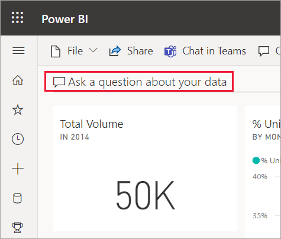
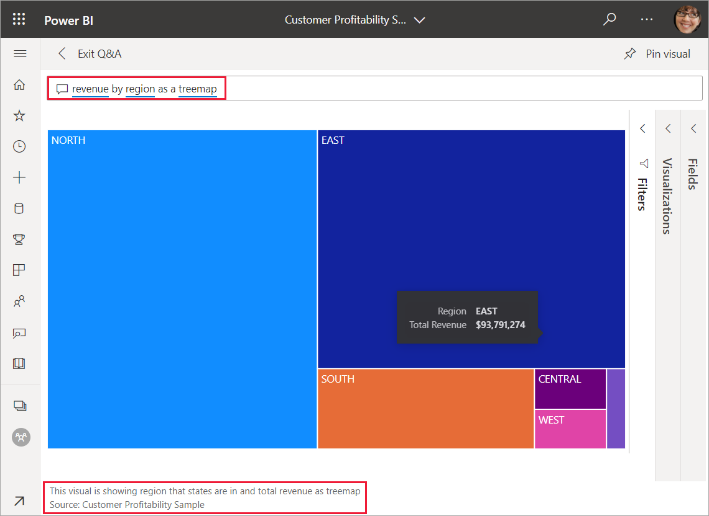

# Q&A for Power BI business users

[!INCLUDE[consumer-appliesto-ynny](../includes/consumer-appliesto-ynny.md)]

## What is Q&A?

Sometimes the fastest way to get an answer from your data is to ask a question using natural language. For example, "what were total sales last year."

Use Q&A to explore your data using natural language capabilities and receive answers in the form of charts and graphs. Unlike a search engine, Q&A only provides results about the data in Power BI datasets.

## Which visualizations does Q&A use?

Q&A picks the best chart or graph based on the data displayed. Sometimes data is defined as a certain type or category, telling Q&A how to display it. For example, if data is defined as a date type, it's more likely to be displayed as a line chart. Data that is categorized as a city is more likely to be displayed as a map.

You can also tell Q&A which visual to use by adding it to your question. But keep in mind that it may not always be possible for Q&A to display the data using the visual type you requested. Q&A will prompt you with a list of workable visual types.

## Where can I use Q&A?

You can find Q&A on dashboards in the Power BI service, and at the bottom of the dashboard in Power BI mobile. Unless the *designer* has given you edit permissions, you can use Q&A to explore data but won't be able to save any visualizations created with Q&A.

Q&A is available on reports, if the report *designer* added an interactive [Q&A visual](../visuals/power-bi-visualization-q-and-a.md).

## Q&A on dashboards

**Power BI Q&A** is available with a Pro or Premium license.  [Q&A virtual analyst in iOS apps](mobile/mobile-apps-ios-qna.md) and [Q&A in Power BI embedded analytics](../developer/embedded/qanda.md) are covered in separate articles. **Power BI Q&A** only supports answering natural language queries in English, although there's a preview available for Spanish that can be enabled by your Power BI administrator.

## The Q&A visual in Power BI reports

A report designer can add a specific type of interactive visual called the
Q&A visual. Power BI report end users can ask natural language questions and create a new report visual that represents the answer to the question. The Q&A visual behaves like any other visual in a report. **Cross-filter**, **cross-highlight**, bookmarks, and comments are enabled.

Q&A visuals have a **question** box across the top of the visual. You type your question into the **question** box and Q&A responds with a visual. The Q&A visual can be used over and over again to ask questions about your data. When you leave the report, the Q&A visual resets to its default.

## Considerations and troubleshooting

**Question**: I don't see Q&A on this dashboard.

**Answer 1**: If you don't see a question box, check your settings. Select the **Settings** icon in the upper right corner of your Power BI toolbar, or from the **More options (...)** drop-down menu.

Choose **Settings** > **Dashboards**. Make sure there's a check mark next to **Show the Q&A search box on this dashboard**.
  

**Answer 2**: Sometimes you won't have access to the settings. If the dashboard owner or your administrator turned Q&A off, check with them to see if it's OK to turn it back on. To look up the owner, select the name of the dashboard from the top menu bar.

**Question**: I'm not getting the results I'd like to see when I type a question.

**Answer**: Select the option to contact the report or dashboard owner. You can find the report or dashboard owner from the Q&A dashboard page or the Q&A visual. Or, you can look up the owner from the Power BI header.  There are many things the owner can do to improve the Q&A results. For example, the owner can rename columns in the dataset to use terms that are easily understood (`CustomerFirstName` instead of `CustFN`). Since the owner knows the dataset, they can also come up with helpful questions and add them to the Q&A suggested questions.

## Privacy

Microsoft may use your questions to improve Power BI, see the [Microsoft Privacy Statement](https://go.microsoft.com/fwlink/?LinkId=521839) for more information.

## Next steps

Learn how to ask your own natural language questions and create answers in the form of visuals. [Q&A Tutorial](end-user-q-and-a-tutorial.md)
