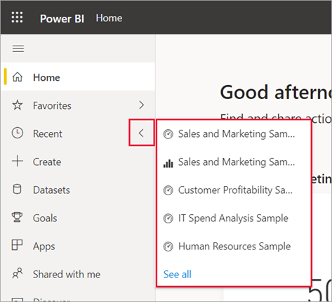

# **Recent** content in the Power BI service

[!INCLUDE[consumer-appliesto-yyny](../includes/consumer-appliesto-yyny.md)]

**Recent** content contains the last items you visited in the Power BI service. This include: dashboards, reports, apps, datasets, workspaces, and workbooks. When you select **Recent** from the nav bar, Power BI displays this content in descending order by date.  To change the sort order, select one of the headings and choose ascending or descending.

Notice that two items are [favorites](end-user-favorite.md), they have a star icon, while four items are stored in [Premium capacity](end-user-license.md), as denoted by a diamond icon.

## See your five most recents

To display only your five most recently visited items, from the nav pane, select the arrow to the right of **Recent**.  From here, select content to open it. 

## See all of your recent content

If you have more than five recently visited items, select **See all** to open the **Recent** screen. As we did at the beginning of this article, you can skip the flyout and open the **Recent** screen by selecting the word **Recent**, or its icon , from the nav pane.

## Search and sort your list of recent content

If your lists get long, [use the search field and sorting to find what you need](end-user-search-sort.md). To find out if a column can be sorted, hover to see if an arrow appears. In this example, hovering over **Type** reveals an arrow -- your recent content can be sorted alphabetically by type of content. 

Watch Amanda demonstrate some feature of navigating around your content the Power BI service.

> [!NOTE]  
> This video might use earlier versions of Power BI Desktop or the Power BI service.

<iframe width="560" height="315" src="https://www.youtube.com/embed/G26dr2PsEpk" frameborder="0" allowfullscreen></iframe>

> [!NOTE]
> This video uses an older version of the Power BI service.

<!--
## Actions available from the **Recent** content list
The actions available to you will depend on the settings assigned by the content *designer*. Some of your options may include:
* Select the star icon to [favorite a dashboard, report, or app](end-user-favorite.md) .
* Some dashboards and reports can be re-shared  .
* [Open the report in Excel](/power-bi/visuals/power-bi-visualization-export-data)  
* [View insights](end-user-insights.md) that Power BI finds in the data . -->

## Next steps
[Power BI service apps](end-user-apps.md)

More questions? [Try the Power BI Community](https://community.powerbi.com/)