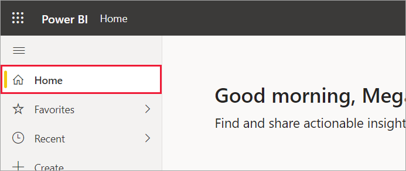
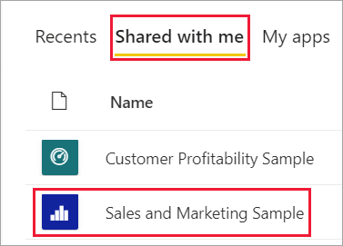
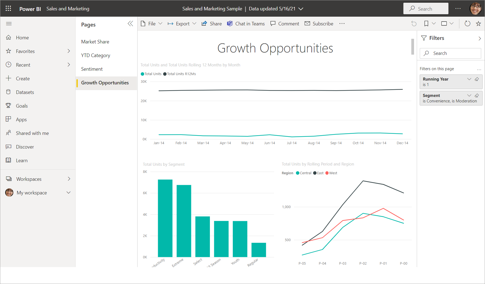

# View a report in the Power BI service for *business users*

[!INCLUDE[consumer-appliesto-yynn](../includes/consumer-appliesto-yynn.md)]

A report is one or more pages of visuals. Reports are created by Power BI *designers* and [shared with *business users directly*](end-user-shared-with-me.md) or as part of an [app](end-user-apps.md). To open a report, you'll need either a Power BI Pro license, or for the report to be part of a workspace that is stored in a Premium capacity. [Learn about licenses and subscriptions](end-user-license.md)

There are many different ways to open a report and we'll show you two of them: open from Home and open from a dashboard. 

<!-- add art-->

## Open a report from Power BI Home
Let's open a report that's been shared with you directly and then open a report that was shared as part of an app.

   

### Open a report that has been directly shared with you
Power BI *designers* can share an individual report directly with you via a link in email or by adding it automatically to your Power BI content. Reports that are shared this way show up in the **Shared with me** container on your nav pane and in the **Shared with me** section of your Home canvas.

1. Open the Power BI service (app.powerbi.com).

2. From the nav pane, select **Home** to display your Home canvas.  

   
   
3. Scroll down until you see **Shared with me**. Look for the report icon . In this screenshot we have one dashboard and one report. The report is named *Sales and Marketing Sample*.
   
   

4. Simply select the report *card* to open the report.

   

5. Notice the tabs along the left side.  Each tab represents a report *page*. We currently have the *Growth Opportunity* page open. Select the *YTD Category* tab to open that report page instead. 

   

6. Expand the **Filters** pane along the right side. Filters that have been applied to this report page, or to the entire report, are displayed here. You can change these filters to see the impact on your visuals and report.

   

7. Display the actions menu for a visual. Hovering over a report visual reveals actions you can take on that visual. To see the filters applied to a specific visual, select the filter icon. Here we've selected the filter icon for the *Total units by month and manufacturer* line chart.

   

6. You can also change the display of the report page. Right now, we're displaying the entire report page. To change the display (zoom) of the page, select the **View** dropdown from the upper right corner and choose **Actual size** and then switch to **Fit to width**. Notice the differences each view option makes to the display of your report.

   

   

There are many ways for you to interact with a report to discover insights and make business decisions.  Use the table of contents on the left to read through other articles about Power BI reports. 

### Open a report that is part of an app
If you've received apps from colleagues or from AppSource, those apps are available from Home, and from the **Apps** and **Shared with me** containers on your nav pane. An [app](end-user-apps.md) is a collection of dashboards and reports that have been bundled together for you by a Power BI *designer*.

### Prerequisites
Opening an app requires a Power BI Pro license, or for the app workspace to be stored in Power BI Premium capacity. [Learn about licenses and subscriptions](end-user-license.md)    
    
To follow along, download the Sales and Marketing app.
1. In your browser, navigate to appsource.microsoft.com.
1. Select the checkbox for **Power Platform**.
1. Search for "Sales & Marketing" and select **Microsoft sample - Sales & Marketing**. Scroll down to see the search results.
1. Select **Get it now** > **Continue** > **Install** to install the app in your Apps container. 

You can now open the app from your **Apps** container or from **Home**.
1. Go back to Home by selecting **Home** from the nav pane.

7. Scroll down until you see **My Apps**.

   

8. Select your new *Sales and marketing* app to open it. Depending on the options set by the app *designer*, the app will open either a dashboard or a report. This app opens to a dashboard.  

## Open a report from a dashboard
Reports can be opened from a dashboard. Most dashboard [tiles](end-user-tiles.md) are *pinned* from reports. Selecting a tile opens the report that was used to create the tile. 

1. From the dashboard, select a tile. In this example we've selected the *Total Units YTD...* column chart tile.

    

2.  The associated report opens. Notice that we're on the *YTD Category* page. This is the report page that contains the column chart we selected from the dashboard.

    

> [!NOTE]
> Not all tiles lead to a report. 
>If you select a tile that was [created with Q&A](end-user-q-and-a.md), the Q&A screen will open. 
>If you select a tile that was [created using the dashboard **Add tile** widget](../create-reports/service-dashboard-add-widget.md), several different things may happen: a video may play, a website open, and more.  

##  Still more ways to open a report
As you get more comfortable navigating the Power BI service, you'll figure out workflows that work best for you. A few other ways to access reports:
- From the nav pane using [Favorites](end-user-favorite.md) and [Recent](end-user-recent.md)    
- Using [View related](end-user-related.md)    
- In an email, when someone [shares with you](../collaborate-share/service-share-reports.md) or you [set an alert](end-user-alerts.md)    
- From your [Notification center](end-user-notification-center.md)    
- From a workspace
- and more

## Next steps
[Open and view a dashboard](end-user-dashboard-open.md)    
[Report filters](end-user-report-filter.md)

