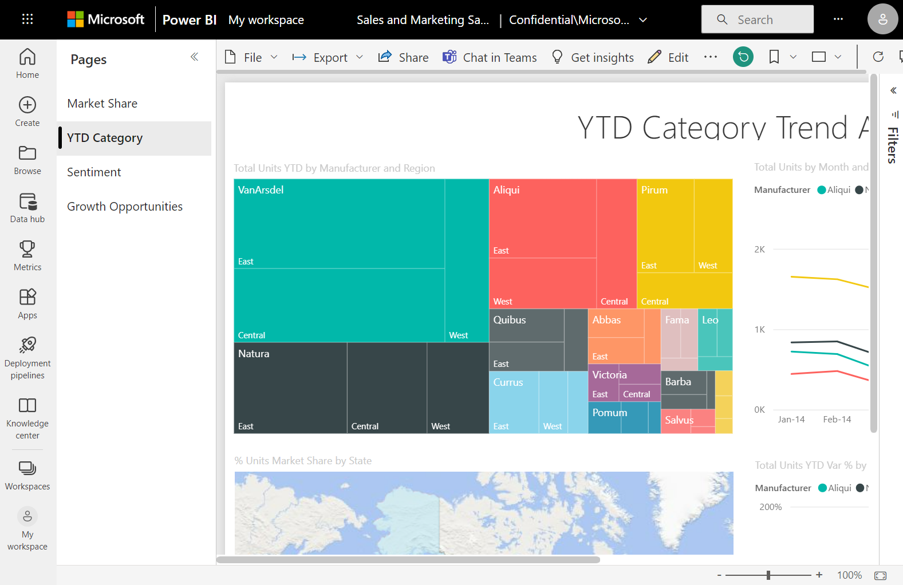
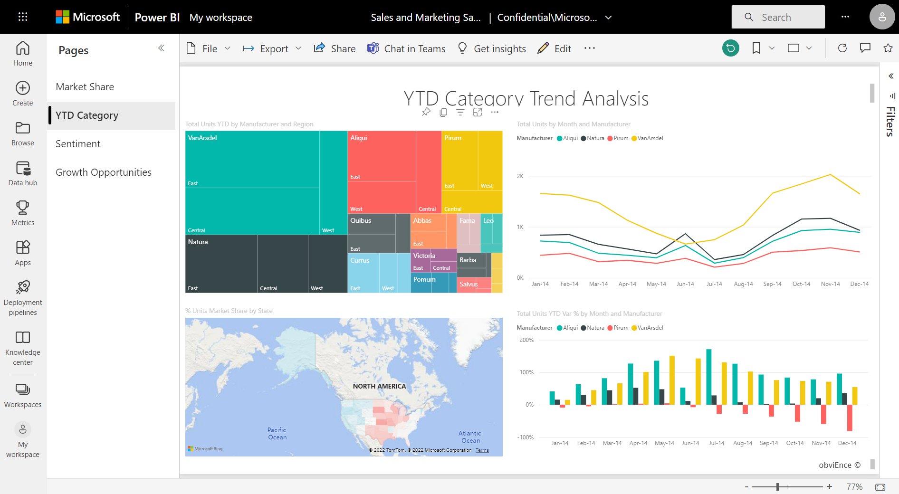
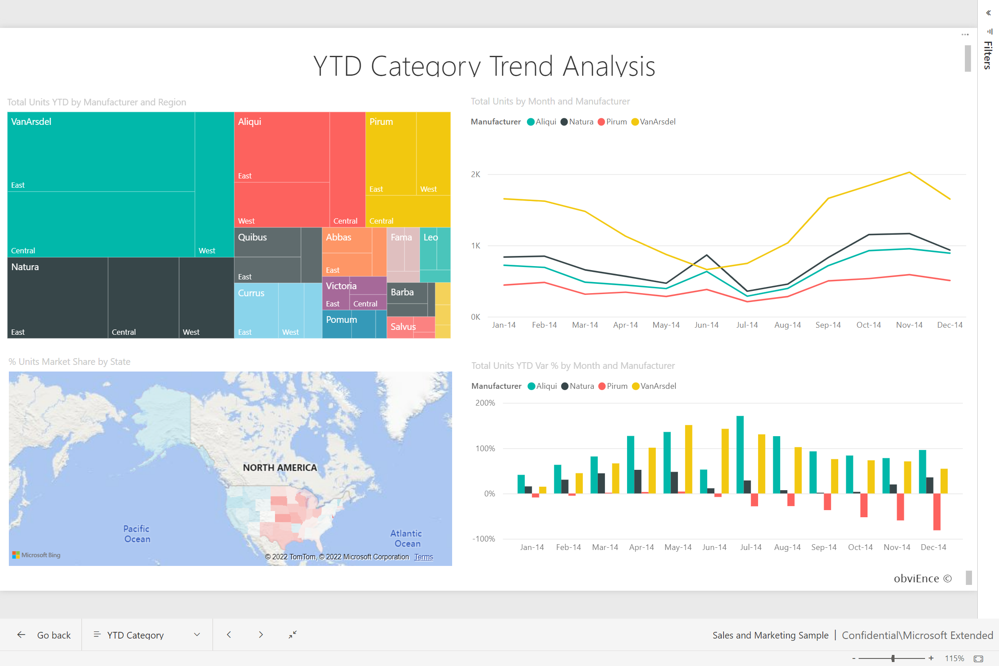
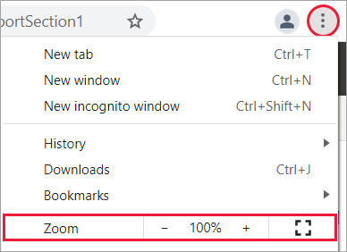
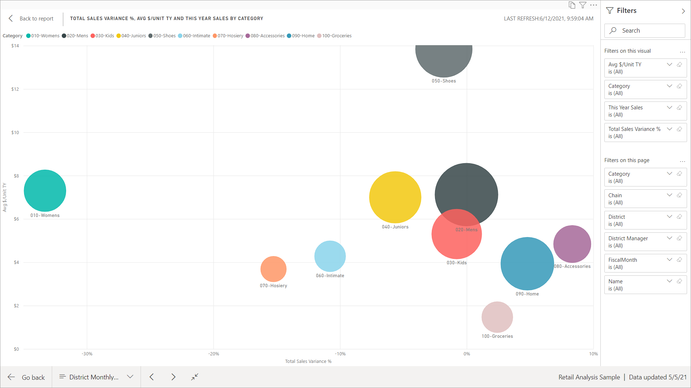

# Change the display of a report page

[!INCLUDE[consumer-appliesto-yyny](../includes/consumer-appliesto-yyny.md)]

You can view reports on many devices with varying screen sizes and aspect ratios. Learn how to change the display of a report page, so it fits your needs.

## Explore the View menu

The options in the **View** menu give you flexibility to display report pages at the size and width you choose.

If you view a report on a small device, it might be hard to see titles and legends. Select **View** and then select **Actual size** to increase the size of the report page. Use the scroll bars to move around the report.

 

Fit the report to your screen width by selecting **Fit to width** from the **View** menu. Because it adjusts the width and not the height, you might need to use the vertical scroll bar.

If you don't want any scroll bars, but you want to make the best use of your screen size, select **Fit to Page** from the **View** menu.

   

Change your display colors by selecting **High contrast colors** in the **View** menu. Select one of the options, High-contrast #1, High-contrast #2, High-contrast black, or High-contrast white. This feature gives people with impaired vision more options to see the reports better. The example below is the High-contrast #1 option.

Select **Full screen** in the **View** menu to display your report page without menu bars and headers. Full screen is a good choice for small screens where the details might be hard to see. Full screen can also be a good choice when projecting report pages on a large screen for people to view but not interact with.  

When you exit the report, your **View** settings aren't saved. The changes revert to the default view settings. If you want to save these settings, you can preserve them as a [bookmark](end-user-bookmarks.md).

## Use your browser to change page display

The zoom controls in your browser increase or decrease the available canvas area. Decreasing the zoom expands the available canvas area, and increasing the zoom decreases the available canvas area.

You can also resize your entire browser to change the display size of your report.

## Zoom in on a visual

Sometimes it's difficult to see the details in a visual. You can focus on one visual by itself and make it bigger by using Focus mode. For more information, see [Focus mode and Full screen mode](end-user-focus.md).

### A visual in Focus mode

### A visual in Full screen mode

## Next steps

- [Take a tour of the report Filters pane](end-user-report-filter.md)