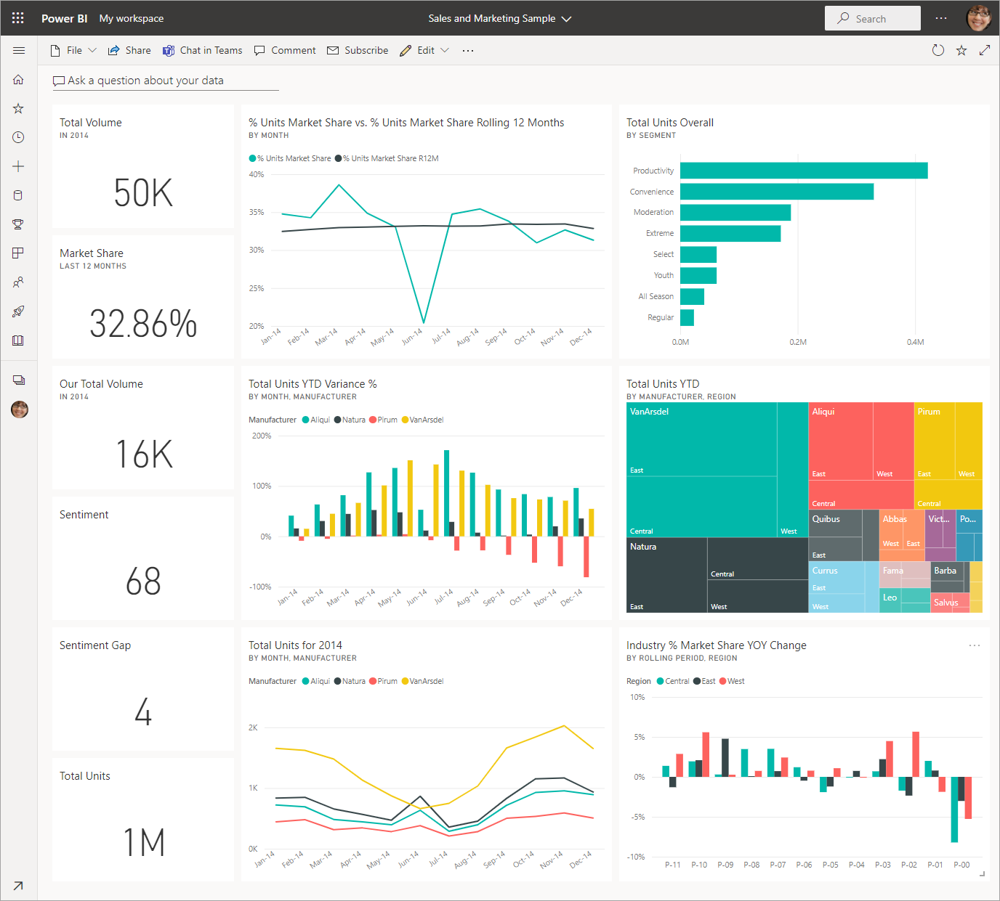

# Dashboard tiles in Power BI

[!INCLUDE[consumer-appliesto-yyny](../includes/consumer-appliesto-ynny.md)]

A tile is a snapshot of your data, pinned to a dashboard by a *designer*. *Designers* can create tiles from a report, dataset, dashboard, the Q&A question box, Excel, SQL Server Reporting Services (SSRS), and more.  This screenshot shows many different tiles pinned to a dashboard.

Besides tiles pinned from reports, *designers* can add standalone tiles directly on the dashboard using **Add tile**. Standalone tiles include: text boxes, images, videos, streaming data, and web content.

Need help understanding the building blocks that make up Power BI?  See [Power BI - Basic Concepts](end-user-basic-concepts.md).

## Interacting with tiles on a dashboard

1. Hover over the tile to display the ellipses.
   
    
2. Select the ellipses to open the tile action menu. The options available vary by your permissions, the visual type, and the method used to create the tile. For example, the menu items available for tiles pinned from Q&A are different than the tiles pinned from a report. Here is an action menu for a tile created using Q&A.

   
    

   
    Some of the actions available from these menus are:
   
   * [Open the report that was used to create the tile ](end-user-reports.md)   
   
   * [Open the Q&A question that was used to create the tile ](end-user-reports.md)   
   

   * [Open the workbook that was used to create the tile ](end-user-reports.md)   
   * [View the tile in focus mode ](end-user-focus.md)   
   * [View insights ](end-user-insights.md) 
   * [Add a comment and start a discussion](end-user-comment.md)  
   * [Manage alerts set on a dashboard tile](end-user-alerts.md)  
   * [Open the data in Excel](end-user-export.md)  

3. To close the action menu, select a blank area in the canvas.

### Select (click) a tile
When you select a tile, what happens next depends on how the tile was created and if it has a [custom link](../create-reports/service-dashboard-edit-tile.md). If it has a custom link, selecting the tile takes you to that link. Otherwise, selecting the tile takes you to the report, Excel Online workbook, SSRS report that is on-premises, or Q&A question that was used to create the tile.

> [!NOTE]
> The exception to this is video tiles added to dashboards by *designers*. Selecting a video tile (that was created this way) causes the video to play right there on the dashboard.   
> 
> 

## Considerations and troubleshooting
* If nothing happens when you select (click) a tile, or you receive an error message, here are some possible reasons:
  - The report that was used to create the visualization was not saved, or has been deleted.
  - The tile was created from a workbook in Excel Online, and you do not have at least Read permissions for that workbook.
  - If the tile was created from SSRS, and you don't have permission to the SSRS report or you don't have access to the network where the SSRS server is located.
* For tiles created directly on the dashboard using **Add tile**, if a custom hyperlink has been set, selecting the title, subtitle, and or tile will open that URL.  Otherwise, by default, selecting one of these tiles created directly on the dashboard for an image, web code, or text box produces no action.
* If the original visualization used to create the tile changes, the tile doesn't change.  For example, if the *designer* pinned a line chart from a report and then changed the line chart to a bar chart, the dashboard tile continues to show a line chart. The data refreshes, but the visualization type does not.

## Next steps
[Data refresh](../connect-data/refresh-data.md)

[Power BI - Basic Concepts](end-user-basic-concepts.md)

