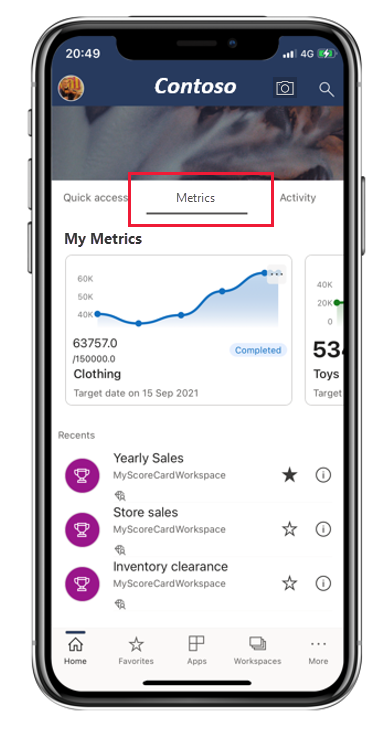
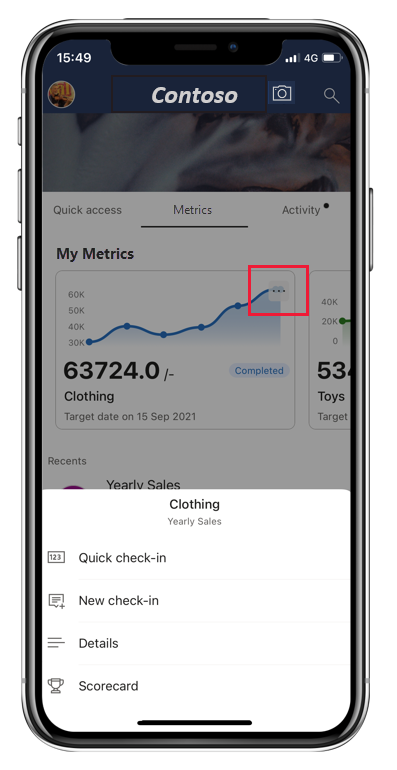
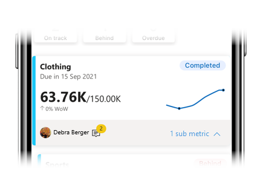
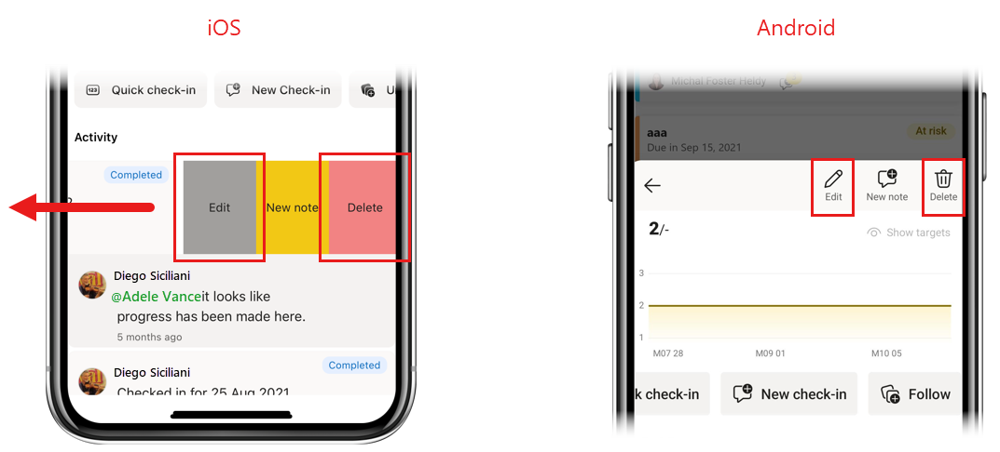
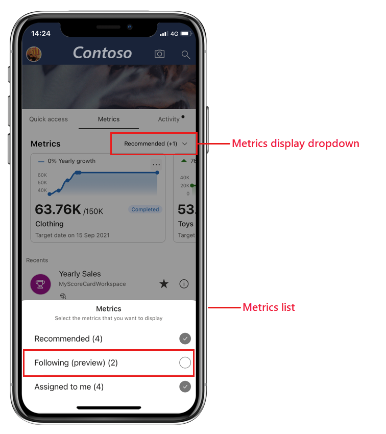

# Metrics

Applies to:

|  |  |  |  |
|:--- |:--- |:--- |:--- |
|iPhones |iPads |Android phones |Android tablets |

The Power BI mobile apps make it easy for you to keep on top of your metrics while on the go. While scorecards and metrics are [created in the Power BI service](../../create-reports/service-goals-create.md), in the app you can monitor progress on your metrics, make check-ins to update progress, add notes, and, when a metric is connected to a report, easily open the associated report to dig deeper into the data.

This article explains how to monitor your metrics on the mobile app and shows you how to update progress and to dig deeper into the data when the metric is connected to a report.

To read more about metrics, see [Get started with metrics in Power BI](../../create-reports/service-goals-introduction.md)

## Metrics hub
The metrics hub is a centralized place where you can see and update your important metrics as well as navigate to scorecards you have access to.

Tap the **Metrics** tab on the app’s home page to display the metrics hub.

  
The top section of the metrics hub, **My Metrics**, displays all the metrics that matter most to you. Tap a metric to open the scorecard that the metric belongs to.

The My Metrics section is followed by a list of the scorecards you have access to, grouped as Recents, Favorites, Shared with me, etc. Tap a scorecard to open it.

### Update a metric

You can easily update a metric by tapping the ellipsis at the upper right corner of a metric’s tile.

You'll get a number of options:
* **Quick check-in**: Allows you to check in a value for the current date and to update metric status. Quick check-in is not available for metrics with connected reports.
* **New check-in**: Allows you to check in a value for a date you choose, update metric status, and also add a note if you want to. In the note, you can \@mention a person if you want to get their attention. They will receive [notification](#notifications) that a check-in has been flagged for their attention.
* **Connected report (current)**: Opens the report that is connected to the metric’s “current” value. You'll only see this option if the metric's current value is connected to a report.
* **Connected report (target)**: Opens the report that is connected to the metric’s “target” value. You'll only see this option if the metric's target value is connected to a report.

## Scorecards

Metrics are created in scorecards. A scorecard is where colleagues can keep track of a set of metrics. Metrics and scorecards are [created in the Power BI service](../../create-reports/service-goals-create.md), but you can monitor and stay on top of them in the mobile app.

A scorecard has a summary that shows the number of metrics in the scorecard and the number of metrics in each status followed by a list of all the metrics.

 
Tap the status buttons in the summary to filter for the metrics with the selected status. You can select multiple filters. Tap the **Metrics** button to clear the filters. The image above shows the scorecard filtered by Completed and Behind status.

In the scorecard, metrics are represented by cards.

 
The card for a metric shows
* The name of the metric
* Metric due date
* Metric status
* Last check-in value over the target value
* A spark line illustrating progress towards the metric
* Metric owner
* An indication of whether there are any notes attached to the metric
* An expandable menu to display submetrics, if any

Tap anywhere else on the card to open the metric’s [details pane](#metric-detail-pane).

You can also tap and hold on the sparkline on a metric to see the high-low value range and cycle (if any) of check-in values.

## Metric detail pane

A metric’s detail pane has a chart of the metric’s progress and lists all the activity on the metric – all the check-ins and notes.

 
Tap an action button to update the metric or to start/stop following it. You will have several options:
* **Quick check-in**: Allows you to check in a value for the current date and to update metric status. Quick check-in is not available for metrics with connected reports.
* **New check-in**: Allows you to check in a value for a date you choose, update metric status, and also add a note if you want to. In the note, you can \@mention a person if you want to get their attention. They will receive [notification](#notifications) that a check-in has been flagged for their attention.
* **Follow/Unfollow**: Allows you to start/stop following the metric in order to keep up to date with activity on the metric.

Use the toggle to switch between views of check-in activity on the metric and details such as connected reports or other info that the scorecard creator has configured.

Tap on a connected report to open it. If you don't see the name of the report, but only the word "Report", it means you don't have access to the report. Tap on the report to request access.

### Add a note to an existing check-in

Generally, you add note as part of a new check-in, but you can also add a note to an existing check-in as well. On iOS devices, just slide the relevant check-in to the left and choose **New note**. On Android devices, select the relevant check-in and then pick the **New note** icon in the upper right corner of the details pane.

As mentioned, in a note you can @mention a person if you want to get their attention. They will receive [notification](#notifications) that a check-in has been flagged for their attention.

### Edit or delete a check-in
To edit or delete a check-in on iOS devices, slide the check-in to the left and tap the desired option. On Android devices, select the check-in you wish to edit or delete and then select the desired option from the icons in the upper right corner of the details pane.

## Notifications

Notifications help you stay up to date with information that requires your immediate attention. The Mobile apps support two types of notification that are related to metrics:
* **Metric assignment notification**: When someone assigns you a metric, you'll receive a metric assignment notification on your mobile device. This way you’ll never miss when you've become a metric owner and are now accountable for that metric.  
* **Notifications for \@mentions**: Whenever you're @mentioned in a note attached to a new or existing check-in, you'll receive a notification on your mobile device. This way, you won't miss it when someone @mentions you to get your attention.

For both kinds of notification, tapping the notification takes you right to the metrics details pane inside the scorecard, where you can see all the necessary information.

## Follow metrics (preview)

You can follow metrics directly from the mobile app to keep up to date with the activity on those metrics. To start following a metric, just tap **More options (…)** on a metric’s card in the Metrics hub and choose **Follow metric**, or tap the **Follow metric** button in the metric's details pane.

To see all the metrics you're following, tap the metrics display dropdown in the Metrics hub and select **Following (preview)** in the metrics list that appears.

It makes no difference whether the metric was marked for following in the Power BI service or in the mobile app - you'll see them all. Likewise, in the Power BI service you'll also be able to see all your followed metrics - including those that you started following from the mobile app.

## Next steps
 
* [Introducing metrics in Power BI](https://powerbi.microsoft.com/en-us/blog/introducing-goals-in-power-bi/)
* [Get started with metrics in Power BI](../../create-reports/service-goals-introduction.md)
* [Stay on top of your metrics in Power BI](../../create-reports/service-goals-check-in.md)
* [Create scorecards and manual metrics in Power BI](../../create-reports/service-goals-create.md)
* [Create connected metrics in Power BI](../../create-reports/service-goals-create-connected.md)