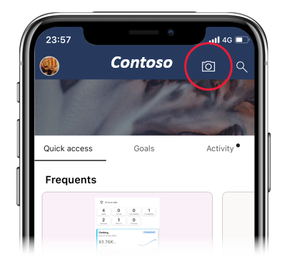
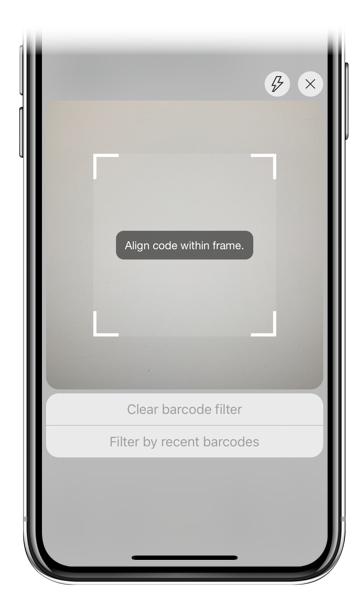

# Scan barcodes from the mobile app to get filtered data 
Scan barcodes in the real world to get directly to filtered BI information in the Power BI mobile app.

Applies to:

|  |  |  |  |
|:--- |:--- |:--- |:--- |
|iPhones |iPads |Android phones |Android tablets |

Say your organization has reports containing data that has been [tagged as barcode data in Power BI Desktop](../../transform-model/desktop-mobile-barcodes.md). When you scan a product barcode using the Power BI mobile app's camera, you'll get a list of the reports that have barcode data. You can open the report you're looking for, automatically filtered to the information you need.

Here are examples of two scenarios where barcode scanning is useful:
* Imagine you're checking inventory in a large supermarket and while your out in the aisles you need to get information about particular products, such as how many the store has in stock, what departments the items are stocked in, etc. You can just open the Power BI scanner on your mobile device and scan an item's barcode. You'll get a list of reports that have barcode data. You choose the relevant report and the report opens, filtered to the relevant data.
* Say the machines on a factory floor are identified with barcodes, and the telemetry from those machines is being processed and sent to Power BI. When engineers are out on the floor checking machine status, they can easily scan a machine's barcode and get to a KPI report about its performance and status.

## Scan a barcode with the Power BI scanner
1. On the navigation bar, tap **More options** (...) and then tap **Scanner**.

    

1. If your camera is not enabled, you'll need to approve the Power BI app to use the camera. This is a one-time operation. 
1. Point the scanner at a barcode on the item you're interested in. You will see a list of reports that have barcode fields.
1. Find the report you're looking for and tap to open it on your device, automatically filtered according to the barcode you scanned. If the report doesn't contain the barcode, you'll get the message "Couldn't filter report". In that case you can go back to the list and try another report.
    
>[!NOTE]
>If there is only one report with a barcode field, you won't get a list of reports, but rather the report will open directly, filtered according to the barcode you scanned. If the report doesn't contain the barcode you scanned, you will also get the message "Couldn't filter report".

## Filter by other barcodes while in a report
While looking at a report filtered by a barcode on your device, you may want to filter the same report by a different barcode.

On the report's action bar, tap the barcode icon.

* If the barcode icon is filled, , the filter is active and the report is already filtered by a barcode. 
* If the icon is clear , the filter isn't active and the report isn't filtered by a barcode. 

Either way, tap the icon to open a small menu with a floating scanner.

* Focus the scanner on the new item to change the filter of the report to a different barcode value. 
* Select **Clear barcode filter** to go back to the unfiltered report.
* Select **Filter by recent barcodes** to change the report filter to one of the barcodes you've scanned within the current session.

## Clear a barcode filter
To clear barcode filtering while in a filtered report:
1. On the report's action bar, tap the filled barcode scanner icon  that indicates that a filter is active and tap it to open the floating scanner.

1. On the floating scanner, select **Clear barcode filter** to go back to the unfiltered report.

## Considerations and limitations

* The Filters pane gives no indication of barcode filtering. To know whether a report is currently filtered by a barcode, look at the icon on the Barcode Scanner menu item:

     indicates that the report is currently filtered by a barcode.
    
     indicates that the report is currently not filtered by a barcode. 
* The mobile apps support Barcode filtering only for reports that have only one barcode column across all report data tables. If you scan a barcode for a report that has more than one barcode column, no filtering takes place.

## Issues with scanning a barcode
Here are some issues you may encounter when you scan a barcode on an item.

* You get a message **Couldn't filter report - Looks like this barcode doesn't exist in the report data**: This means that the value of the barcode you scanned doesn't appear in datamodel of the report you chose to filter. This might be the case, for instance, if the product whose barcode you scanned isn't included in the report. You can scan a different product, choose a different report (if more than one report is available), or view the report unfiltered.

* You get a message **Looks like you don't have any reports that can be filtered by barcodes**: This means you don't have any barcode-enabled reports. The barcode scanner can only filter reports that have a column marked as **Barcode**. Make sure you or the report owner has tagged a column as **Barcode** in Power BI Desktop. Learn more about [tagging a barcode field in Power BI Desktop](../../transform-model/desktop-mobile-barcodes.md)

* Filtering returns an empty state. This could mean that the barcode value you scanned exists in your model, but all or some of the visuals in your report don't contain this value. In this case, try looking at other report pages or edit your reports in Power BI Desktop to contain this value 

## Next steps
* [Tag a barcode field in Power BI Desktop](../../transform-model/desktop-mobile-barcodes.md)
* [Get data from the real world with the Power BI mobile apps](mobile-apps-data-in-real-world-context.md)