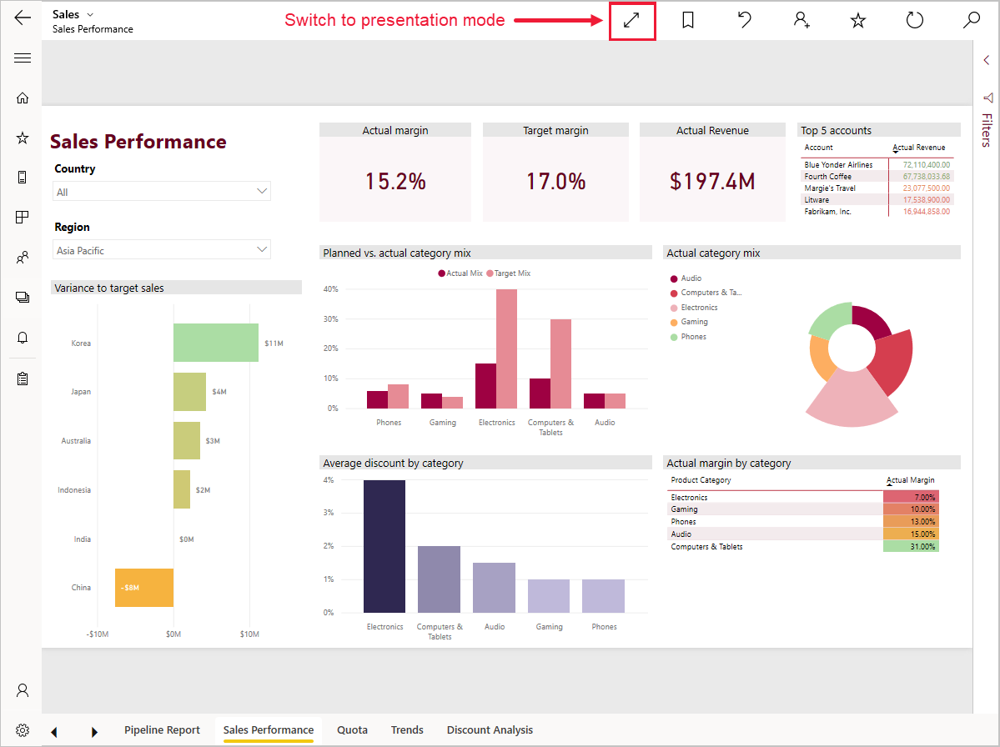
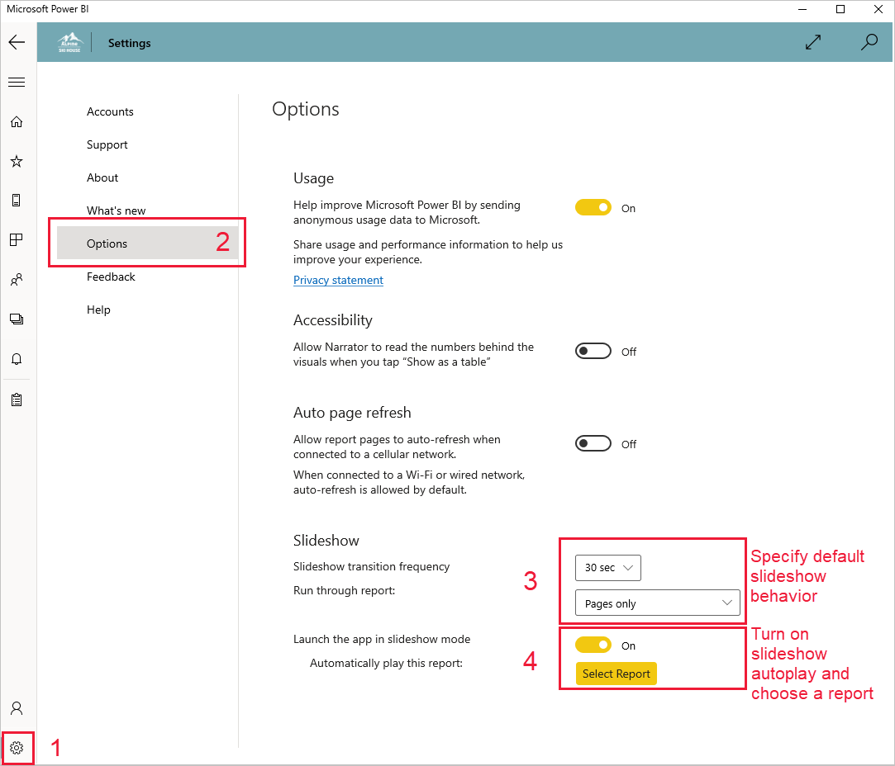

# View reports and dashboards in presentation mode on Surface Hub and Windows 10 devices
You can use presentation mode to display reports and dashboards in full-screen on Windows 10 devices and Surface Hub. Presentation mode is useful for displaying Power BI at meetings or conferences, or on a dedicated projector at the office, or even just for maximizing space on a small screen.

In presentation mode:
* All the "chrome" (such as the navigation and menu bars) disappears, making it easier to focus on the data in your report.
* An action toolbar becomes available to enable you to interact with your data and to control the presentation.
* You can play a slideshow that cycles automatically between pages, bookmarks, or both pages and bookmarks.

>[!NOTE]
>Power BI mobile app support for **phones using Windows 10 Mobile** has been discontinued as of March 16, 2021. [Learn more](/legal/powerbi/powerbi-mobile/power-bi-mobile-app-end-of-support-for-windows-phones)

## Use presentation mode
In the Power BI mobile app, tap the **Switch to presentation mode** icon.

The app chrome disappears and the action toolbar appears at the bottom of the screen or on the right and left sides (depending on your screen size).

From the toolbar you can tap to perform the following actions:

| Icon | Action |
|------|--------|
||**Go back** to the previous page. A long tap on the icon pops up the breadcrumbs windows, allowing you to navigate to the folder containing your report or dashboard.|
||**Switch pages** to another page of the report in your presentation.|
||**Apply a bookmark** to present the particular view of your data that that bookmark captures. You can apply both personal and report bookmarks.|
||**Choose an ink color** when you use your Surface pen to draw and annotate on your report page.|
||**Erase ink marks** you might have made with the Surface pen to draw and annotate on your report page.          |
||**Reset to default view** and clear any filters, slicers, or any other data view changes you might have made during the presentation.|
||**Share** an image of the presentation view with your colleagues. The image will include any annotations you have made with the Surface pen during the presentation.|
||**Refresh** the report.|
||**Play the slideshow**, hiding the action bar and starting the slideshow. A selector allows you to choose to auto-rotate between pages, bookmarks, or both pages and bookmarks. By default the slideshow auto-rotates between pages once every 30 seconds. You can change these settings in [**Settings > Options**](#slideshow-settings). See [more detail](#slideshows) about slideshows|
||**Exit** presentation mode.|
||**Search** for other artifacts in Power BI.|

You can undock the toolbar and drag and drop it to anywhere on the screen. This is useful for large screens, when you want to focus on a specific area in your report and want to have the tools available next to it. Just place your finger on the toolbar and swipe it into the report canvas.

## Slideshows

You can play a slideshow to automatically cycle through your presentation. You can set the slideshow to cycle through pages, bookmarks, or both pages and bookmarks. During the slideshow, report pages with [auto page refresh](../../create-reports/desktop-automatic-page-refresh.md) will continue to automatically refresh as configured, ensuring that the most current data is always shown.

When you select the **Play** button on the action toolbar, the slideshow begins. A controller appears that allows you to pause the slideshow or to change what's being played: pages, bookmarks, or both pages and bookmarks.

 The controller shows the name of the currently displayed view (page or bookmark and page). In the image above, we see that in the report called **Sales**, we are currently viewing the **Asia Pacific** bookmark on the **Sales Performance** page.

By default, a slideshow cycles through pages only, at a rate of one every 30 seconds. You can change the default behavior in the [Slideshow settings](#slideshow-settings).

### Auto play a slideshow on startup

You can set up the Power BI mobile app to start playing a slideshow automatically whenever the app is launched. This option is useful for creating a kiosk-like experience that runs a report in public displays without any manual intervention. See [Slideshow settings](#slideshow-settings) for detail about setting up a report for autoplay.

### Slideshow settings

By default, a slideshow cycles through pages only, at a rate of one every 30 seconds. You can change this default behavior by going to **Settings > Options**, as illustrated below. You can also turn on autoplay and choose a report to play.

1. Select the settings icon.

1. Open the options tab.

1. If desired, change the default settings for what the slideshow will cycle over (pages, bookmarks, or both) and how frequently the slides will transition.

1. If you want your report to start playing automatically when the app is launched, turn on the toggle and choose **Select Report**. You will be able to search for reports you have access to.

## Next steps
* [Display dashboards and reports in full-screen mode from the Power BI service](../end-user-focus.md)
* Questions? [Try asking the Power BI Community](https://community.powerbi.com/)