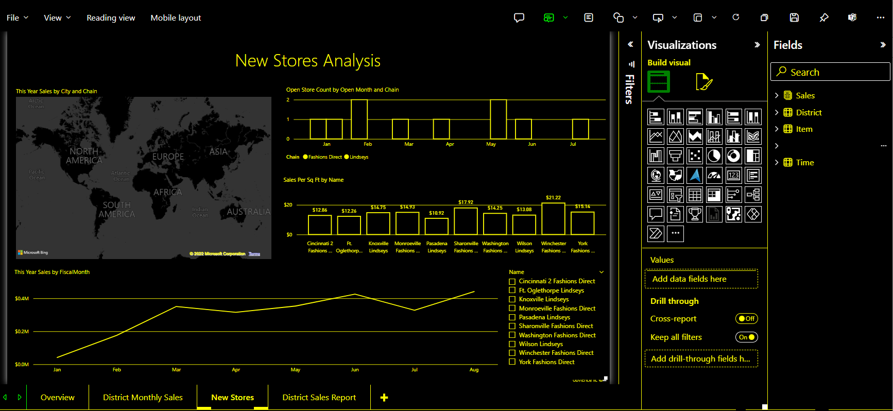

# Overview of accessibility in Power BI

When working with Power BI, consider the different types of users who may interact with your reports. You can create reports that are easily navigated and understood by keyboard or screen reader users. Such reports enable users who may have visual or physical impairments to benefit from your reports.

This article provides an overview of Power BI and accessibility. Additional articles provide guidance, and tools, that can help you create great reports with accessibility in mind.

## Universal design

Universal design is the design of products that are usable by as many people as reasonably possible, without the need for special adaptation or specialized design. When creating reports or experiences in Power BI, it’s important to consider the needs of your users. Designing an accessible experience won't only benefit your end users who may have hearing, motor, cognitive, or visual impairments. It can help all the end users in your organization. Power BI gives you the tools to make and consume accessible reports. It’s up to you, as a report creator, to use those tools to improve everyone’s experience.

## Accessibility standards

Power BI is committed to the following accessibility standards. The standards help ensure that your Power BI experiences are accessible to as many people as possible. When you build accessible reports or dashboards, that content is accessible for anyone who views them using Power BI Mobile.

### WCAG 2.1

Web Content Accessibility Guidelines (WCAG) help make web content accessible to people with disabilities. The following are key principles of the guidelines:

1. **Perceivable**. Information and user interface components must be presentable to users in ways they can perceive.
2. **Operable**. User interface components and navigation must be operable.
3. **Understandable**. Information and the operation of user interface must be understandable.

### US Section 508

US Section 508 is a standard that requires governments and federal agencies to make their electronic and information technology accessible to people with disabilities.

### EN 301 549

EN 301 549 is the Harmonized European Standard for Accessibility requirements for ICT products and services.  

## Next steps

For more information about Power BI accessibility, see the following resources:

* [Design Power BI reports for accessibility](desktop-accessibility-creating-reports.md)
* [Consume Power BI reports by using accessibility features](desktop-accessibility-consuming-tools.md)
* [Creating reports in Power BI using accessibility tools](desktop-accessibility-creating-tools.md)
* [Keyboard shortcuts in Power BI Desktop](desktop-accessibility-keyboard-shortcuts.md)
* [Report accessibility checklist](desktop-accessibility-creating-reports.md#report-accessibility-checklist)

