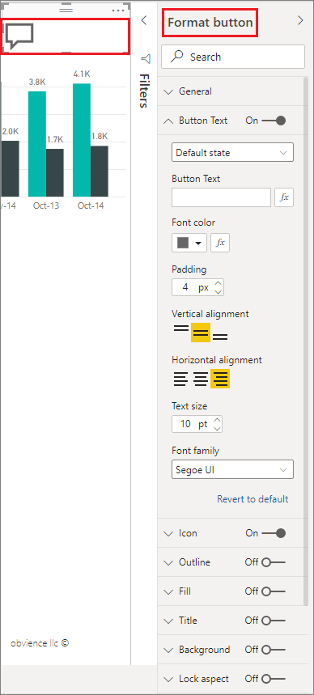
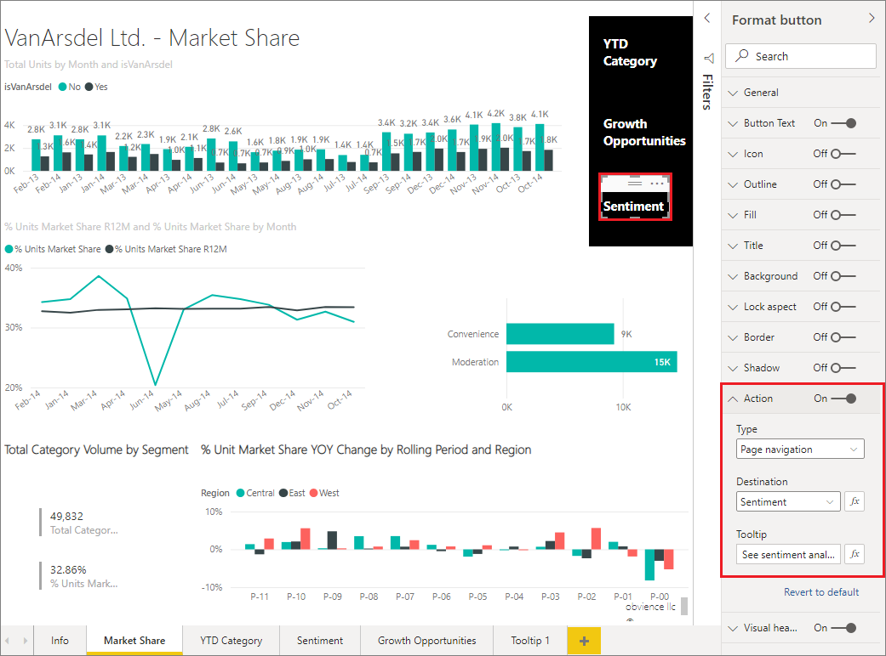

# Use buttons in Power BI
Using **buttons** in Power BI lets you create reports that behave similar to apps, and thereby, create an engaging environment so users can hover, click, and further interact with Power BI content. You can add buttons to reports in **Power BI Desktop** and in the **Power BI service**. When you share your reports in the Power BI service, they provide an app-like experience for your users.

## Create buttons in reports

### Create a button in Power BI Desktop

To create a button in **Power BI Desktop**, on the **Insert** ribbon, select **Buttons** and a drop-down menu appears, where you can select the button you want from a collection of options, as shown in the following image. 

### Create a button in the Power BI service

To create a button in the **Power BI service**, open the report in Editing view. Select **Buttons** in the top menu bar and a drop-down menu appears, where you can select the button you want from a collection of options, as shown in the following image. 

## Customize a button

Whether you create the button in Power BI Desktop or the Power BI service, the rest of the process is the same. When you select the button on the report canvas, the **Format button** pane shows you the many ways you can customize the button to fit your requirements. For example, you can turn **Button Text** on or off by toggling the slider in that card of the **Format button** pane. You can also change the button icon, the button fill, the title, and the action that's taken when users select the button in a report, among other properties.

## Set button properties when idle, hovered over, or selected

Buttons in Power BI have three states: default (how they appear when not hovered over or selected), when hovered over, or when selected (often referred to as being *clicked*). Many of the cards in the **Format button** pane can be modified individually based on those three states, providing plenty of flexibility for customizing your buttons.

The following cards in the **Format button** pane let you adjust formatting or behavior of a button based on its three states:

* Button Text
* Icon
* Outline
* Fill

To select how the button should appear for each state, expand one of those cards and select the drop-down that appears at the top of the card. In the following image, you see the **Icon** card expanded, with the drop-down selected to show the three states.

## Select the action for a button

You can select which action is taken when a user selects a button in Power BI. You can access the options for button actions from the **Action** card in the **Format button** pane.

Here are the options for button actions:

- **Back** returns the user to the previous page of the report. This is useful for drillthrough pages.
- **Bookmark** presents the report page that's associated with a bookmark that is defined for the current report. Learn more about [bookmarks in Power BI](desktop-bookmarks.md). 
- **Drillthrough** navigates the user to a drillthrough page filtered to their selection, without using bookmarks. Learn more about [drillthrough buttons in reports](desktop-drill-through-buttons.md).
- **Page navigation** navigates the user to a different page within the report, also without using bookmarks. See [Create page navigation](#create-page-navigation) in this article for details.
- **Q&A** opens a **Q&A Explorer** window. 

Certain buttons have a default action selected automatically. For example, the **Q&A** button type automatically selects **Q&A** as the default action. You can learn more about **Q&A Explorer** by checking out [this blog post](https://powerbi.microsoft.com/blog/power-bi-desktop-april-2018-feature-summary/#Q&AExplorer).

You can try or test the buttons you create for your report by using *CTRL+CLICK* on the button you want to use. 

## Create page navigation

With the **Action** type **Page navigation**, you can build an entire navigation experience without having to save or manage any bookmarks at all.

To set up a page navigation button, create a button with **Page navigation** as the action type, and select the **Destination** page.

You can build a custom navigation pane, and add the navigation buttons to it. You avoid having to edit and manage bookmarks if you want to change which pages to show in your navigation pane.

Additionally, you can conditionally format the tooltip as you can do with other button types.

## Set the navigation destination conditionally

You can use conditional formatting to set the navigation destination, based on the output of a measure. For example, you may want to save space on your report canvas by having a single button to navigate to different pages based on the user’s selection.

:::image type="content" source="media/desktop-buttons/button-navigate-go.png" alt-text="Navigate with a Go button":::
 
To create the example shown above, start by creating a single-column table with the names of the navigation destinations:

:::image type="content" source="media/desktop-buttons/button-create-table.png" alt-text="Create a table":::

Power BI uses exact string match to set the drillthrough destination, so double-check that the entered values exactly align with your drillthrough page names.

After you've created the table, add it to the page as a single-select slicer:

:::image type="content" source="media/desktop-buttons/button-navigate-slicer.png" alt-text="Navigate slicer":::

Then create a page navigation button and select the conditional formatting option for the destination:

:::image type="content" source="media/desktop-buttons/button-set-page-nav-destination.png" alt-text="Page navigation button":::
 
Select the name of the column you created, in this case, **Select a destination**:

:::image type="content" source="media/desktop-buttons/button-select-destination.png" alt-text="Select a destination":::

Now the button can navigate to different pages, depending on the user’s selection.

:::image type="content" source="media/desktop-buttons/button-navigate-go.png" alt-text="Navigate with a Go button":::
 
### Shapes and images for navigation

Page navigation action is supported for shapes and images, not just buttons. Here’s an example using one of the built-in shapes:

:::image type="content" source="media/desktop-buttons/button-navigation-arrow.png" alt-text="Use an arrow for navigation":::
 
Here’s an example using an image:

:::image type="content" source="media/desktop-buttons/button-navigation-image.png" alt-text="Use an image for navigation":::
 
## Buttons support fill images

Buttons support fill images. You can customize the look and feel of your button with fill images combined with the built-in button states: default, on hover, on press, and disabled (for drillthrough).

:::image type="content" source="media/desktop-drill-through-buttons/drill-through-fill-images.png" alt-text="Drill-through button fill images":::

Set **Fill** to **On**, then create images for the different states.

:::image type="content" source="media/desktop-drill-through-buttons/drill-through-fill-state-settings.png" alt-text="Fill image settings":::

## Next steps
For more information about features that are similar or interact with buttons, take a look at the following articles:

* [Use drillthrough in Power BI reports](desktop-drillthrough.md)
* [Use bookmarks to share insights and build stories in Power BI](desktop-bookmarks.md)
* [Create a drillthrough button](desktop-drill-through-buttons.md)

