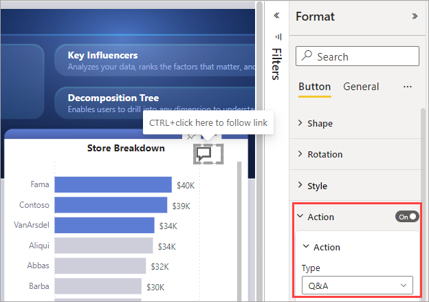
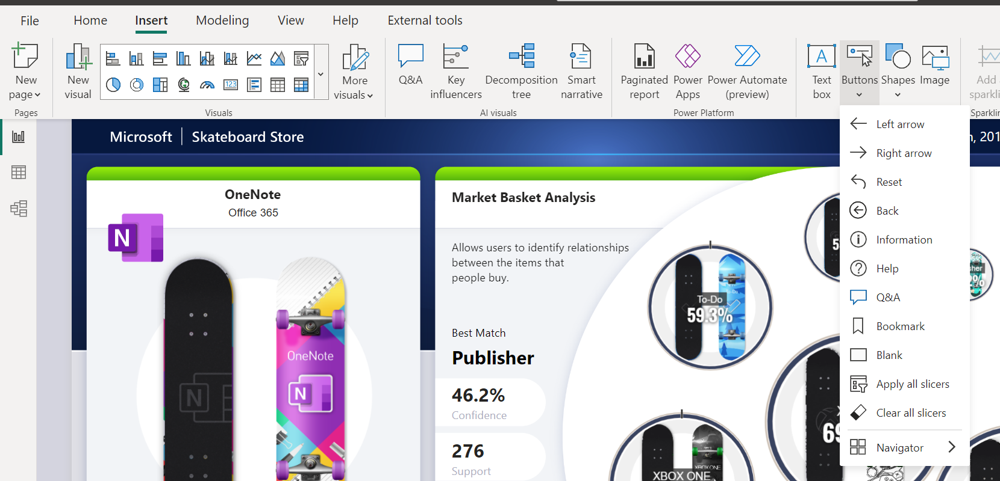
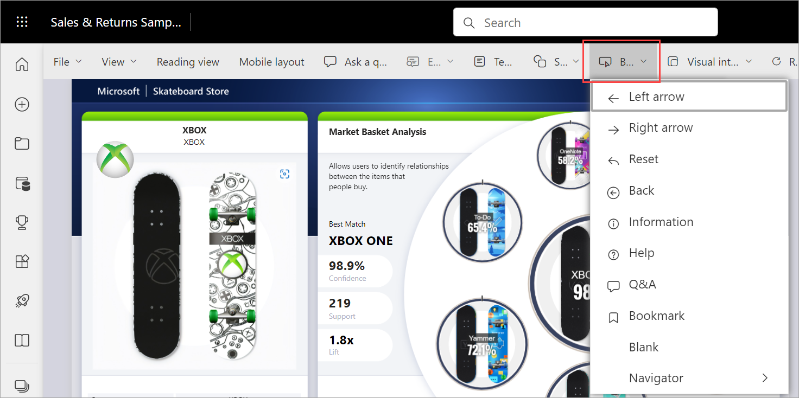
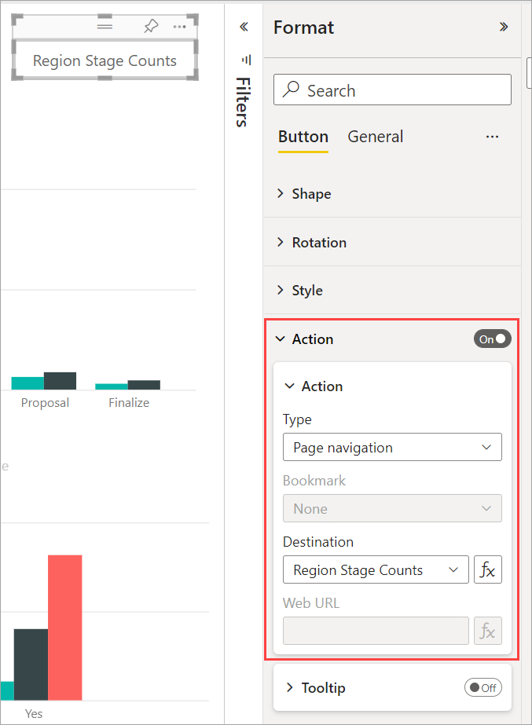

# Create buttons in Power BI reports

[!INCLUDE [applies-yes-desktop-yes-service](../includes/applies-yes-desktop-yes-service.md)]

With *buttons* in Power BI, you can create reports that behave similarly to apps, and create an environment where users can hover, click, and further interact with Power BI content. This article explains how to add buttons to reports in Power BI Desktop and in the Power BI service. When you share your reports in the Power BI service, buttons provide an app-like experience. The article [Identify and use buttons in the Power BI service](../consumer/end-user-buttons.md) describes how report readers experience buttons in your reports.

## Create buttons in reports

### [Power BI Desktop](#tab/powerbi-desktop)

In Power BI Desktop, on the **Insert** ribbon, select **Buttons** to reveal a drop-down menu, where you can select the button you want from a collection of options.

### [Power BI service](#tab/powerbi-service)

In the Power BI service, open the report in Editing view. Select **Buttons** in the top menu bar to reveal a drop-down menu, where you can select the button you want from a collection of options.

---

## Customize a button

Whether you create a button in Power BI Desktop or the Power BI service, the rest of the process is the same. When you select a button on the report canvas, the **Format** pane shows you the many ways you can customize the button to fit your requirements. For example, you can customize the shape of a button.

:::image type="content" source="media/desktop-buttons/power-bi-customize-shape-parallelogram.png" alt-text="Screenshot showing how to customize the shape of an arrow button to a parallelogram.":::

For more information, see [Customize buttons in Power BI reports](power-bi-customize-button.md).

## Button states

Buttons in Power BI have four possible states:

- **Default**: How buttons appear when not hovered over or selected.
- **On hover**: How buttons appear when hovered over.
- **On press**: How buttons appear when selected.
- **Disabled**: How buttons appear when they can't be selected.

You can modify many of the cards in the **Format** pane individually, based on these four states, which provides plenty of flexibility for customizing your buttons.

The following cards in the **Format** pane let you adjust formatting of a button for each of its four states:

- Shape
- Style
- Rotation (applies to all states automatically)

To select how a button should appear for each state:

1. In the **Format** pane, select the **Button** tab, and then expand the **Shape** or **Style** card.

1. Select **State** under **Apply settings to** at the top of the card, and then select the settings you want to use for that state.

   In the following image, you see the **Style** card and **Icon** expanded. The **State** is **On hover**, and the **Icon type** is **Right arrow**.

   

## Select the action for a button

You can select which action is taken when a user selects a button in Power BI.

Here are the options for button actions:

- **Back** returns the user to the previous page of the report. This action is useful for drillthrough pages.
- **Bookmark** presents the report page that's associated with a bookmark that is defined for the current report. Learn more about [bookmarks in Power BI](desktop-bookmarks.md).
- **Drillthrough** navigates the user to a drillthrough page filtered to their selection, without using bookmarks. Learn more about [drillthrough buttons in reports](desktop-drill-through-buttons.md).
- **Page navigation** navigates the user to a different page within the report, also without using bookmarks. See [Create page navigation](button-navigators.md) for details. 
- **Bookmark navigation** navigates the user to a different state in the report, either on the same or a different page, by using bookmarks. See [Create bookmark navigation](button-navigators.md#bookmark-navigator) for details.
- **Q&A** opens a **Q&A Explorer** window. When your report readers select a Q&A button, the Q&A Explorer opens, and they can ask natural-language questions about your data.
- **Apply all slicers** and **Clear all slicers** buttons apply all the slicers or clear all the slicers on a page. See [Create Apply all slicers and Clear all slicers buttons in reports](buttons-apply-all-clear-all-slicers.md) for details.
- **Web URL** opens a web page in a browser.

Certain buttons have a default action that's selected automatically. For example, the **Q&A** button type automatically selects **Q&A** as the default action.

> [!NOTE]
> An action can't have a numeric measure as the value of any of its fields.

To select a button action:

1. On the **Button** tab of the **Format** pane, turn the **Action** to **On**, and then expand the card.

1. Expand **Action**, and then select the **Type** of button action.

   

1. Test the buttons you create for your report by selecting <kbd>Ctrl</kbd> and the button.

## Create page navigation

With the **Type** of an **Action** set to **Page navigation**, you can create a button that links to another page in your report, without creating a bookmark.

> [!TIP]
> If you want to build an entire navigation experience for the report, without having to save or manage any bookmarks, [create page and bookmark navigators](button-navigators.md) instead of individual buttons.

To set up a single-page navigation button:

1. Create a button with **Page navigation** as the **Type** of its **Action**, and then select a page for the **Destination**.

   

1. Optionally, you can conditionally format the **Tooltip** under **Action** as you can do with other button types.

1. If you want a custom navigation pane, [create page and bookmark navigators](button-navigators.md) instead of individual buttons.

## Shapes and images for navigation

Page navigation action is also supported for shapes and images, not just buttons. Here’s an example using one of the built-in shapes:

:::image type="content" source="media/desktop-buttons/button-navigation-arrow.png" alt-text="Screenshot showing Use an arrow for navigation.":::

## Buttons support fill images

Power BI buttons support fill images. With fill images, you can customize the look and feel of your button, combined with the built-in button states: default, on hover, on press, and disabled (for drillthrough).

:::image type="content" source="media/desktop-drill-through-buttons/drill-through-fill-images.png" alt-text="Screenshot showing Drill-through button fill images.":::

Under **Style**, set **Fill** to **On**, and then **Browse** for an image for each style state.

:::image type="content" source="media/desktop-buttons/button-set-fill.png" alt-text="Screenshot showing Fill image settings.":::

## Next steps

For more information about features that are similar or interact with buttons, take a look at the following articles:

- [Create page and bookmark navigators](button-navigators.md)
- [Identify and use buttons in the Power BI service](../consumer/end-user-buttons.md)
- [Use drillthrough in Power BI reports](desktop-drillthrough.md)
- [Use bookmarks to share insights and build stories in Power BI](desktop-bookmarks.md)
- [Create a drillthrough button](desktop-drill-through-buttons.md)
