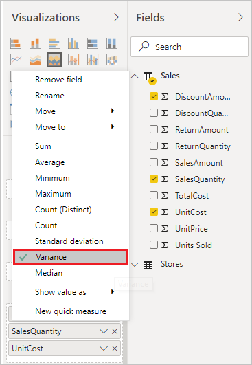

# Customize tooltips in Power BI

[!INCLUDE [applies-yes-desktop-yes-service](../includes/applies-yes-desktop-yes-service.md)]

Tooltips are an elegant way of providing contextual information and detail to data points on a visual. The following image shows a tooltip applied to a chart in Power BI Desktop. You can customize tooltips in Power BI Desktop and in the Power BI service.

When a visualization is created, the default tooltip displays the data point's value and category. There are many instances when customizing the tooltip information is useful. Customizing tooltips provides context and information for users viewing the visual. Custom tooltips enable you to specify more data points that display as part of the tooltip.

## How to customize tooltips

To create a customized tooltip, in the **Fields** well of the **Visualizations** pane, drag a field into the **Tooltips** bucket, shown in the following image. In the following image, three fields have been placed into the **Tooltips** bucket.

Once tooltips are added to **Tooltips**, hovering over a data point on the visualization shows the values for those fields.

## Customize tooltips with aggregation or quick measures

You can further customize a tooltip by selecting an aggregation function. Select the arrow beside the field in the **Tooltips** bucket. Then select from the available options.

In Power BI Desktop, you can also select a *quick measure*. Read about [creating quick measures](../transform-model/desktop-quick-measures.md) in Power BI Desktop.

There are many ways to customize tooltips, using any field available in your dataset, to convey quick information and insights to users viewing your dashboards or reports.

## Allow tooltips to auto-scale (preview)

You can change a report setting so that tooltips adjust their size automatically based on the canvas size.

### [Power BI Desktop](#tab/powerbi-desktop)

In Power BI Desktop, select **File** > **Options and settings** > **Options**.

Under **Current file**, select **Report settings**, and select **Tooltip size is affected by canvas size**.

:::image type="content" source="media/desktop-custom-tooltips/desktop-tooltip-auto-scale-setting.png" alt-text="Screenshot showing Tooltip size is affected by canvas size checkbox in Power BI Desktop.":::

### [Power BI service](#tab/powerbi-service)

In the Power BI service, select More options (...) next to a report > **Settings**.

In the **Settings** pane, select **Tooltip size is affected by canvas size**.

:::image type="content" source="media/desktop-custom-tooltips/service-tooltip-auto-scale-setting.png" alt-text="Screenshot showing Tooltip size is affected by canvas size checkbox in the Power BI service.":::

## Considerations and limitations

- Default tooltips aren't designed to contain large amounts of content, and their look and feel may change with Power BI updates. To have more control over the look and feel of the content in a tooltip, [create tooltips based on custom report pages](desktop-tooltips.md) instead.

## Next steps

[Create tooltips based on report pages](desktop-tooltips.md)
