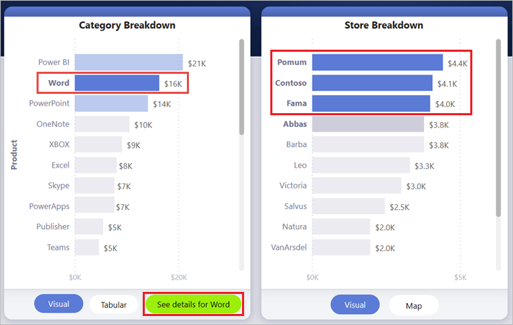
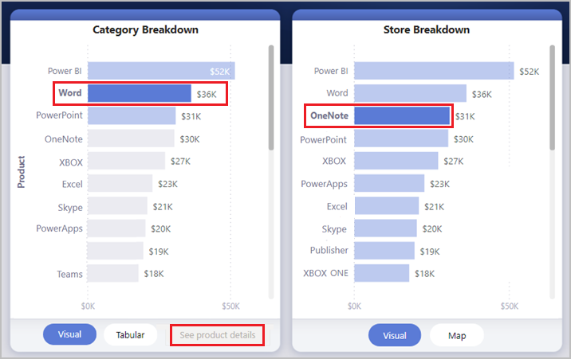
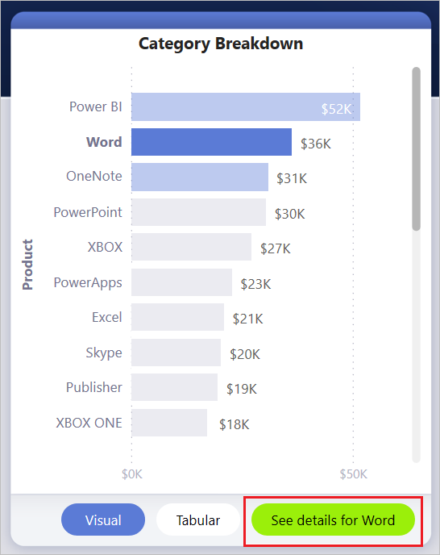
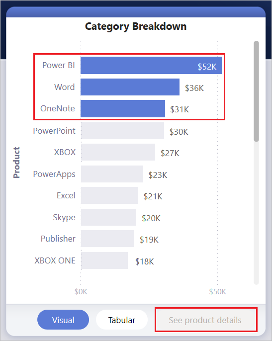

# Create a drillthrough button in Power BI

[!INCLUDE [applies-yes-desktop-yes-service](../includes/applies-yes-desktop-yes-service.md)]

You can create a *drillthrough* button in Power BI, a button that drills through to a page with details that are filtered to a specific context.

One way to drill through in a report is to right-click in a visual. However, if you want the drillthrough action to be more obvious, you can create a drillthrough button instead. A drillthrough button can increase the discoverability of important drillthrough scenarios in your reports and you can conditionally determine how the button looks and acts. For example, you can show different text on a button if certain conditions are met.

In this example, after you select the Word bar in the chart, the **See details** drillthrough button is enabled.


When you select the **See details** button, you drill through to the Market Basket Analysis page. As you can see from the visual on the left, the drillthrough page is now filtered for Word.


## Set up a drillthrough button

To set up a drillthrough button, you first need to [set up a valid drillthrough page](desktop-drillthrough.md) within your report. Then, you create a button with **Drill through** as the action type and select the drillthrough page as the **Destination**.

Because the drillthrough button has two states, enabled vs. disabled, you see two tooltip options.

:::image type="content" source="media/desktop-drill-through-buttons/power-bi-create-drill-through-button.png" alt-text="Screen shot showing how to set up a drillthrough button.":::

If you leave the tooltips boxes blank, Power BI automatically generates tooltips. Those tooltips are based on the destination and drillthrough field(s).

Here's an example of the autogenerated tooltip when the button is disabled:

"To drill through to Market Basket Analysis [the destination page], select a single data point from Product [the drillthrough field]."


And here's an example of the autogenerated tooltip when the button is enabled:

"Click to drill through to Market Basket Analysis [the destination page]."


However, if you'd like to provide custom tooltips, you can always input a static string. You can also apply [conditional formatting to tooltips](#set-formatting-for-tooltips-conditionally).

## Pass filter context

The button works like the regular drillthrough: You can pass filters on additional fields by cross-filtering the visuals that contain the drillthrough field. For example, using **Ctrl** + **click** and cross-filtering, you can pass multiple filters on Store to the drillthrough page because your selections cross-filter the visual that contains Product, the drillthrough field:



After you select the drillthrough button, you see filters on both Store and Product being passed through to the destination page:


### Ambiguous filter context

Since the drillthrough button isn't tied to a single visual, if your selection is ambiguous, then the button is disabled.

In this example, the button is disabled because two visuals both contain a single selection on Product. There's ambiguity about which data point from which visual to tie the drillthrough action to:



## Customize formatting for disabled buttons

You can customize the formatting options for the disabled state of drillthrough buttons.

:::image type="content" source="media/desktop-drill-through-buttons/drill-through-customize-disabled-button.png" alt-text="Screenshot showing customized disabled button formatting.":::

These formatting options include:

- **Button text controls**: text, font, size, color, alignment, and padding

    :::image type="content" source="media/desktop-drill-through-buttons/drill-through-disabled-button-text.png" alt-text="Screenshot showing a formatted disabled button text.":::

- **Button fill controls**: color, fill image, and transparency

    :::image type="content" source="media/desktop-drill-through-buttons/drill-through-disabled-button-fill.png" alt-text="Screenshot showing a formatted disabled button fill.":::

- **Button icon controls**: shape, line color, weight, transparency, alignment, and padding

    :::image type="content" source="media/desktop-drill-through-buttons/drill-through-disabled-button-icon.png" alt-text="Screenshot showing a formatted disabled button icon.":::

- **Button border controls**: color, width, transparency

     :::image type="content" source="media/desktop-drill-through-buttons/drill-through-disabled-button-border.png" alt-text="Screenshot showing formatted disabled button border.":::

## Set formatting for button text conditionally

You can use conditional formatting to change the button text based on the selected value of a field. To do so, create a measure in Power BI Desktop that outputs the desired string based on the DAX function SELECTEDVALUE.

Here's an example measure that outputs "See product details" if a single Product value is NOT selected; otherwise, it outputs "See details for [the selected Product]":

```dax
String_for_button = If(SELECTEDVALUE('Product'[Product], 0) == 0, "See product details", "See details for " & SELECTEDVALUE('Product'[Product]))
```

Once you've created this measure, you select the **Conditional formatting** option for the button text:

:::image type="content" source="media/desktop-drill-through-buttons/power-bi-button-conditional-tooltip.png" alt-text="Screenshot showing the Conditional formatting button for the button text highlighted.":::

Then, you select the measure you created for the button text:

:::image type="content" source="media/desktop-drill-through-buttons/power-bi-conditional-measure.png" alt-text="Screenshot showing the selected field for the button text.":::

When a single product is selected, the button text reads:

"See details for Word"



When either no products are selected, or more than one product is selected, the button is disabled. The button text reads:

"See product details"



## Set formatting for tooltips conditionally

You can conditionally format the tooltip for the drillthrough button when it's enabled or disabled. If you've used conditional formatting to dynamically set the drillthrough destination, you may want the tooltip for the button state to be more informative, based on your end user’s selection. Here are some examples:

- You can set the disabled state tooltip to be prescriptive on a case-by-case basis using a custom measure. For example, if you want the user to select a single product *and* a single store before they can drill through to the Market Analysis page, you can create a measure with the following logic:

    If the user hasn't selected either a single product or a single store, the measure returns: “Select a single product and Ctrl + click to also select a single store.”

    If the user has selected a single product, but not a single store, the measure returns: “Ctrl + click to also select a single store.”

- Similarly, you can set the enabled-state tooltip to be specific the user’s selection. For example, if you want the user to know which product and store the drillthrough page will be filtered to, you can create a measure that returns:

    “Click to drill through to [drillthrough page name] to see more details on sales for [product name] at [store name] stores.”

## Set the drillthrough destination conditionally

You can use conditional formatting to set the drillthrough destination based on the output of a measure.

Here are some scenarios where you might want the button drillthrough destination to be conditional:

- You only want to enable drillthrough to a page **when multiple conditions have been met**. Otherwise the button is disabled.

    For example, you want users to select a single product *and* a single store before they can drill through to the Market details page. Otherwise the button is disabled.

    :::image type="content" source="media/desktop-drill-through-buttons/drill-through-select-product-store.png" alt-text="Screenshot showing the product and store selected.":::

- You want the button **to support multiple drillthrough destinations** based on user selections.

    For example, say you have multiple destinations (Market details and Store details) that users can drill through to. You can have them select a specific destination to drill through to before the button becomes enabled for that drillthrough destination.

    :::image type="content" source="media/desktop-drill-through-buttons/drill-through-select-product-destination.png" alt-text="Screenshot showing the product and destination selected.":::

- You may also have interesting **cases for a hybrid scenario** to support both multiple drillthrough destinations and specific conditions where you want the button to be disabled. Read on for details about these three options.

### Disable the button until multiple conditions are met

Let's look at the first case, where you want to keep the button disabled until additional conditions are met. You need to create a basic DAX measure in Power BI Desktop that outputs an empty string (“”) unless the condition has been met. When it's met, it then outputs the name of the drillthrough destination page.

Here’s an example DAX measure that requires a Store to be selected before the user can drill through on a Product to Store details page:

```dax
Destination logic = If(SELECTEDVALUE(Store[Store], “”)==””, “”, “Store details”)
```

When you've created the measure, you select the Conditional formatting (fx) button next to **Destination** for the button:

:::image type="content" source="media/desktop-drill-through-buttons/drill-through-select-formula.png" alt-text="Screenshot showing the conditional formatting button highlighted.":::

For the last step, you select the DAX measure you created as the field value for the destination:

:::image type="content" source="media/desktop-drill-through-buttons/drill-through-based-formula.png" alt-text="Screenshot showing the Destination with a field selected.":::

Now you see the button is disabled even when a single product is selected, because the measure also requires you to select a single store:

:::image type="content" source="media/desktop-drill-through-buttons/drill-through-button-disabled.png" alt-text="Screenshot showing the drillthrough button disabled.":::

### Support multiple destinations

For the other common case where you want to support multiple destinations, you start by creating a single-column table with the names of the drillthrough destinations:

:::image type="content" source="media/desktop-drill-through-buttons/drill-through-create-table.png" alt-text="Screenshot showing the Create a table window.":::

Power BI uses exact string match to set the drillthrough destination, so double-check that the entered values exactly align with your drillthrough page names.

After you've created the table, add it to the page as a single-select slicer:

:::image type="content" source="media/desktop-drill-through-buttons/drill-through-slicer.png" alt-text="Screenshot showing a drillthrough slicer.":::

If you need more vertical space, convert the slicer to a dropdown. Remove the slicer header and add a text box with the title next to it:

:::image type="content" source="media/desktop-drill-through-buttons/drill-through-drop-down-slicer.png" alt-text="Screenshot showing a drillthrough slicer with no header.":::

Alternatively, change the list slicer from vertical to horizontal orientation:

:::image type="content" source="media/desktop-drill-through-buttons/drill-through-horizontal-slicer.png" alt-text="Screenshot showing a horizontal slicer.":::

For the destination input for the drillthrough action, select the conditional formatting (fx) button next to **Destination** for the button:

:::image type="content" source="media/desktop-drill-through-buttons/drill-through-select-formula.png" alt-text="Screenshot showing the Conditional formatting button for the drillthrough destination highlighted.":::

Select the name of the column you created, in this case, **Select a destination**:

:::image type="content" source="media/desktop-drill-through-buttons/drill-through-select-destination.png" alt-text="Screenshot showing the Select a destination field selected.":::

Now you see that the drillthrough button is only enabled when you've selected a product *and* a destination:

:::image type="content" source="media/desktop-drill-through-buttons/drill-through-select-product-destination.png" alt-text="Screenshot showing the product and destination selected.":::

### Hybrid of the two scenarios

If you're interested in a hybrid of the two scenarios, you can create and reference a DAX measure in Power BI Desktop to add additional logic for the destination selection.

Here’s an example DAX measure that requires the user to select a Store before they can drill through on a Product to any of drillthrough pages:

```dax
Destination logic = If(SELECTEDVALUE(Store[Store], “”)==””, “”, SELECTEDVALUE(‘Table'[Select a destination]))
```

Then you select the DAX measure you created as the field value for the destination.
In this example, the user would need to select a Product, a Store, *and* a destination page before the drillthrough button is enabled:

:::image type="content" source="media/desktop-drill-through-buttons/drill-through-product-store-destination.png" alt-text="Screenshot showing the product, store, and destination selected.":::

## Considerations and limitations

- This button doesn't allow for multiple destinations using a single button.
- This button only supports drillthroughs within the same report; in other words, it doesn't support cross-report drillthrough.
- The disabled state formatting for the button is tied to the color classes in your report theme. Learn more about [color classes](desktop-report-themes.md#setting-structural-colors).
- The drillthrough action works for all built-in visuals, and works with *some* visuals imported from AppSource. However, it isn't guaranteed to work with *all* visuals imported from AppSource.

## Next steps

For more information about features that are similar or interact with buttons, take a look at the following articles:

- [Create buttons](desktop-buttons.md)
- [Use drillthrough in Power BI reports](desktop-drillthrough.md)
- [Use bookmarks to share insights and build stories in Power BI](desktop-bookmarks.md)
