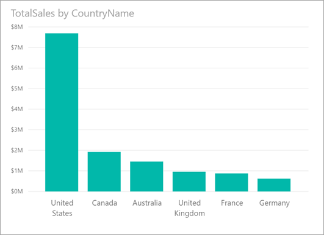
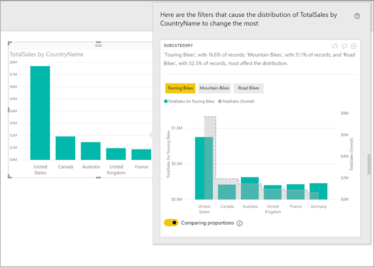
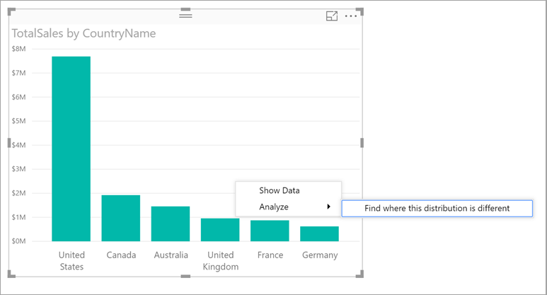

# Apply insights in Power BI Desktop to discover where distributions vary (preview)

Often in visuals, you see a data point, and wonder about whether distribution would be the same for different categories. With **insights** in **Power BI Desktop** you can find out with just a few clicks.

Consider the following visual, which shows *Total Sales* by *Country*. As the chart shows, most sales come from the United States, accounting for 57% of all sales with lessor contributions coming from the other countries. It's often interesting in such cases to explore whether that same distribution would be seen for different sub-populations. For example, is this the same for all years, all sales channels, and all categories of products?  While you could apply different filters and compare the results visually, doing so can be time consuming and error prone. 



You can tell **Power BI Desktop** to find where a distribution is different, and get fast, automated, insightful analysis about your data. Simply right-click on a data point, and select **Analyze > Find where the distribution is different**, and insight is delivered to you in an easy-to-use window.



In this example, the automated analysis quickly shows that for *Touring Bikes*, the  proportion of sales in the United States and Canada are lower, while the proportion coming from the other countries is higher.   

> [!NOTE]
> This feature is in preview, and is subject to change. The insight feature is enabled and on by default (you don't need to check a Preview box to enable it) beginning with the September 2017 version of **Power BI Desktop**.
> 
> 

## Using insights
To use insights to find where distributions seen on charts are different, just right-click on any data point (or on the visual as a whole), and select **Analyze > Find where the distribution is different**.



**Power BI Desktop** then runs its machine learning algorithms over the data, and populates a window with a visual and a description that describes which categories (columns), and which values of those columns, result in the most significantly different distribution. Insights are provided as a column chart, as shown in the following image. 


The values with the selected filter applied are shown using the normal default color. The overall values, as seen on the original starting visual, are shown in grey for easy comparison. Up to three different filters might be included (*Touring Bikes*, *Mountain Bikes*, *Road Bikes* in this example) and different filters can be chosen by clicking on them (or using ctrl-click to select multiple).

For simple additive measures, like *Total Sales* in this example, the comparison is based on the relative, rather than absolute, values. Hence while the sales for Touring Bikes are lower than overall sales for all categories, by default the visual uses a dual axis to allow the comparison between the proportion of sales across different countries, for Touring Bikes versus all categories of bikes.  Switching the toggle below the visual allows the two values to be displayed in the same axis, allowing the absolute values to easily be compared (as shown in the following image).    


The descriptive text also gives some indication of the level of importance that might be attached to a filter value, by given the number of records that match the filter. So in this example, you can see that while the distribution for *Touring Bikes* might be significantly different, they account for only 16.6% of records.

The *thumbs up* and *thumbs down* icons at the top of the page are provided so you can provide feedback about the visual and the feature. Doing so provides feedback, but it does not currently train the algorithm to influence the results returned next time you use the feature.

And importantly, the **+** button at the top of the visual lets you add the selected visual to your report, just as if you created the visual manually. You can then format or otherwise adjust the added visual just as you would to any other visual on your report. You can only add a selected insight visual when you're editing a report in **Power BI Desktop**.

You can use insights when your report is in reading or editing mode, making it versatile for both analyzing data, and for creating visuals you can easily add to your reports.

## Details of the returned results
You can think of the algorithm as taking all the other columns in the model, and for all of the values of those columns, applying them as filters to the original visual, and finding which of those filter values produces the most *different* result from the original.

You likely wonder what *different* means. For example, say that the overall split of sales between the USA and Canada was the following:

|Country  |Sales ($M)|
|---------|----------|
|USA      |15        |
|Canada   |5         |

Then for a particular category of product *“Road Bike*) the split of sales might be:

|Country  |Sales ($M)|
|---------|----------|
|USA      |3        |
|Canada   |1         |

While the numbers are different in each of those tables, the relative values between USA and Canada are identical (75% and 25% overall, and for Road Bikes). Because of that, these are not considered different. For simple additive measures like this, the algorithm is therefore looking for differences in the *relative* value.  

By contrast consider a measure like margin, that is calculated as Profit/Cost, and say that the overall margins for the USA and Canada were the following

|Country  |Margin (%)|
|---------|----------|
|USA      |15        |
|Canada   |5         |

Then for a particular category of product *“Road Bike*) the split of sales might be:

|Country  |Margin (%)|
|---------|----------|
|USA      |3        |
|Canada   |1         |

Given the nature of such measures, this *is* considered interestingly different. So for non-additive measures such as this margin example, the algorithm is looking for differences in the absolute value.

The visuals displayed are thus intended to clearly show the differences found between the overall distribution (as seen in the original visual) and the value with the particular filter applied.  

So for additive measures, like *Sales* in the previous example, a column and line chart is used, where the use of a dual axis with appropriate scaling such that the relative values can easily be compared. The columns show the value with the filter applied, and the line shows the overall value (with the column axis being on the left, and the line axis on the right, as normal). The line is shown using a *stepped* style, with a dashed line, filled with grey. For the previous example, if the column axis maximum value is 4, and the line axis maximum value is 20, then it would allow easy comparison of the relative values between USA and Canada for the filtered and overall values. 

Similarly, for non-additive measures like *Margin* in the previous example, a column and line chart is used, where the use of a single axis means the absolute values can easily be compared. Again the line (filled with grey) shows the overall value. Whether comparing actual or relative numbers, the determination of the degree to which two distributions are different is not simply a matter of calculating the difference in the values. For example:

* The size of the population is factored in, as a difference is less statistically significant and less interesting when it applies to a smaller proportion of the overall population. As an example, the distribution of sales across countries might be very different for some particular product, this would not be considered interesting if there were thousands of products, and hence that particular product accounted for only a small percentage of the overall sales.

* Differences for those categories where the original values were very high or very close to zero are weighted higher than others. For example, if a country overall contributes only 1% of sales, but for some particular type of product contributes 6%, that is more statistically significant, and therefore considered more interesting, than a country whose contribution changed from 50% to 55%. 

* Various heuristics are employed to select the most meaningful results, for example by considering other relationships between the data.
     
After examining different columns, and the values for each of those columns, the set of values that give the biggest differences are chosen. For ease of understanding, these are then output grouped by column, with the column whose values give the biggest difference listed first. Up to three values are shown per column, but less might be shown either if there were fewer than three values that have a large effect, or if some values are much more impactful than others. 

It is not necessarily the case that all of the columns in the model will be examined in the time available, so it is not guaranteed that the most impactful columns and values are displayed. However, various heuristics are employed to ensure that the most likely columns are examined first. For example, say that after examining all the columns, it is determined that the following columns/values have the biggest impact on the distribution, from most impact to least:

```console
Subcategory = Touring Bikes
Channel = Direct
Subcategory = Mountain Bikes
Subcategory = Road Bikes
Subcategory = Kids Bikes
Channel = Store
```

These would get output in column order, as follows:

* Subcategory: Touring Bikes, Mountain Bikes, Road Bikes (only three listed, with the text including “...amongst others” to indicate that more than three have a significant impact) 

* Channel = Direct (only Direct listed, if it’s level of impact was much greater than Store)

## Considerations and limitations
The following list is the collection of currently unsupported scenarios for **insights**:

* TopN filters
* Measure filters
* Non-numeric measures
* Use of "Show value as"
* Filtered measures - filtered measures are visual level calculations with a specific filter applied (for example, *Total Sales for France*), and are used on some of the visuals created by the insights feature

In addition, the following model types and data sources are currently not supported for insights:

* DirectQuery
* Live connect
* On-premises Reporting Services
* Embedding

## Next steps
For more information about **Power BI Desktop**, and how to get started, check out the following articles.

* [What is Power BI Desktop?](../fundamentals/desktop-what-is-desktop.md)
* [Query Overview with Power BI Desktop](../transform-model/desktop-query-overview.md)
* [Data Sources in Power BI Desktop](../connect-data/desktop-data-sources.md)
* [Connect to Data in Power BI Desktop](../connect-data/desktop-connect-to-data.md)
* [Shape and Combine Data with Power BI Desktop](../connect-data/desktop-shape-and-combine-data.md)
* [Common Query Tasks in Power BI Desktop](../transform-model/desktop-common-query-tasks.md)   
