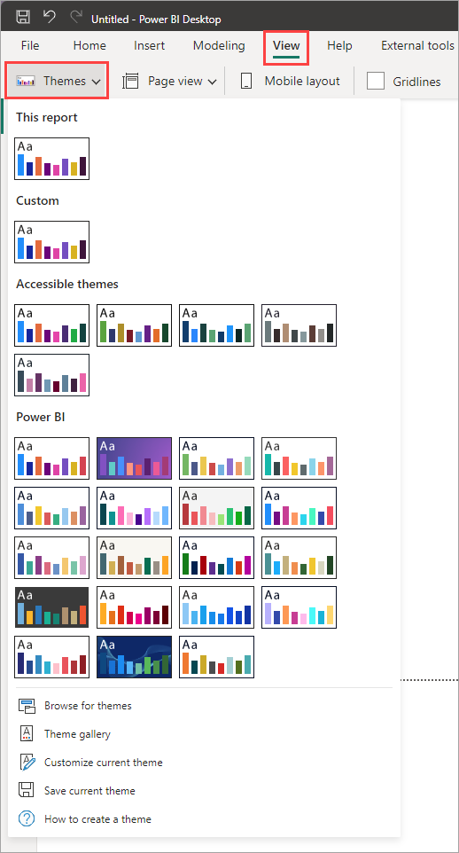
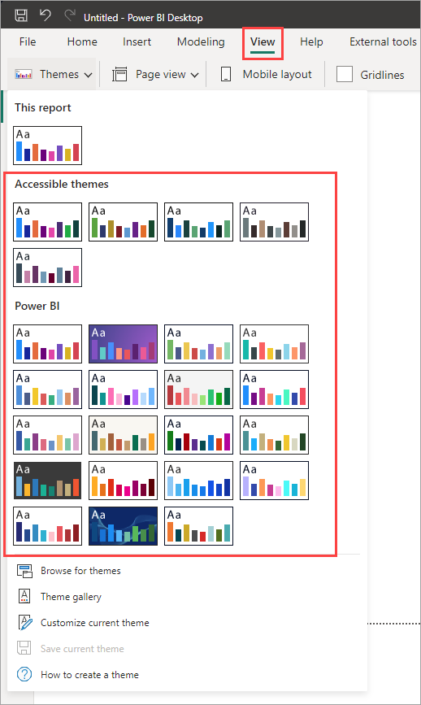
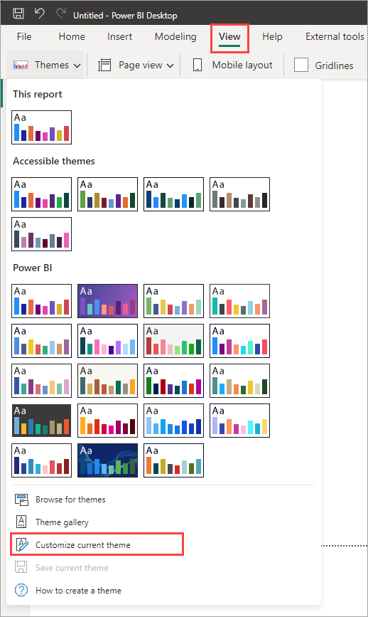
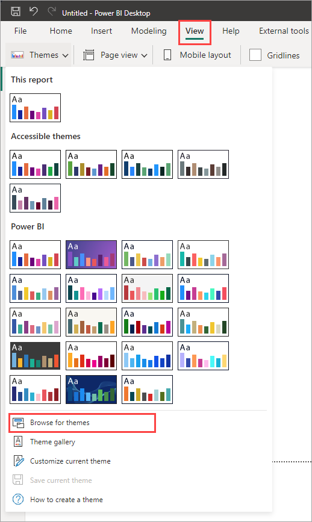
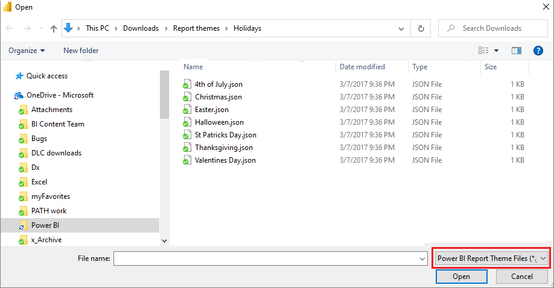
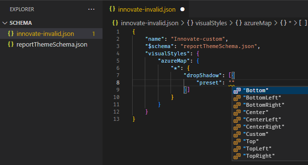

# Use report themes in Power BI Desktop

[!INCLUDE [applies-yes-desktop-no-service](../includes/applies-yes-desktop-no-service.md)]

With Power BI Desktop *report themes*, you can apply design changes to your entire report, such as using corporate colors, changing icon sets, or applying new default visual formatting. When you apply a report theme, all visuals in your report use the colors and formatting from your selected theme as their defaults. A few exceptions are described later in this article.

You can select report themes by going to the **View** ribbon. In the **Themes** section, select the dropdown arrow, and then select the theme you want. Available themes are similar to themes seen in other Microsoft products, such as Microsoft PowerPoint.



The two types of report themes:

- **Built-in** report themes provide different kinds of predefined color schemes. You select built-in report themes directly from the Power BI Desktop menu.

- **Custom** report themes provide granular control over many aspects of a report theme, as described in [Customize report themes](#customize-report-themes) later in this article. You can create custom report themes by adjusting a current theme then saving it as a custom theme or by creating your own custom theme by using a JSON file.

## Ways to apply a report theme

To apply a report theme to a Power BI Desktop report, you can select from the following options:

* Select from the [available built-in report themes](#built-in-report-themes) that are built into Power BI Desktop.
* [Customize a theme](#customize-and-save-a-theme-in-power-bi-desktop) by using the **Customize theme** dialog.
* [Import a custom theme JSON file](#import-custom-report-theme-files).

> [!NOTE]
> You can only apply themes in Power BI Desktop. You can't apply themes to existing reports within the Power BI service.

### Apply a built-in report theme

Follow these steps to select from the available built-in report themes. See the [Built-in report themes](#built-in-report-themes) table for the default color sequence for each theme.

1. On the **View** ribbon, select the dropdown arrow next to **Themes** .

2. Select from among the themes on the dropdown menu that appears, including the new **Accessible themes**.

   

   Your report theme is now applied to the report.

3. You can also browse the collection of themes created by members of the Power BI Community, by selecting **Theme gallery** from the Themes dropdown menu.

   

    From the gallery, you can select a theme and download its associated JSON file.

    To install the downloaded file, select **Browse for themes** from the **Themes** dropdown menu, go to the location where you downloaded the JSON file, and select it to import the theme into Power BI Desktop as a new theme.

    When successful, Power BI shows a dialog that the import was successful.

   

### Built-in report themes

The following table shows the available built-in report themes.
    
| Built-in report theme | Default color sequence |
|------ |---------- |
| Default | |
| Highrise | |
| Executive | |
| Frontier| |
| Innovate | |
| Bloom | |
| Tidal| |
| Temperature | |
| Solar| |
| Divergent | |
| Storm | |
| Classic | |
| City park | |
| Classroom | |
| Color-blind safe | |
| Electric | |
| High contrast | |
| Sunset | |
| Twilight | |
| Accessible default | :::image type="content" source="media/desktop-report-themes/accessible-theme-default.png" alt-text="Diagram of the color sequence for the Accessible default theme."::: |
| Accessible city park |:::image type="content" source="media/desktop-report-themes/accessible-theme-city-park.png" alt-text="Diagram of the color sequence for the Accessible city park theme."::: |
| Accessible tidal | :::image type="content" source="media/desktop-report-themes/accessible-theme-tidal.png" alt-text="Diagram of the color sequence for the Accessible tidal theme.":::|
| Accessible neutral | :::image type="content" source="media/desktop-report-themes/accessible-theme-neutral.png" alt-text="Diagram of the color sequence for the Accessible neutral theme."::: |
| Accessible orchid |:::image type="content" source="media/desktop-report-themes/accessible-theme-orchid.png" alt-text="Diagram of the color sequence for the Accessible orchid theme."::: |


## Customize report themes

You can customize and standardize most of the elements listed in the **Format** section of the **Visualizations** pane, either through customizations made directly in Power BI Desktop or through a report theme JSON file. The goal is to give you full control over your report's default look and feel on a granular level.

You can customize report themes in the following ways:

- Customize and save a [theme in Power BI Desktop](#customize-and-save-a-theme-in-power-bi-desktop)
- Create and customize a [custom report theme JSON file](#report-theme-json-file-format)

### Customize and save a theme in Power BI Desktop

To customize a theme directly in Power BI Desktop, you can select a theme that's close to what you like and make a few adjustments. First select the theme that's close and take the following steps:

1. From the **View** ribbon, select the **Themes** dropdown button and select **Customize current theme**.

   

2. A dialog appears where you can make changes to the current theme, and then you can save your settings as a new theme.

   

You can find customizable theme settings in the following categories, reflected in the **Customize theme** window:

- **Name and colors**: Theme name and color settings include [theme colors](#how-report-theme-colors-stick-with-your-reports), sentiment colors, divergent colors, and [structural colors (Advanced)](#set-structural-colors).
- **Text**: Text settings include font family, size, and color, which sets [the primary text class defaults](#set-formatted-text-defaults) for labels, titles, cards and KPIs, and tab headers.
- **Visuals**: Visual settings include background, border, header, and tooltips.
- **Page**: Page element settings include wallpaper and background.
- **Filter pane**: Filter pane settings include background color, transparency, font and icon color, size, and filter cards.

After you make your changes, select **Apply and save** to save your theme. Your can now use the theme in the current report and export it.

Customizing the current theme in this way is fast and simple. However, you can also make finer adjustments to themes, which require modifying the theme's [JSON file](#report-theme-json-file-format).

> [!TIP]
> You can customize the most common report theme options by using the controls in the **Customize theme** dialog. For more control, you can export a theme's JSON file and make fine-tuned adjustments by manually modifying the settings in that file. You can rename that JSON file and later import it.

### Update the base theme

Power BI makes changes to themes, including new defaults for formatting settings, as a part of a new base theme. So as not to disturb existing reports, these changes don’t propagate to custom themes. If you've customized a built-in theme, you may not see fixes to issues or updates to your reports without updating your base themes. 

To see if you're using an outdated theme, on the **View** ribbon, select the **Themes** dropdown button and select **Customize current theme**. If your theme is out of date, you’ll see a banner at the top of your theme, encouraging you to update to the latest base theme. 

Select **Update theme** to see the changes, then select **Apply**.

:::image type="content" source="media/desktop-report-themes/update-theme.png" alt-text="Screenshot showing the Update theme option.":::

### Import custom report theme files

You can also import a custom report theme file by following these steps:

1. On the **View** ribbon, select the **Themes** dropdown button > **Browse for themes**.

   

   A window appears that you can use to go to the JSON theme file.

2. In the following image, you can see holiday theme files. See the sample selection of a holiday theme for March, *St Patricks Day.json*.

   

   When the theme file has loaded successfully, Power BI Desktop displays a success message.

   

See the [Example report theme JSON file](#example-report-theme-json-file) section in this article to continue exploring the St Patricks Day.json file.

## How report theme colors stick with your reports

When you publish your report to the Power BI service, your report theme colors stay with it. The **Colors** section of the **Format** pane reflects your report theme.

To view the available colors in a report theme:

1. Select the report canvas or one of the visuals on the canvas.

2. From the **Format** section of the **Visualization** pane, select **Color**.

    The **Theme colors** palette of the report theme opens.

   

In the example, after you apply the multitude of green and brown colors from the St. Patrick's Day report theme, you can view the theme colors. The colors are part of the imported and applied report theme.

The colors in the color palette are relative to the current theme. For example, suppose you select the third color of the top row for a data point. Later, if you change to a different theme, that data point's color updates automatically to the third color of the top row in the new theme, just as you'd see when changing themes in Microsoft Office.

Setting a report theme changes the default colors used in visuals throughout the report. Power BI maintains a list consisting of hundreds of colors to ensure visuals have plenty of unique colors to display in a report. When Power BI assigns colors to a visual's series, colors are selected as series colors are assigned. When you import a theme, the mapping of colors for data series is reset.

### Dynamic series

Power BI tracks the color for a dynamic series and uses the same color for the value in other visuals. In a *dynamic series*, the number of series presented in visuals may change based on measures, values, or other aspects. For example, if you show *Profit by Region* in a report, you might have five sales regions, or you might have nine. The number of regions is dynamic, so it's considered a dynamic series.

### Static series

Conversely, for *static series*, the number of series is known. For example, *Profit* and *Revenue* revenue are static series. In static series, Power BI assigns colors by index within the theme palettes. You can override the default color assignment by selecting a color from the formatting pane under **Data colors**. You might have to change your slicer selections to see all potential series values and set their colors as well. If you explicitly set a color as a single visual by using the **Properties** pane, the imported theme does not apply to any of those explicitly defined colors.

To undo the explicit color application and allow the theme to apply to those explicitly selected colors, use **Revert to default** in the **Data Colors** section of the visual to which the color has been explicitly set.

### Situations when report theme colors won't stick to your reports

Suppose you apply a custom color set or individual color to a data point in a visual by using the **Custom color** option in the color picker. When you apply a report theme, it doesn't override that customized data point color.

Or, suppose you want to set the color of a data point by using the **Theme colors** section. When you apply a new report theme, those colors aren't updated. To get your default colors back so that they'll update when you apply a new report theme, select **Reset to default**, or select a color from the **Theme colors** palette in the color picker.


Many Power BI visuals don't apply to report themes.

## Custom report theme files you can use right now

Want to get started with report themes? See the custom report themes in the [themes gallery](https://community.powerbi.com/t5/Themes-Gallery/bd-p/ThemesGallery) or the following ready-made custom report theme JSON files, which you can download and import into your Power BI Desktop report:

- [Waveform theme](https://community.powerbi.com/t5/Themes-Gallery/Waveform/m-p/140536). This report theme was introduced in the [blog post](https://powerbi.microsoft.com/blog/power-bi-desktop-march-feature-summary/) that announced the first release of report themes. [Download Waveform.json](https://go.microsoft.com/fwlink/?linkid=843924).

  

- [Color-blind friendly theme](https://community.powerbi.com/t5/Themes-Gallery/Color-Blind-Friendly/m-p/140597).
This report theme is easier to read for the visually impaired. [Download ColorblindSafe-Longer.json](https://go.microsoft.com/fwlink/?linkid=843923).

  

- Valentine's Day theme.

  

  Here's the code for the Valentine's Day JSON file:

   ```json
       {
           "name": "Valentine's Day",
           "dataColors": ["#990011", "#cc1144", "#ee7799", "#eebbcc", "#cc4477", "#cc5555", "#882222", "#A30E33"],
           "background":"#FFFFFF",
           "foreground": "#ee7799",
           "tableAccent": "#990011"
       }
   ```

Here are a few more report themes you can use as starting points:

- [Sunflower-twilight](https://community.powerbi.com/t5/Themes-Gallery/Sunflower-Twilight/m-p/140749)
- [Plum](https://community.powerbi.com/t5/Themes-Gallery/Plum/m-p/140711)
- [Autumn](https://community.powerbi.com/t5/Themes-Gallery/Autumn/m-p/140746)
- [High contrast](https://community.powerbi.com/t5/Themes-Gallery/Color-Blind-Friendly/m-p/140597)

Report themes can make your Power BI Desktop reports a colorful reflection of you, your organization, or even the current season or holiday.

### More sources of report themes

The following GitHub repository has sample JSON for all the different components in the JSON themes file: [Power BI Theme Templates](https://github.com/mattrudy/PowerBI-ThemeTemplates/blob/master/README.md).

In addition, try searching for ["Power BI theme generator"](https://www.bing.com/search?q=power+bi+theme+generator) on Bing.

## Export report themes

You can export the currently applied report theme directly from Power BI Desktop to a JSON file. After you export a report theme, you can then reuse it in other reports. This option lets you export the JSON file for most of the built-in themes. The only exceptions are the base themes, Classic and Default, which other themes build upon when imported.

To export the currently applied theme from Power BI Desktop:

1. Select **View** and select the **Themes** dropdown menu.

   

2. Near the bottom of the dropdown menu, select **Save current theme**.

4. From the **Save As** dialog box, go to a directory in which to save the JSON file, and then select **Save**.

## Report theme JSON file format

At its most basic level, the theme JSON file has only one required line: `name`.

```json
{
    "name": "Custom Theme"
}
```

Other than `name`, everything else is optional, which means you're free to only add the properties you specifically want to format to the theme file. You can continue to use Power BI's defaults for the rest.

In a report theme JSON file, you define only the formatting that you want to change. Settings you don't specify in the JSON file revert to the Power BI Desktop default settings.

When you create a JSON file, you can specify that all charts use a font size of 12, that certain visuals use a particular font family, or that data labels are turned off for specific chart types. By using a JSON file, you can create a report theme file that standardizes your charts and reports, making it easy for your organization's reports to be consistent.

When you import your theme file, Power BI validates it to make sure it can successfully read its full contents. If Power BI finds fields it doesn’t understand, it shows you a message letting you know that the theme file is invalid, and inviting you to reimport with a corrected theme file. Power BI also publishes the schema it uses to check your theme file in a public location, updating it automatically whenever we change it in Power BI, so that you can ensure your theme files are always current.

Power BI validates custom themes based on a _JSON schema_.  This [JSON schema is available for download](https://github.com/microsoft/powerbi-desktop-samples/tree/main/Report%20Theme%20JSON%20Schema) for use with an IDE that supports JSON validation, which can help identify available formatting options and highlight invalid theme formatting. More information is available in the [Report Theme JSON Schema repository](https://github.com/microsoft/powerbi-desktop-samples/tree/main/Report%20Theme%20JSON%20Schema).

> [!NOTE]
> Modifying a custom JSON report theme in the [**Customize theme** dialog box](#customize-and-save-a-theme-in-power-bi-desktop) is safe.  The dialog doesn't modify theme settings that it can't control and updates the changes made to the report theme that's in place.

A theme file has four main components:

- [Theme colors](#set-theme-colors)
- [Structural colors](#set-structural-colors)
- [Text classes](#set-formatted-text-defaults)
- [Visual styles](#set-visual-property-defaults-visualstyles)  

The following sections describe each in detail.

### Set theme colors

Under `name`, you can add the following basic data color-related properties:

- `dataColors`: These hexadecimal codes determine the color of shapes that represent data in Power BI Desktop visuals. This list can have as many colors as you want. After all colors from this list have been used, if the visual still needs more colors, it rotates the theme color palette slightly with saturation/hue adjustment and cycle over and over to generate unique colors without repetition.
- `good`, `neutral`, `bad`: These properties set the status colors used by the waterfall chart and the KPI visual.
- `maximum`, `center`, `minimum`, `null`: These colors set the various gradient colors in the conditional formatting dialog box.

A basic theme that defines these colors might appear as follows:

```json
{
    "name": "Custom Theme",
    "dataColors": [
        "#118DFF",
        "#12239E",
        "#E66C37",
        "#6B007B",
        "#E044A7",
        "#744EC2",
        "#D9B300",
        "#D64550",
        "#197278",
        "#1AAB40"
    ],
    "good": "#1AAB40",
    "neutral": "#D9B300",
    "bad": "#D64554",
    "maximum": "#118DFF",
    "center": "#D9B300",
    "minimum": "#DEEFFF",
    "null": "#FF7F48"
}
```

### Set structural colors

Next, you can add various color classes, such as `background` and `firstLevelElements`. These color classes set the structural colors for elements in the report, such as axis gridlines, highlight colors, and background colors for visual elements.

The following table shows the six color classes you can format.  The **Color class** names correspond to the names in the "Advanced" subsection of the "Name and Colors" section in the [**Customize theme** dialog box](#customize-and-save-a-theme-in-power-bi-desktop).

| Color class preferred name | Also called  | What it formats |
|---|---|---|
| **firstLevelElements** | **foreground** | Label background color (when outside data points) <br> Trend line color <br>  Textbox default color <br> Table and matrix values and totals font colors <br> Data bars axis color <br> Card data labels <br> Gauge callout value color <br> KPI goal color <br>  KPI text color <br> Slicer item color (when in focus mode)  <br> Slicer dropdown item font color <br> Slicer numeric input font color <br> Slicer header font color <br> Scatter chart ratio line color <br> Line chart forecast line color <br> Map leader line color <br> Filter pane and card text color <br> Modern visual tooltips text and icon color (Preview)|
| **secondLevelElements** |**foregroundNeutralSecondary**| Light [secondary text classes](#set-formatted-text-defaults) <br> Label colors  <br> Legend label color <br> Axis label color <br> Table and matrix header font color <br> Gauge target and target leader line color <br>  KPI trend axis color <br> Slicer slider color <br> Slicer item font color <br> Slicer outline color <br> Line chart hover color <br> Multi-row card title color <br> Ribbon chart stroke color <br> Shape map border color <br> Button text font color <br> Button icon line color <br> Button outline color |
| **thirdLevelElements** |**backgroundLight** | Axis gridline color <br> Table and matrix grid color <br> Slicer header background color (when in focus mode)  <br> Multi-row card outline color  <br> Shape fill color <br> Gauge arc background color <br> Applied filter card background color <br> Disabled button fill color (when the background is `FFFFFF`)  <br> Disabled button outline color (when the background is `FFFFFF`) <br> |
| **fourthLevelElements** | **foregroundNeutralTertiary** | Legend dimmed color <br> Card category label color <br> Multi-row card category labels color <br> Mulit-row card bar color <br> Funnel chart conversion rate stroke color <br> Disabled button text font color <br> Disabled button icon line color <br> |
| **background** | | Label background color (when inside data points) <br> Slicer dropdown items background color  <br> Donut chart stroke color <br> Treemap stroke color <br> Combo chart background color <br> Button fill color <br> Filter pane and available  filter card background color <br> Modern visual tooltips background color (Preview)|
| **secondaryBackground** | **backgroundNeutral** | Table and matrix grid outline color <br> Shape map default color <br> Ribbon chart ribbon fill color (when match series option is turned off) <br> Disabled button fill color (when the background color isn't `FFFFFF`). <br> Disabled button outline color (when the background color isn't `FFFFFF`). <br> Modern visual tooltips separator line and hover color (Preview)|
| **tableAccent** | | Table and matrix grid outline color (when present). |

Here's a sample theme that sets the color classes:

```json
{
    "name": "Custom Theme",
    "firstLevelElements": "#252423",
    "secondLevelElements": "#605E5C",
    "thirdLevelElements": "#F3F2F1",
    "fourthLevelElements": "#B3B0AD",
    "background": "#FFFFFF",
    "secondaryBackground": "#C8C6C4",
    "tableAccent": "#118DFF"
}
```

> [!TIP]
> If you use a dark theme or other colorful theme that diverges from the typical black `firstLevelElements` on white `background` style, set the values for other structural colors and the [primary text class colors](#set-formatted-text-defaults). This ensures that data labels on charts with a label background match the anticipated style, are readable, and have visible axis gridlines.

### Set formatted text defaults

Next, you can add text classes to your JSON file. Text classes are similar to color classes, but they allow you to update the font size, color, and family for groups of text across your report.

You only need to set four of the 12 classes, called *primary classes*, to change all of the text formatting in your report. These four primary classes can be set in the [**Customize theme** dialog box](#customize-and-save-a-theme-in-power-bi-desktop) under the **Text** section: **General** corresponds to **label**, **Title** to **title**, **Cards and KPIs** to **callout**, and **Tab headers** to **header**.

Other text classes, considered *secondary classes*, automatically derive their properties from their associated primary classes. Often, a secondary class selects a lighter shade of text color or a percentage larger or smaller text size compared to the primary class.

Take the **label** class as an example. The default formatting for the **label** class is Segoe UI, #252423 (a dark grey color), with a 12-point font. This class is used to format the values in the table and matrix. Typically, the totals in a table or matrix have similar formatting but are made bold with the **bold label** class so that they stand out. However, you don't need to specify that class in the theme JSON. Power BI does so automatically. If you decide to specify labels that have a 14-point font in your theme, you don't need to also update the **bold label** class because it inherits text formatting from the **label** class.

The following table shows:

- Each of the four primary text classes, what it formats, and its default settings.
- Each secondary class, what it formats, and its default setting that's unique compared to the primary class.

|Primary class  |Secondary classes  |JSON class name  | Default settings  |Associated visual objects  |
|---------|---------|---------|---------|---------|
| Callout | N/A | callout | DIN <br> #252423 <br> 45 pt |Card data labels <br> KPI indicators|
|Header|N/A|header|Segoe UI Semibold <br> #252423 <br> 12 pt |Key influencers headers |
| Title || title |DIN <br> #252423 <br> 12 pt |Category axis title <br> Value axis title <br> Multi-row card title * <br> Slicer header|
|-| Large title | largeTitle |14 pt |Visual title |
|Label ||label |Segoe UI<br>#252423<br>10 pt |Table and matrix column headers <br> Matrix row headers<br>Table and matrix grid<br>Table and matrix values |
|-|Semibold |semiboldLabel| Segoe UI Semibold | Key influencers profile text
|-|Large |largeLabel |12 pt | Multi-row card data labels |
|-|Small |smallLabel |9 pt |Reference line labels * <br>Slicer date range labels<br> Slicer numeric input text style<br>Slicer search box<br>Key influencers influencer text|
|-|Light |lightLabel |#605E5C |Legend text<br>Button text<br>Category Axis labels<br>Funnel chart data labels<br>Funnel chart conversion rate labels<br>Gauge target<br>Scatter chart category label<br>Slicer items|
|-|Bold |boldLabel |Segoe UI Bold |Matrix subtotals<br>Matrix grand totals<br>Table totals |
|-|Large and Light |largeLightLabel |#605E5C<br>12 pt |Card category labels<br>Gauge labels<br>Multi-row card category labels |
|-|Small and Light |smallLightLabel |#605E5C<br>9 pt |Data labels<br>Value axis labels|

*\* Starred items are based on the first data color of the report theme.*

You can use the `bold` Boolean setting to adjust the format. To make the text bold, use the following settings:

- `bold`: true
- `titleBold`: true

> [!TIP]
> The *light* variations of text classes take their light color from the [structural colors](#set-structural-colors) defined earlier.  If you are authoring a `dark theme`, set the color's `firstLevelElements` (matching the primary text color), `secondLevelElements` (matching the anticipated light color for text), and `background` (with sufficient contrast to both first- and second-level elements colors).

See the following example theme that sets only the primary text classes:

```json
{
    "name": "Custom Theme",
    "textClasses": {
        "callout": {
            "fontSize": 45,
            "fontFace": "DIN",
            "color": "#252423"
        },
        "title": {
            "fontSize": 12,
            "fontFace": "DIN",
            "color": "#252423"
        },
        "header": {
            "fontSize": 12,
            "fontFace": "Segoe UI Semibold",
            "color": "#252423"
        },
        "label": {
            "fontSize": 10,
            "fontFace": "Segoe UI",
            "color": "#252423"
        }
    }
}
```

Because secondary classes inherit from the primary classes, you don't need to set them in your theme file. However, if you don't like the inheritance rules (for example, if you don't want bolded totals), you can explicitly format the secondary classes in the theme file, just like you can format the primary classes.

### Set visual property defaults (`visualStyles`)

To create an extended-format JSON file, with more detailed and granular control over all visual formatting in a report, add a `visualStyles` section to the JSON file to nest the formatting specifics. See the following example of the `visualStyles` section:

```json
    "visualStyles": {
        "<visualName>": {
            "<styleName>": {
                "<cardName>": [{
                    "<propertyName>": <propertyValue>
                }]
            }
        }
    }
```

For the `visualName` and `cardName` sections, use a specific visual and card name. Currently, the `styleName` is always an asterisk (*), but in a future release you'll be able to create different styles for your visuals and give them names (similar to the table and matrix style feature). The `propertyName` is a formatting option, and `propertyValue` is the value for that formatting option.

For `visualName` and `cardName`, use an asterisk in quotes if you want that setting to apply to all visuals or cards that have a property. If you use an asterisk for both the visual and card names, you're effectively applying a setting globally in your report, such as a font size or specific font family for all text across all visuals.

See the following example that sets a few properties through the visual styles:

```json
{
   "name":"Custom Theme",
   "visualStyles":{
      "*": {
         "*": {
            "*": [{
                "wordWrap": true
            }],
            "categoryAxis": [{
                "gridlineStyle": "dotted"
            }],
            "filterCard": [
              {
                "$id": "Applied",
                "foregroundColor": {"solid": {"color": "#252423" } }
              },
              {
                "$id":"Available",
                "border": true
              }
            ]
         }
      },
      "scatterChart": {
         "*": {
            "bubbles": [{
                  "bubbleSize": -10
            }]
         }
      }
   }
}
```

This example makes the following settings:

- Turns on word wrap everywhere.
- Sets the gridline style to dotted for all visuals with a category axis.
- Sets some formatting for the available and applied filter cards (note the format using "$id" to set the different versions of the filter cards).
- Sets the bubble size for scatter charts to -10.

> [!NOTE]
> You need only specify the formatting elements you want to adjust. Any formatting elements that aren't included in the JSON file revert to their default values and settings.

### Find visual properties to set

[The report theme schema](https://github.com/microsoft/powerbi-desktop-samples/tree/main/Report%20Theme%20JSON%20Schema) can help you identify what properties are available to style with a report theme.  By using the schema as a local reference in your theme file, you can use the auto-complete functionality of your IDE to identify available formatting options.

For example, using Visual Studio Code's [support for JSON schema](https://code.visualstudio.com/docs/languages/json#_json-schemas-and-settings), we can define a theme as follows with "reportThemeSchema.json" downloaded from the [schema repository](https://github.com/microsoft/powerbi-desktop-samples/tree/main/Report%20Theme%20JSON%20Schema) and placed in the same folder:

```json
{
    "name": "My custom theme",
    "$schema": "reportThemeSchema.json"
}
```

With this defined, you can use autocomplete in Visual Studio Code to understand the structure and available formatting options available. Trigger autocomplete explicitly by using the key combination <kbd>Ctrl</kbd> + <kbd>Space</kbd>. The description pop-up will show the formatting item's display name and description as they show in the Formatting pane, if available:



### Tips for setting values

Here are some helpful tips here about setting values.

- Booleans are either true or false. 
- Strings must be in double quotes, as in "this is a string." 
- Numbers are just the value itself not in quotes.
- When you use `dateTime`, the date must be an ISO date in single quotes, with "datetime" at the beginning. See the following example:

    "datetime'2022-10-05T14:48:00.000Z'"

- Colors that use a custom hexadecimal code to replace `FFFFFF` use the following format.  Either 3-digit or 6-digit hexadecimal values are acceptable:

    ```json
    { "solid": { "color": "#FFFFFF" } }
    ```

You can use an enumeration to format dropdown menus by setting menu options to any of the options in the pane, for example, `RightCenter` for legend position or `Data value, percent of total` for pie data label.  The enumerations are usually formatted as strings.

## Example report theme JSON file

Here is the *St Patricks Day.json* file in its entirety:

 ```json
    {
        "name": "St Patrick's Day",
        "dataColors": ["#568410", "#3A6108", "#70A322", "#915203", "#D79A12", "#bb7711", "#114400", "#aacc66"],
        "background":"#FFFFFF",
        "foreground": "#3A6108",
        "tableAccent": "#568410"
    }
```

This report theme JSON file has the following lines:

- `name`: The report theme name. This field is the only required field.
- `dataColors`: The list of color hexadecimal codes to use for data in Power BI Desktop visuals. This list can have as many or as few colors as you want.
- `background`, `foreground`, and `tableAccent`: Color classes. Color classes enable you to set many structural colors in your report at once.

You can copy this JSON and use it as a basis to create your own custom report theme file to import. If you want to adjust only the basic colors of your report, change the name and hex codes in the file.

## Considerations and limitations

If you use one of the original themes, the Classic theme, or a custom theme that you imported on top of one of these, the text section of the theme dialog box isn't available for configuring.

Built-in themes that are affected by this limitation include the following themes:

- Classic
- City park
- Classroom
- Color blind safe
- Electric
- High contrast
- Sunset
- Twilight

If you use one of the affected themes and you don't need to modify the text settings, you can safely use the other tabs of the dialog box with no issues. However, if you want to use the text classes with one of the affected themes, you have the following options:

- The quickest and easiest way to enable the text classes is to select the Default theme options.
- If you want to keep your current custom theme to enable the text tab:
  1. Export your current theme.
  1. Select the default theme.
  1. Import the custom theme you exported in the first step.

The text in your report will look different, but you'll be able to access the text tab in the theme dialog box.
