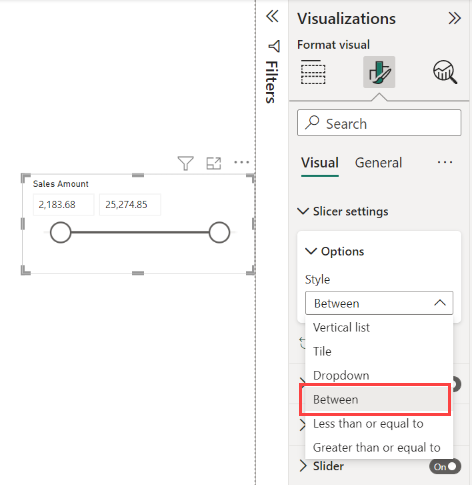
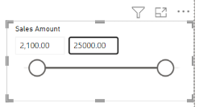
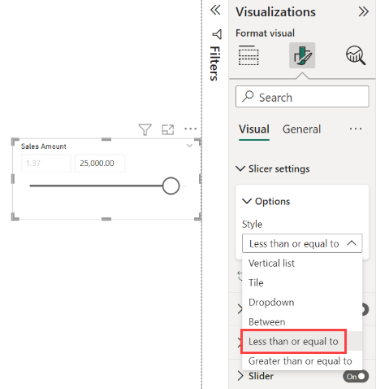

# Use the numeric range slicer in Power BI

[!INCLUDE [applies-yes-desktop-yes-service](../includes/applies-yes-desktop-yes-service.md)]

With the numeric range slicer, you can apply all sorts of filters to any numeric column in your data model. There are three options for filtering your numeric data: 

- Between numbers. 
- Less than or equal to a number.
- Greater than or equal to a number. 

This simple technique is a powerful, visual way to filter your data.

## Video

In this video, Will walks through creating a numeric range slicer.

> [!NOTE]  
> This video might use earlier versions of Power BI Desktop or the Power BI service.

<iframe width="560" height="315" src="https://www.youtube.com/embed/zIZPA0UrJyA" frameborder="0" allowfullscreen></iframe>

## Add a numeric range slicer

You can use the numeric range slicer like you would use any other slicer. Create a **Slicer** visual for your report, and then select a numeric value for the **Field** value. 

Power BI automatically creates a numeric range slicer. By default, it's set to **Between**.

## Format the range slicer

In the **Format** pane, under **Visual** > **Slicer settings** > **Options**, select one of these options:

* **Between**
* **Less than or equal to**
* **Greater than or equal to**

You can use the slider to select numeric values that fall between the numbers. Sometimes the granularity of moving the slicer bar makes landing exactly on that number difficult. You can use the slider, or select either box to type in the values you want. This option is convenient when you want to slice on specific numbers.

In the following image, the report page filters for **Sales Amount** values that range between 2,100.00 and 25,000.00.

When you select **Less than or equal to**, the left (lower value) handle of the slider bar disappears, and you can adjust only the upper-bound limit of the slider bar. In the following image, the lower limit is gone.

If you select **Greater than or equal to**, then the right (higher value) slider bar handle disappears. You can then adjust the lower value, but not the upper value.

## Snap to whole numbers with the numeric range slicer

A numeric range slicer snaps to whole numbers if the data type of the underlying field is *Whole Number*. This feature lets your slicer cleanly align to whole numbers. *Decimal Number* fields let you enter or select fractions of a number. The formatting set in the text box matches the formatting set on the field even though you can type in or select more precise numbers.

## Display formatting with the date range slicer

When you use a slicer to display or set a range of dates, the dates display in the *Short Date* format. The user's browser or operating system locale determines the date format. As such, it will be the display format no matter what the data type settings are for the underlying data or model.

You could, for example, have a long date format for the underlying data type. In this case, a date format such as *dddd, MMMM d, yyyy* would format a date in other visuals or circumstances as *Wednesday, March 14, 2001*. But in the date range slicer, that date displays in the slicer as *03/14/2001*.

:::image type="content" source="media/desktop-slicer-numeric-range/desktop-slicer-numeric-range-date.png" alt-text="Screenshot showing a slicer witha date range.":::

Displaying the Short Date format in the slicer ensures the length of the string stays consistent and compact within the slicer.

## Considerations and limitations

The following considerations and limitations apply to the numeric range slicer:

* The numeric range slicer filters every underlying row in the data, not any aggregated value. For example, let's say that you use a *Sales Amount* field. The slicer then filters each transaction based on the sales amount, not the sum of the sales amount for each data point of a visual.
* The numeric range slicer doesn't currently work with measures.
* You can type any number into a numeric slicer even if it is outside the range of values in the underlying column. This option lets you set up filters if you know the data may change in future.
* The date range slicer allows for any date values even if they don't exist in the underlying date column.

## Next steps

- [Slicers in Power BI](../visuals/power-bi-visualization-slicers.md)
- More questions? [Try asking the Power BI Community](https://community.powerbi.com/)