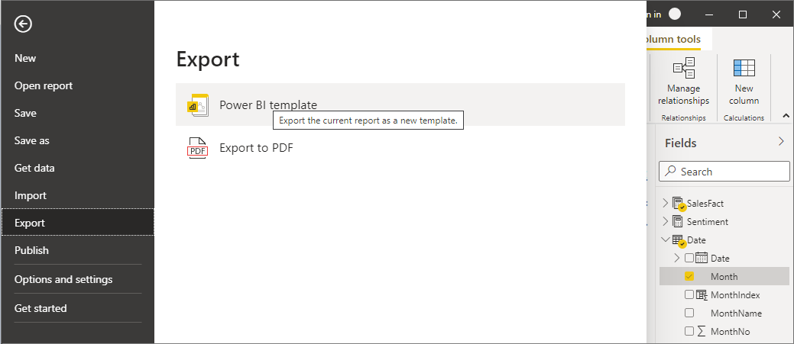
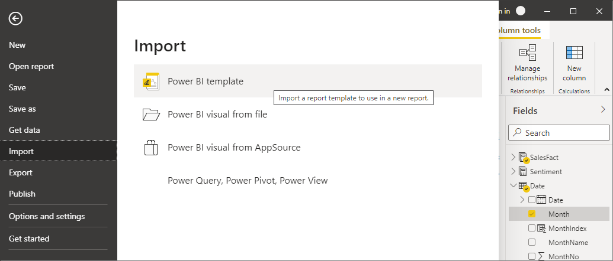

# Create report templates for Power BI Desktop

With **Power BI Desktop,** you can create compelling reports that share insights across your entire organization. With Power BI Desktop **templates**, you can streamline your work by creating a report template, based on an existing template, which you or other users in your organization can use as a starting point for a new report's layout, data model, and queries. Templates in **Power BI Desktop** help you jump-start and standardize report creation.

## Creating templates

Power BI report templates contain the following information from the report from which they were generated:

* Report **pages**, visuals, and other visual elements
* The **data model definition**, including the schema, relationships, measures, and other model definition artifacts
* All **query definitions**, such as queries, Query Parameters, and other query elements

What is *not* included in templates is the report's data. 

Report templates use the file extension .PBIT (compare to Power BI Desktop reports, which use the .PBIX extension). 

To create a report template, select **File > Export > Power BI template** from the menu, which brings up the following window, which prompts you to provide a description for the template. In this example, our description for the template is *Monthly sales report template.*

Select **OK** and you're prompted for a file location to store the .PBIT template file.

And that's it, your Power BI report template is created in the file location you specified, with the .PBIT extension.

> [!NOTE]
> Power BI report template files are generally much smaller than a Power BI Desktop report, because templates to not contain any data - just the report definitions themselves. 

## Using templates

To use a Power BI report template, simply open it in Power BI Desktop and begin using it. You can open Power BI report templates in two ways:

* Double-click on any .PBIT file to automatically launch Power BI Desktop and load the template
* Select **File > Import > Power BI template** from within Power BI Desktop

When you open a report template, a dialog appears values for any parameters that are defined in the report on which the template is based. For example, if a report analyzes customers based on country or region and has a *Country* parameter to specify the customer base, a prompt appears for you to select a *Country* value from the list of values that were specified when defining the parameter. 

Once any required parameters are provided, you're prompted for the location of the underlying data associated with the report. The current report creator can then connect to data based on their credentials.

Once parameters and data have been specified, a report is created containing all the pages, visuals, data model artifacts, and queries that were part of the report on which the template is based. 

That's it. Creating and using report templates in Power BI Desktop is easy, enabling you to easily reproduce compelling layouts and other report aspects, and share them with others.

## Next steps
You might also be interested in learning about **Query Parameters**:
* [Using Query Parameters in Power BI Desktop?](/power-query/power-query-query-parameters)

In addition, there are all sorts of things you can do with Power BI Desktop. For more information on its capabilities, check out the following resources:

* [What is Power BI Desktop?](../fundamentals/desktop-what-is-desktop.md)
* [Query Overview with Power BI Desktop](../transform-model/desktop-query-overview.md)
* [Data Types in Power BI Desktop](../connect-data/desktop-data-types.md)
* [Shape and Combine Data with Power BI Desktop](../connect-data/desktop-shape-and-combine-data.md)
* [Common Query Tasks in Power BI Desktop](../transform-model/desktop-common-query-tasks.md)