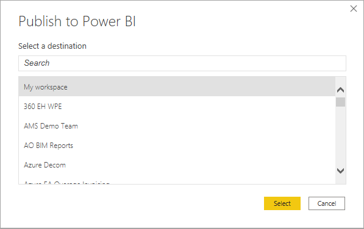
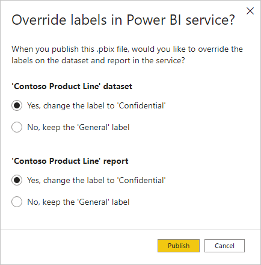

# Publish datasets and reports from Power BI Desktop

[!INCLUDE [applies-yes-desktop-yes-service](../includes/applies-yes-desktop-yes-service.md)]

When you publish a Power BI Desktop file to the Power BI service, you publish the data in the model to your Power BI workspace. The same is true for any reports you created in **Report** view. You’ll see a new dataset with the same name and any reports in your Workspace navigator.

Publishing from Power BI Desktop has the same effect as using **Get Data** in Power BI to connect to and upload a Power BI Desktop file.

> [!NOTE]
> Any changes you make to the report in Power BI won't be saved back to the original Power BI Desktop file. This includes when you add, delete, or change visualizations in reports.

## To publish a Power BI Desktop dataset and reports
1. In Power BI Desktop, choose **File** > **Publish** > **Publish to Power BI** or select **Publish** on the **Home** ribbon.

   

2. Sign in to Power BI if you aren't already signed in.
3. Select the destination. You can search your list of available workspaces to find the workspace into which you want to publish. The search box lets you filter your workspaces. Select the workspace, and then click the **Select** button to publish.

   

When publishing is complete, you receive a link to your report. Select the link to open the report in your Power BI site.

## Republish or replace a dataset published from Power BI Desktop
The dataset, and any reports you created in Power BI Desktop, upload to your Power BI site when you publish a Power BI Desktop file. When you republish your Power BI Desktop file, the dataset in your Power BI site is replaced with the updated dataset from the Power BI Desktop file.

This process is straightforward, but you should know the following:

* Two or more datasets in Power BI with the same name as the Power BI Desktop file could cause publishing to fail. Make sure you have only one dataset in Power BI with the same name. You can also rename the file and publish, creating a new dataset with same name as the file.
* If you rename or delete a column or measure, any visualizations you already have in Power BI with that field could be broken.
* Power BI ignores some format changes of existing columns. For example, if you change a column’s format from 0.25% to 25%.
* If you have a refresh schedule that's configured for your existing dataset in Power BI, you should verify that you're signed in during republishing. For example, when you add new data sources to your file and then republish, you have to sign into them before the next scheduled refresh.
* When you republish a dataset published from Power BI Desktop and have a refresh schedule defined, a dataset refresh is started as soon as you republish.
* When you make a change to a dataset and then republish it, a message shows you how many workspaces, reports, and dashboards are potentially impacted by the change. The message then asks you to confirm that you want to replace the currently published dataset with the one you modified. The message also provides a link to the full dataset impact analysis in the Power BI service. From there, you can see more information and take action to mitigate the risks of your change.

   

* If the dataset (and, if one exists, the report) in the Power BI service that you're overwriting has sensitivity labels that differ from the label in your .pbix file, a dialog appears. The dialog lets you choose whether to keep the existing labels or overwrite them with the ones coming from your .pbix file.

    

   [Learn more about Dataset impact analysis](../collaborate-share/service-dataset-impact-analysis.md).

> [!NOTE]
> Some data connection in Power BI reports may include links to data, rather than including the data in the dataset that's imported into the Power BI service. For example, DirectQuery connections link to data as updates or interactions occur, rather than importing the data itself. If linked data sources in your report are on premises, you may need a gateway to access them from Power BI. For more information, see [what is an on-premises data gateway?](../connect-data/service-gateway-onprem.md).
> 

## Next steps

For more information, see:

* [What is Power BI Desktop?](../fundamentals/desktop-what-is-desktop.md)
* [Query overview with Power BI Desktop](../transform-model/desktop-query-overview.md)
* [Data types in Power BI Desktop](../connect-data/desktop-data-types.md)
* [Tutorial: Shape and combine data in Power BI Desktop](../connect-data/desktop-shape-and-combine-data.md)
* [Common query tasks in Power BI Desktop](../transform-model/desktop-common-query-tasks.md)
