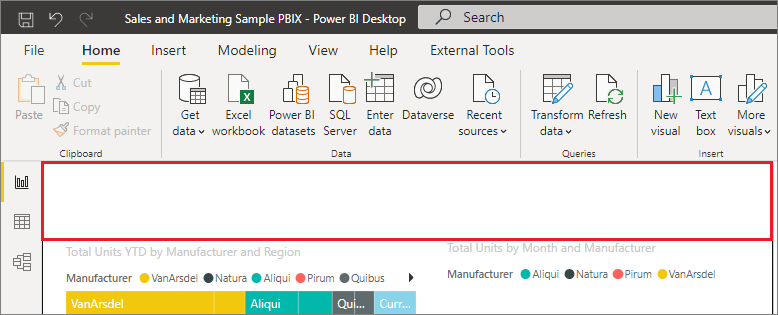
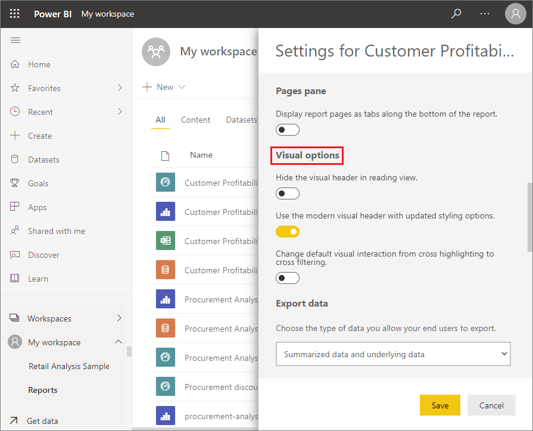

# Use visual elements to enhance Power BI reports

[!INCLUDE [applies-yes-desktop-yes-service](../includes/applies-yes-desktop-yes-service.md)]

With **Power BI Desktop** you can use visual elements, such as wallpaper and improved visual headers for visualizations, to enhance the appearance of your reports.

You can put enhancements to use in your reports and make your analytics and reports even more appealing than before. The enhancements discussed in this article include the following:

* Apply **wallpaper** to your reports so your background can enhance or highlight elements of the story you want to tell with your data
* Use improved **visual headers** for individual visualizations to create perfectly aligned visuals on your report canvas.

The following sections describe how to use these enhancements and how to apply them to your reports.

## Using wallpaper in Power BI reports

You can format the gray area outside your report page using **wallpaper**. The following image has a red box that clarifies where the wallpaper area applies.

You can either set wallpaper on a per-report-page basis or have the same wallpaper for every page in your report. To set your wallpaper, select the **Formatting** icon when no visual is selected in your report and the **Wallpaper** card appears in the pane.

You can choose a color to apply as **wallpaper** by selecting the **Color** dropdown, or you can select the **Add Image** button to select an image to apply as wallpaper. You can also apply transparency to your wallpaper, whether it's a color or an image by using the **Transparency** slider.

It's useful to keep in mind the following definitions that pertain to **wallpaper**:

* The gray area outside of your report area is the **wallpaper** area.
* The area in the canvas where you can place visuals is referred to as the report **page** and, in the **Format pane**, can be modified using the **Page background** dropdown.

The report **page** is always in the foreground (when compared to the wallpaper), while the **wallpaper** is behind it and the furthest-back element on the report page. When you apply transparency to the page, the visuals in your report also have the transparency applied, allowing your wallpaper to be visible in the background through your visuals.

For all new reports, the default settings are the following:

* The report **page** is set to **white** and its transparency is set to **100%**.
* The **wallpaper** is set to **white** and its transparency is set to **0%**.

When you set your page background to greater than 50% transparency, a dotted border appears while you're creating or editing your report to show you the boundary of the report canvas border.

It's important to note that the dotted boundary *only* shows up when editing your report and does *not* appear for people who are viewing your published report, such as when it's viewed in the **Power BI service**.

> [!NOTE]
> If you use dark-colored backgrounds for wallpaper and set text color to white or very light, be mindful that the **Export to PDF** feature doesn't include wallpaper, so any exports with white fonts will be nearly invisible in the exported PDF file. For more information, see [export to PDF](../collaborate-share/end-user-pdf.md).

## Using improved visual headers in Power BI reports

The headers for visuals in reports have been significantly improved. The primary improvements are that the header has been detached from the visual, so its position can be adjusted based on your preference of layout and positioning. The header now appears within the visual itself instead of floating above it.

By default, the header appears inside the visual aligned with the title. In the following image, you can see the header (the pin icon, the expand icon, and the ellipses icon) within the visual and aligned to the right, along the same horizontal position as the visual's title.

If your visual doesn't have a title, the header floats above the top of the visual aligned to the right, as shown in the following image.

If your visual is positioned all the way to the top of your report, the visual header instead snaps to the bottom of the visual.

Each visual also has a card in the **Formatting** section of the **Visualizations** pane called **Visual header**. You can adjust all sorts of characteristics of the visual header.

> [!NOTE]
> The visibility of toggles don't affect your report when you're authoring or editing the report. You must publish the report and view it in reading mode to see the effect. This behavior ensures that the many options provided in visual headers are important during editing, especially warning icons that alert you to issues while editing.

For reports that only appear in the **Power BI service**, you can adjust the use of visual headers by going to **My Workspace > Reports**, selecting a report, and then choosing the **Settings** icon. There you see settings for the report for which you selected **Settings** and you can adjust the settings from there, as shown in the following image.

### Enabling improved visual headers for existing reports

The new visual header is the default behavior for all new reports. For existing reports, you need to enable this behavior in Power BI Desktop by going to **File > Options and settings > Options** and then in the **Report settings** section, enable the **Use the modern visual header with updated styling options** checkbox.

## Next steps

For more information about Power BI Desktop and how to get started, see:

* [What is Power BI Desktop?](../fundamentals/desktop-what-is-desktop.md)
* [Query Overview with Power BI Desktop](../transform-model/desktop-query-overview.md)
* [Data Sources in Power BI Desktop](../connect-data/desktop-data-sources.md)
* [Connect to Data sources in Power BI Desktop](../connect-data/desktop-connect-to-data.md)
* [Shape and Combine Data with Power BI Desktop](../connect-data/desktop-shape-and-combine-data.md)
* [Perform common Query Tasks in Power BI Desktop](../transform-model/desktop-common-query-tasks.md)