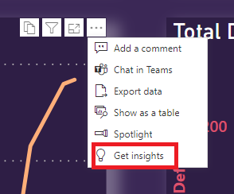
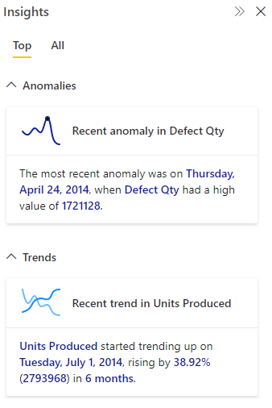
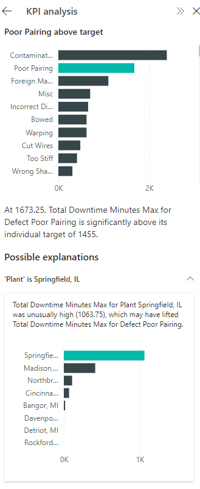

# Insights (preview)

 The Insights feature helps users easily explore and find insights such as anomalies, trends in their data as they interact and consume their reports. It  notifies a user if there are interesting insights in the reports and also provides explanations for the insights. It works out of the box on any report so the consumers can automatically start getting insights from their reports without any setup.
 
 
 
## License requirements

 Insights is supported for reports in Premium and Premium Per User (PPU) workspaces. You can also use the feature in non-premium workspaces if you have a PPU license, but  notifications won't be supported. 

 
## Notifications

Power BI automatically runs insights analysis when you open a report. The light bulb in the action bar turns yellow and toast notifications are shown if there are **Top** insights for visuals in your current report page. **Top** insights are those that are noteworthy based on factors like recency, significance of the trend/anomaly. These notifications are supported only in Premium and PPU workspaces.

 
 
Click on the **See insights** button to open the Insights pane or choose **Show me later** if you’d not like to get further notifications for this report in the current session.

If you usually dismiss these notifications or don't engage with them, they'll be disabled for the current session. You can click on **Keep Showing** to continue getting notifications.

 
 
 To stop getting notifications for a report, turn it off in the report settings as shown below:
 
 
 
 
## Get insights on reports and visuals

Click on **Get insights** in the action bar to open the Insights pane.

The pane only shows insights about the current report page and it updates when you select a different page on the report.

Select **More options (...)** in the upper-right corner of a visual and then **Get insights** to see insights about just that visual.

## Insights
The Insights pane currently shows you three types of insights – Anomalies, Trends, and KPI analysis.
The **Top** tab shows you Top insights. **All** tab shows you both Top insights and other insights. 

Insights are computed every time you open a report or interact with a report such as changing pages, changing filters, or cross-filtering your data.

### Anomalies
An anomaly is an abnormality in time-series data, such as unexpected spikes and dips in the data. The algorithm computes a boundary around what’s considered a normal or expected value. Any value found outside this boundary is marked as an anomaly. Check out this technical blog for more details about the algorithm. There are three types of anomaly insights:
- Significant Anomaly: 
The anomaly has a high score. Anomaly score indicates how far the point is from the expected range. 
- Recent Anomaly: 
The most recent anomaly in the measure.
- Anomaly summary: 
This insight type summarizes multiple anomalies in the measure.

### Trends
A trend occurs there's a prolonged increase or decrease in time-series data. There are a series of steps the Power BI algorithm uses to find meaningful trends: It first performs data smoothening, interpolation, time-series sampling. The trends are then identified for statistical significance based on the slope and length of a change in value.  The algorithm removes noise like seasonality and outliers. For example, if sales jump in December, the algorithm won't mark that as a noteworthy trend because it's common for sales to jump around the holidays.
- Long trend:
The trend is significant and is the longest trend within a single series or across multiple series in a visual. 
- Steep trend:
The trend is significant and is the steepest trend within a single series or across multiple series in a visual.
- Recent trend:
The trend is significant and is the most recent trend within a single series or across multiple series in a visual.
- Trend reversal:
Recent trend in a single series or across multiple series in a visual where the reversal is significant compared to the previous trend segment.

### KPI analysis
KPI analysis with a target looks at the variance of the current value to its target, and it's considered significant if the variance is significantly high or low compared to other segments. Whereas KPI analysis without a target looks at the value itself and flags ones that are significantly high or low compared to other segments. 

## Explanations
Click on the card to get more details about the insight. 
Expand/collapse the cards under **Possible Explanations** to view/hide the explanation visuals and text. 

### Anomalies
When an anomaly in your data is flagged, Power BI runs the analysis across different dimensions in your data model to look for spikes or dips in the measure that correlate to the anomaly. They're shown as possible explanations ranked by strength. Check out this documentation to learn more.	

### Trends
When a trend in your data is flagged, Power BI looks for and identifies the categories that most influenced the increase or decrease in the identified trend. Possible explanations are ranked based on the relative contributions from different categories to the increase or decrease in trend. Learn more here.

### KPI analysis
For KPI analysis explanations, Power BI looks for and identifies the categories that have significantly high or low values. For KPI analysis with target, possible explanations are ranked based on Z-scores of the difference of the value from the target. Whereas for KPI analysis without target, possible explanations are ranked based on the Z-scores of the value itself.

## Details
If the insight talks about multiple anomalies, or trends, clicking on the insight card will show you the **Details** cards to help you choose the specific anomaly/trend/KPI segment you’d like to get explanations for.

## Considerations and limitations
- Insights is currently not available in Apps and Embedded for reports in Premium workspaces. Users with PPU license can still use Insights. The Power BI team is working on a fix.
- If no insights found are found, you’ll be shown the following message: “We didn’t find any insights”. This can be because:
  - The data or visuals aren't supported
     -	 Anomalies and trend insights are supported on time series with numeric data on visuals such as Line chart, Area chart, Stacked Area chart, Stacked bar chart, Stacked column chart, Clustered bar chart, Clustered column chart, KPI. KPI analysis insight is supported on KPI, Gauge, Cards, Bar, and Column charts.

     -	Anomalies and trends are only supported for built-in date hierarchy or date time fields. They aren't supported on custom date hierarchy. 
  -	The data doesn't have significant anomalies or trends. You can try filtering your data or check back later when there’s new data.
  -	The following functionality isn't supported:
     - Publish to Web
     -	Live Connection to Azure Analysis Services or SQL Server Analysis Services
     -	MultiDimensional Analysis Services data sources (e.g. SAP BW, SAP HANA)
     -	Power BI Report Server
  
- Explanations aren't supported in the following cases:         
   - TopN filters
   - Include/exclude filters
   - Measure filters
   - Non-numeric measures
   - Use of "Show value as"
   - Filtered measures: filtered measures are visual level calculations with a specific filter applied (for example, Total Sales for France), and are used on some of the visuals created by the insights feature.
   - Some measure types such as % grand total and measures from extension schemas
   - RLS

  If no explanations are found, you’ll be shown the following message: “We didn’t find any significant explanations”. You can try bringing in more fields for the analysis.

