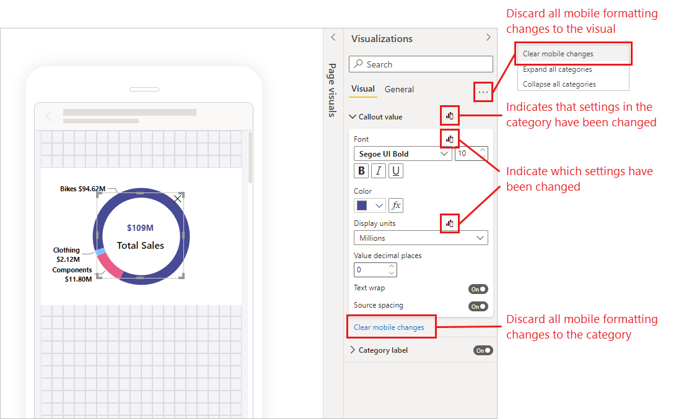
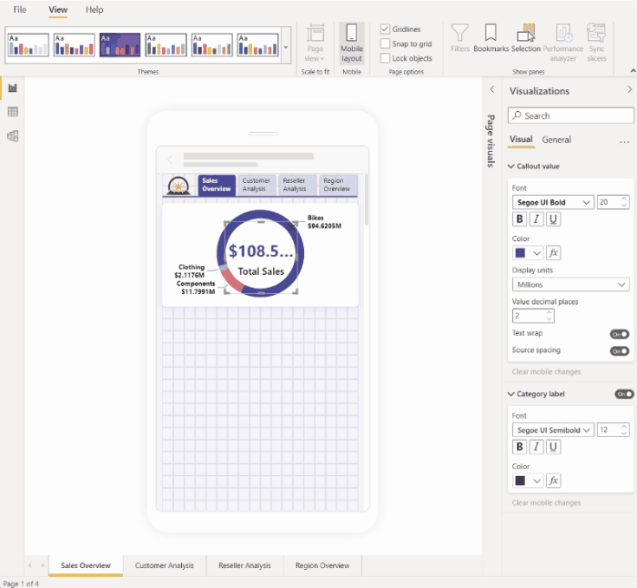
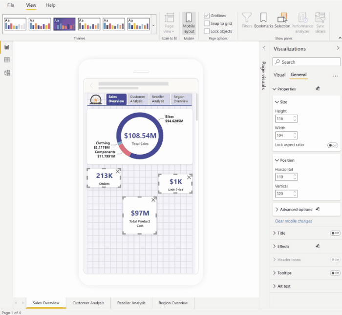
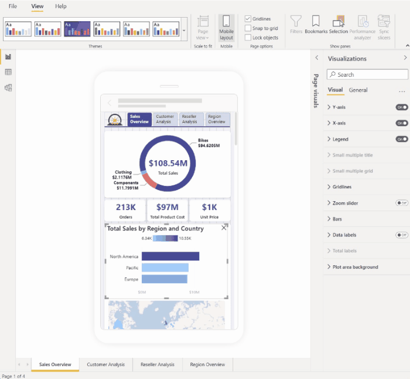
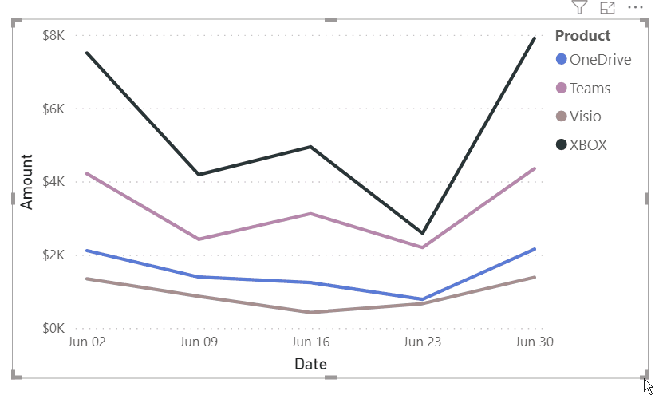

# Optimize visual formatting

Use the visualizations pane to optimize a visual's format for mobile layout.

## The visualizations pane

The visualizations pane enables you to precisely format visuals for mobile layout by changing their format settings.

When you first place a visual on the canvas, its format settings will display in the visualizations pane. Most of its format settings are connected to the desktop layout and take their values from there. See [Mobile formatting considerations and limitations](#mobile-formatting-considerations-and-limitations) for exceptions.

To format a visual, make sure the visual is selected on the canvas. In the visualizations pane, find the relevant settings and make your changes.

When you change a setting, the setting disconnects from desktop layout and becomes independent. Any changes you make to the setting won't affect the desktop layout, and vice versa; any changes you make to the setting in desktop layout won't affect mobile layout. When you change a visual's setting, an icon indicates that it has been changed. If you discard mobile formatting changes, the setting (or settings) reconnects to the desktop layout and will take on the current desktop value.

The image below shows the visualizations pane with format settings, change indication, another pane functionality.

### Discarding mobile formatting changes

You can discard mobile formatting changes to a single category by selecting **Clear mobile changes** at the bottom of the category card. You can discard all mobile formatting changes for the visual by selecting **More options (…)** and choosing **Clear mobile formatting** from the context menu.

When you discard mobile formatting changes, the setting (or settings) reconnects to the desktop layout resume taking its value from the there.

The visualizations pane in mobile layout view is quite similar to the visualization pane that is part of desktop layout view. See [The new Format pane in Power BI Desktop](../fundamentals/desktop-format-pane.md) for more information about the visualization pane in desktop layout.

### Mobile formatting considerations and limitations
* Size and positions settings are not inherited from desktop layout - hence you will never see a change indication on size and position settings.

## Mobile formatting examples

This section shows some examples of how Power BI's mobile formatting capabilities can be used to modify visuals so that they are more useful and suitable for mobile layout.

The examples show:
* How the grid orientation and style settings of a visual can be changed to better suit phone layout.
* How different shapes can be used to better fit the mobile design.
* How a visual's font size can be adjusted to fit in with other report visuals.
* How you can create precise, pixel perfect design with size and position settings.
* How chart settings can be adjusted to maximize real estate.

In the animated images below, the starting points show the mobile layout after some visuals have been placed on the canvas. The images then show how those visuals are changed using the Visualizations formatting pane. 

### Changing grid orientation to better suit mobile layout

The grid orientation of some visuals might work well in desktop layout but not so well in the smaller size and more limited space of a mobile screen. In this sample report page, the page navigator was stacked vertically. While this orientation worked well for desktop layout, it is not optimal for mobile layout. The image shows how the page navigator becomes horizontal by changing the Grid layout orientation setting in the Visualizations pane.

### Changing a shape to use as a design element

You can take any shape created in desktop layout and change it into any other shape in mobile layout using the Shape setting. This makes it possible to repurpose shapes. The image below demonstrates how a rectangle shape in the desktop layout, which was used as a background for the page navigator, gets changed to a line shape in the mobile layout and is used to underline the page navigator. 

### Changing a visual's font size to better suit other visuals

The font sizes used in desktop layout are usually too large for mobile layout, taking up too much space and resulting in text that is hard to read. Therefore one of the most common things you need to do when you create a mobile layout is change the font sizes. In the image below, you can see how changing the font size on the card visual makes the text fit better into the other visual. Note how changing the display unit from thousands to millions also helps get the visual sized better for the mobile layout.

### Using properties to precisely determine visual size and position

While mobile layout canvas already has a fine-grained grid and smart guides to help you size and align visuals, there are cases where you need to control the exact size and position of the visual. You can do this using the position and size setting.

>[!NOTE]
> Size and position settings are never inherited from the desktop layout. Therefore, when you make changes to size and position settings, no change indicator will appear. 

The images below shows how size and position settings can be used to size and align visuals. Note how multi-selecting the visuals makes it possible to apply the changes to several visuals at once. 

### Using format settings to optimize a visual to save valuable screen real estate

Sometimes you can use a visual's settings to make it more compact and to save space. In the following example, we see a bar chart visual. To reduce the size that the visual takes up on the canvas, the legend and X axis get toggled off. However, removing the legend and X axis makes the bars unclear, as there are no values to go along with them. To remedy this, data labels are toggled on and centered on the bars. Saving space in such ways makes it possible to see more visuals at once, without having to scroll. 

Tip: Most charts have the responsive setting on by default. If you don't want the elements on your chart to be affected by the visual's size, toggle off the responsive setting in the visual's settings (General > Properties > Advanced options > Responsive)  

## Alternate formatting options for visuals and slicers

**Visuals**

By default, many visuals, particularly chart-type visuals, are responsive.  That means they change dynamically to display the maximum amount of data and insight, no matter the screen size.

As a visual changes size, Power BI gives priority to the data. For example, it might remove padding and move the legend to the top of the visual automatically so that the visual remains informative even as it gets smaller.

 
Responsiveness can interfere with formatting using visual settings. To turn off responsiveness, select the visual on the canvas and then in the visualizations pane go to **General > Properties > Advanced options**.

### Slicers

Slicers offer on-canvas filtering of report data. When designing slicers in the regular report authoring mode, you can modify some slicer settings to make them more usable in mobile-optimized reports:
* You can decide whether to allow report readers to select only one item or multiple items.
* You can make the slicer vertical, horizontal, or responsive (responsive slicers must be horizontal).

If you make the slicer responsive, as you change its size and shape it shows more or fewer options. It can be tall, short, wide, or narrow. If you make it small enough, it becomes just a filter icon on the report page.

 
Read more about [creating responsive slicers](power-bi-slicer-filter-responsive.md).

## Next steps
* [Arrange layering of visuals](power-bi-create-mobile-optimized-report-order-layers.md)