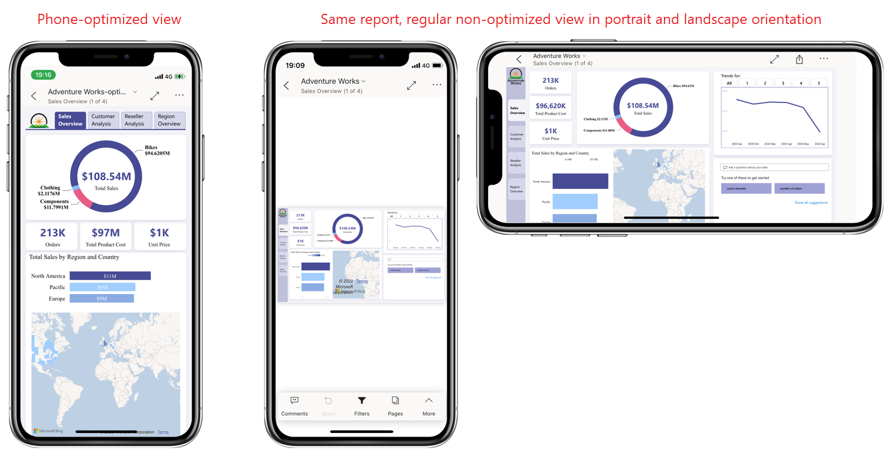
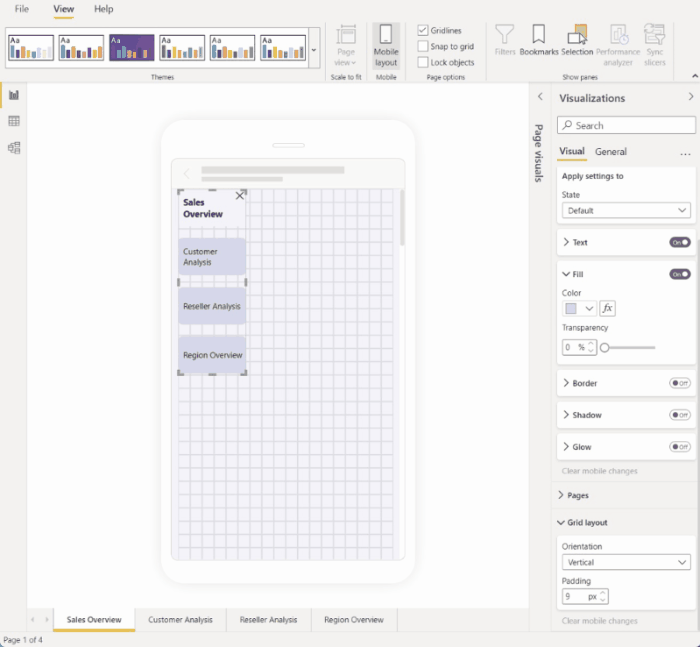

# Optimize Power BI reports for the mobile app

[!INCLUDE [applies-yes-desktop-yes-service](../includes/applies-yes-desktop-yes-service.md)]

Mobile users can view any Power BI report page on their Android or iOS phone, in any orientation they like. However, reports designed to be used on a computer can be difficult to read and interact with on a phone. 

Using Power BI's mobile layout authoring capabilities, report authors can create an additional phone-optimized view that always displays in portrait orientation. This mobile layout design option, which is available in both Power BI Desktop and in the Power BI service, enables authors to select, rearrange, and reformat just those report visuals that make sense for mobile users on the go.

Power BI provides a number of features to help you create mobile-optimized versions of your reports:
* A **mobile layout view** where you create your mobile-optimized report by dragging and dropping visuals onto a phone emulator canvas.
* A **formatting pane** that enables you to precisely format your report visuals by changing their properties.
* **Visuals and slicers** that can be optimized for use on small, mobile screens.

These capabilities make it possible to design and build attractive, interactive mobile-optimized reports.

This article introduces Power BI's mobile authoring capabilities and features, and presents a [walkthrough](#walkthrough) that demonstrates some of the things you can do to create attractive and effective report page views for phone viewing. 

>[!NOTE]
> Formatting changes you make for your phone optimized layout do not affect the regular layout of your report.for mobile 

## Create a mobile-optimized portrait version of a report page

**Prerequisite**: The first step is to design and create the report in the regular web view. After you've created the report, you can optimize it for phones and tablets.

To create the mobile-optimized view, open the report in either Power BI Desktop or in the Power BI service. When the report is open, go the mobile layout view.

# [Power BI Desktop](#tab/powerbi-desktop)

Select the **View** ribbon and choose **Mobile layout**.

# [Power BI service](#tab/powerbi-service)

Choose **Edit report > Mobile Layout**. If the Edit option is not visible, look under **More options (...)**.

---

You see a scrollable canvas shaped like a phone, a **Page visuals** pane that lists all of the visuals that are on the original report page, and a **Visualizations** pane, where you will format visual properties. The features of the  Page visuals pane are described below. The Visualization pane is empty until you select a visual on the canvas.

### The Page visuals pane
* **Visual name**: Helps with identifying the visual.
* **Visibility indicator**: Indicates the visibilty status of the visual - visible or hidden. Changes depending on the visibility status of the visual in the current state of the web report view. The visibility indicator is useful when working with bookmarks.
* **Visibility status filter**: To make it easier to find the visual you are looking for by reducing the number of visuals displayed in the pane, you can filter the visuals according to visibility status.
* **Eraser**: Removes all visuals from the canvas. Removing visuals from the canvas will not remove them from the Page visuals pane. They will still be there available for you to use.

## Add visuals to the mobile layout canvas
To add a visual to the mobile layout, drag it from the **Page visuals** pane to the phone canvas. When you drag the visual to the canvas, it snaps to the grid. Alternatively, you can double-click the visual in the visualization pane and the visual will be added to the canvas.

You can add some or all of the web report page visuals to the mobile-optimized report page. You can add each visual only once, and you don't have to include all the visuals.

>[!NOTE]
> You can drag and drop hidden visuals onto the canvas. They will be placed, but not shown unless their visibility status changes in the current web report view.

Visuals can be layered one on top of the other to create interactive reports using bookmarks, or to build attractive reports by layering visuals over images. You can change the layering order of the visuals in the [Selection pane](#set-the-layering-order-of-visuals-on-the-mobile-layout-canvas).

Once you've placed a visual on the canvas, you can resize it by dragging the handles that appear around the edge of the visual when you select it. To maintain the visual's aspect ratio while resizing, press the **Shift** key while dragging the resize handles.

>[!NOTE]
> Some chart visuals can be configured as responsive, meaning that as the visual is resized, the items displayed in the visual will automatically adjust. If you want precise control over the visual's mobile formatting, turn responsiveness off and use the Visualization pane to manually adjust the visual's properties. To turn off a visual's responsiveness, select the visual and then on the Visualization pane go **General > Properties > Advanced options**.

The image below illustrates dragging and dropping visuals from the **Page visuals** pane onto the canvas, as well as resizing and overlaying some of them.

   

The phone report grid scales across phones of different sizes, so your report looks good on small- and large-screen phones.

## Set the layering order of visuals on the mobile layout canvas

Each time you drag a visual onto the canvas, it is added on its own layer on top of any other visuals that are already on the canvas. The **Selection** pane enables you to change the layering order.

To open the **Selection** pane, click the **Selection** button in the **Show panes** section on the **View** tab. 

The **Selection** pane lists all the visuals that are on the canvas. The order of the list reflects the layer ordering on the canvas - the first listed visual is on the top-most layer, the last listed visual is on the bottom-most layer. To change the order, you can either drag and drop a visual to another place on the list, or select a visual and use the arrow buttons to move it up or down.

The **Selection** pane also has a visibility indication for each visual in the list, but it is not possible to change the visibility in the mobile layout view - this must be done in the regular web layout view.

## Format visuals for use in mobile-optimized reports
Use the visualizations pane to format a visual for mobile layout.

>[!NOTE]
> Formatting changes that you make to visuals in the mobile layout will not affect the desktop layout of your report.

On the mobile layout canvas, select the visual you want to format. The visual's properties will display on the visualizations pane. The visual's properties are split out on to two tabs. The **Visual** tab contains settings that pertain only to the visual, while the **General** tab contains settings that are consistent across all visual types. Expand the categories to start editing properties.

When you first place a visual on the canvas, most of its property values are inherited from the desktop layout. When you change a property, however, the property stops inheriting from the desktop layout and becomes independent. Any changes you make to the property won't affect the desktop layout, and vice versa; any changes you make to the property in desktop layout won’t affect mobile layout. 
When you change a visual's property, an icon indicates that the property has changed.

You can discard mobile formatting changes to a single category by selecting **Clear mobile changes** at the bottom of the category card. You can discard all mobile formatting changes for the visual by selecting **More options (…)** and choosing **Clear mobile formatting** from the context menu.

When you discard mobile formatting changes, the property (or properties) will take onthe current desktop value and resume inheriting from the desktop layout.

With the exception of the mobile change indications and the clear mobile changes options, the Visualizations pane is similar to the Visualizations pane in desktop layout. For more information about using the Visualizations pane, see [The new Format pane in Power BI Desktop](../fundamentals/desktop-format-pane.md).

## Remove visuals from the mobile layout canvas
To remove a visual from the mobile layout, click the **X** in the top-right corner of the visual on the phone canvas, or select the visual and press **Delete**.

You can remove all the visualizations from the canvas by clicking the eraser on the **Page visuals** pane.

Removing visuals from the mobile layout canvas removes them from the canvas only. The visuals still appear in the **Page visuals** pane, and the original report remains unaffected.

## Publish a mobile-optimized report
To publish a mobile-optimized version of a report, [publish the main report from Power BI Desktop to the Power BI service](desktop-upload-desktop-files.md). This publishes the mobile-optimized version at the same time.

## Viewing optimized and unoptimized reports on a phone

In the Power BI mobile apps, mobile-optimized reports are indicated by a special icon.

On phones, the app automatically detects whether the report is mobile-optimized or not.
* If a mobile-optimized report exists, the app automatically opens the report in mobile-optimized mode.
* If a mobile-optimized report doesn’t exist, the report opens in the regular unoptimized view. Turn the phone on it's side to get a slightly larger view of an unoptimzed report page. Alternatively, if all you need to do is get a quick look at the data, you can pinch and zoom into the data you're interested in.

The image below shows an optimized report page as well as an unoptimized version of the same page, in both portrait and landscape orientation.

## Considerations when creating mobile-optimized layouts
* For reports with multiple pages, you can optimize all the pages or just a few.

## Walkthrough

This section not ready for review yet..need to add explanations about what's going on in each one.

This walkthrough shows some of example of how the Power BI's mobile formatting options can be used to create a phone-optimized report that is easy to read makes it possible to focus on the most critical information.

In the walkthrough we'll see
* How the grid orientation and style settings of a visual can be changed to better suit phone layout.
* How different shapes can be used to better fit the mobile design.
* How a visual's font size can be adjusted to fit in with other report visuals.
* How you can create precise, pixel perfect design with size and position settings.
* *How chart settings can be adjusted to maximize real estate.

### Changing grid orientation to better suit mobile layout

### Using changing a shape to use as a design element

### Changing a visual's font size to better suit other visuals

### Using properties to precisely determine visual size and position

### Using properties for optimize the a visual to save valuable screen real estate

## Next steps
* [Create a phone view of a dashboard in Power BI](service-create-dashboard-mobile-phone-view.md).
* [View Power BI reports optimized for your phone](../consumer/mobile/mobile-apps-view-phone-report.md).
* [Power BI documentation on creating reports and dashboards](./index.yml).
* More questions? [Try asking the Power BI Community](https://community.powerbi.com/).
