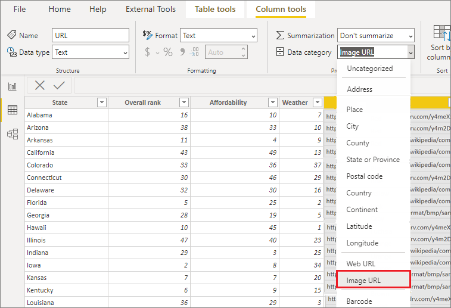

# Display images in a table, matrix, or slicer in a report

[!INCLUDE [applies-yes-desktop-no-service](../includes/applies-yes-desktop-no-service.md)]

A good way to enhance your reports is to add images to them. Static images on the page are good for some purposes. However, sometimes you want images that relate to the data in your report. This article shows you how to display images in a table, matrix, slicer, or multi-row card.

## Add images to your report

1. Create a column with the URLs of the images. See [Considerations](#considerations) later in this article for requirements.

1. Select that column. On the **Column tools** ribbon, for **Data category**, select **Image URL**.

    

1. Add the column to a table, matrix, slicer, or multi-row card.

    

### Format the images

1. In the **Visualizations** pane, select the paintbrush icon to format the images. 
1. On the **Visual** tab, expand **Image size**, and set **Height** and **Width**.

    :::image type="content" source="media/power-bi-images-tables/image-size-height-width.png" alt-text="Screenshot showing setting image height and width.":::

### Add images from OneDrive

Images in your report need to be anonymously accessible. However, for images that are hosted on OneDrive, you may be able to get an embed code that points directly to them. Such images aren't supported by the Power BI mobile apps, however. For the Power BI mobile apps to be able to display an image, the image URL must be anonymously accessible, regardless of whether or not an embed code is used.

1. On your OneDrive site, open an image and select **More options (...)** > **Embed**.

    :::image type="content" source="media/power-bi-images-tables/power-bi-onedrive-embed.png" alt-text="Screenshot of an image on OneDrive, highlighting the More Options dropdown menu and the Embed selection.":::

1. Select **Generate**.

    :::image type="content" source="media/power-bi-images-tables/power-bi-onedrive-embed-generate.png" alt-text="Screenshot of the Embed window, highlighting Generate.":::

1. Copy the URL and paste it in the **Image URL** column.

    :::image type="content" source="media/power-bi-images-tables/power-bi-onedrive-embed-copy-url.png" alt-text="Screenshot of the generated embed image URL.":::

### Add images from OneDrive for work or school

Your organization may not allow displaying images stored on OneDrive for work or school. If they do allow it, follow these steps.

1. In OneDrive for work or school, open an image and select **View original**.
1. Copy the URL that generates.
1. Select **Anyone with the link** to generate a sharing link that anyone can view, so that it has anonymous access set.

    :::image type="content" source="media/power-bi-images-tables/power-bi-onedrive-business-anyone.png" alt-text="Screesnshot of the Link settings window, highlighting the Anyone with a link selection.":::

## Considerations

- The image needs to be in one of these file formats: .bmp, .jpg, .jpeg, .gif, .png, or .svg
- The URL must be anonymously accessible, not on a site that requires a sign-in, such as SharePoint. However, if images are hosted on SharePoint or OneDrive, you might be able to get an embed code that points directly to them.
- The Power BI mobile apps will display the image only if the image URL is anonymously accessible, even if you can see the image in Power BI Desktop or in the service.

## Next steps

[Page layout and formatting](/training/modules/visuals-in-power-bi/12-formatting)

[Basic concepts for designers in the Power BI service](../fundamentals/service-basic-concepts.md)

More questions? [Try the Power BI community](https://community.powerbi.com/)
