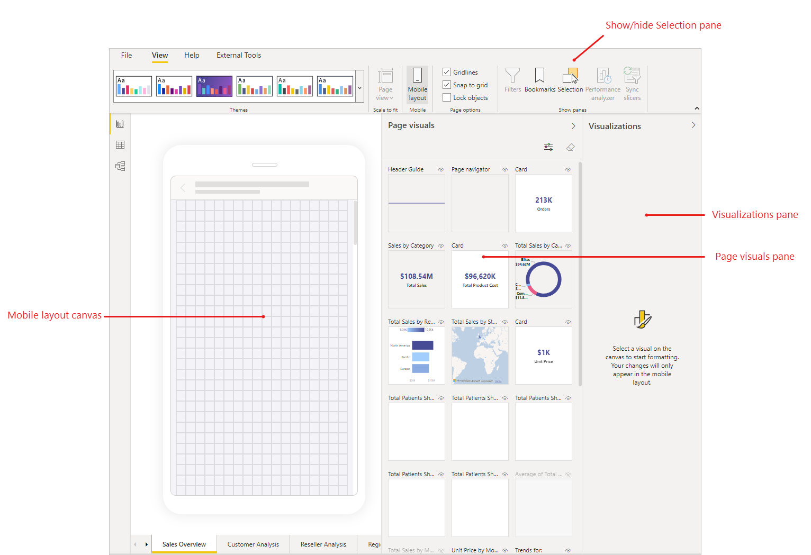
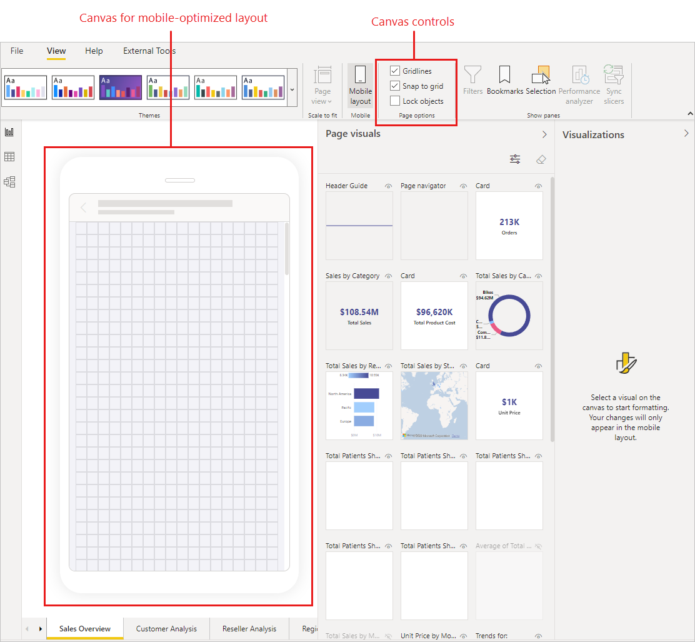

# Mobile layout view

[!INCLUDE [applies-yes-desktop-yes-service](../includes/applies-yes-desktop-yes-service.md)]

Power BI's mobile layout view is used to create views of report pages that are optimized for viewing on mobile devices. Mobile layout view is available in both Power BI Desktop and in the Power BI service. This article explains how to open the mobile layout view and describes the features it provides.

* **Mobile layout canvas**: Create your mobile optimized view on the mobile layout canvas. The canvas has a fined-grained grid to help you place your visuals.
* **Page visuals pane**: The page visuals pane lists all of the visuals that are included on the original report page. From the visuals listed in the page visuals pane you choose which visuals you want to include in your mobile-optimized view.
* **Visualizations pane**: The visualizations pane enables you to format visuals by changing their format settings. The visualizations pane is empty until you select a visual on the canvas.
* **Selection pane**: The selection pane enables you to change the layering order of visuals on the canvas.

Each of these features is explained in the sections below.

## How to open mobile layout view

You can open mobile layout view in both Power BI Desktop and the Power BI service.

# [Power BI Desktop](#tab/powerbi-desktop)

Select the **View** ribbon and choose **Mobile layout**.

# [Power BI service](#tab/powerbi-service)

Choose **Edit report > Mobile Layout**. If the Edit option is not visible, look under **More options (...)**.

   

---

## Mobile layout canvas

The scrollable phone emulator canvas is where you create your mobile-optimized layout. The canvas features a fine-grained grid to help you layout your visuals. Canvas controls enable you to turn off the grid, enable/disable snap-to-grid, and lock visuals in place to prevent them from accidentally being moved around. The grid scales across phones of different sizes, so your report looks good on small- and large-screen phones.

## Page visuals pane

The page visuals pane lists all of the visuals (both shown and hidden) that are on the original report page.

To place a visual on the canvas, drag and drop the visual you want to use from the page visuals pane onto the mobile layout canvas. Alternatively, you can double-click the visual on the page visuals pane and it will be added to the canvas.

Each time you drag a visual from the page visuals pane onto the canvas, it is added on its own layer on top of any other visuals that are already on the canvas. The [selection pane](#selection-pane) enables you to change the layering order.

The page visuals pane has the following features to help you select the visuals you want to use in your mobile-optimized view:

* **Visual name**: Helps to identify the visual.
* **Appearance status**: Indicates the appearance status of the visual - visible or hidden. This indicator changes depending on the appearance status of the visual in the current state of the web report view. The appearance indicator is useful when working with bookmarks.
* **Filter by appearance status**: You can filter the visuals according to appearance status to make it easier to find the visual you are looking.
* **Remove all visuals from canvas**: Removes all visuals from the canvas. Removing visuals from the canvas does not remove them from the Page visuals pane. They remain available for you to use.

## Visualizations pane

The visualizations pane enables you to precisely format visuals for mobile layout by changing their format settings.

When you first place a visual on the canvas, its format settings will display in the visualizations pane. Most of its format settings are connected to the desktop layout and take their values from there. 

When you make a change to a format setting in mobile layout, that setting disconnects from desktop layout and becomes independent. Any changes you make to the setting won't affect the desktop layout, and vice versa; any changes you make to the setting in desktop layout won't affect mobile layout. IF you discard mobile formatting changes, the setting (or settings) reconnects to the desktop layout and will take on the current desktop value.

When you change a formatting setting, an icon indicates that it has been changed, as shown in the illustration below.

You can discard mobile formatting changes to a single category by selecting **Clear mobile changes** at the bottom of the category card. You can discard all mobile formatting changes for the visual by selecting **More options (…)** and choosing **Clear mobile formatting** from the context menu.

Remember, When you discard mobile formatting changes, the setting (or settings) reconnects to the desktop layout and will take on the current desktop value.

The visualizations pane is quite similar to the visualization pane that is part of desktop layout view. See [The new Format pane in Power BI Desktop](../fundamentals/desktop-format-pane.md) for more information about the visualization pane in desktop layout.

## Mobile formatting considerations and limitations
* Size and positions settings are not inherited from desktop layout - hence you will never see an a change indication on size and position settings.
* Currently, in mobile layout view you can't change the formatting settings of the text box visual. When you need resizable text, use a shape visual instead.

## Selection pane

The selection pane enables you to change the layering order of visuals on the canvas..

To open the selection pane, click the **Selection** button in the **Show panes** section of the mobile layout view.

The selection pane lists all the visuals that are on the canvas. The order of the list reflects the layer ordering on the canvas - the first listed visual is on the top-most layer, the last listed visual is on the bottom-most layer. To change the order, you can either drag and drop a visual to another place on the list, or select a visual and use the arrow buttons to move it up or down.

The selection pane also has an appearance indication for each visual in the list, but it is not possible to change the appearance in the mobile layout view - this must be done in the regular desktop layout view.

## Next steps
* [Create a mobile-optimized report](power-bi-create-phone-report-how-to.md)
* [About mobile optimized reports](power-bi-create-phone-report.md)
* More questions? [Try asking the Power BI Community](https://community.powerbi.com/).
