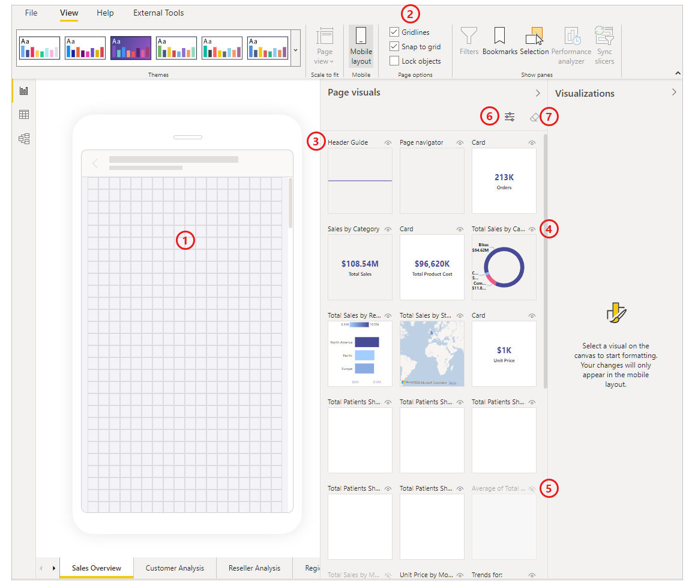
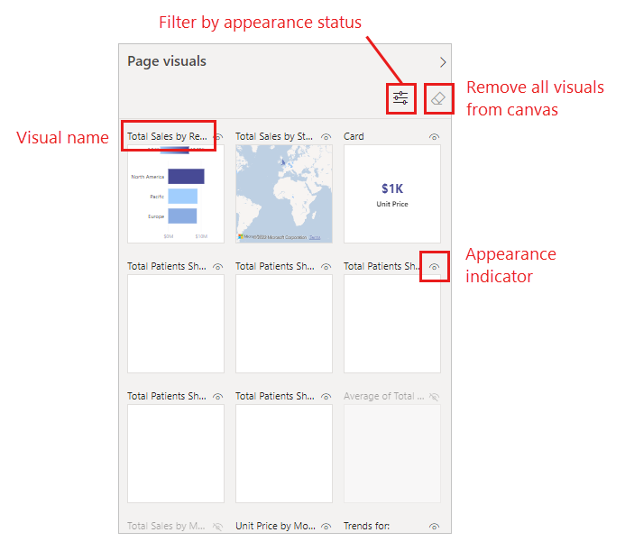

# Mobile layout view

[!INCLUDE [applies-yes-desktop-yes-service](../includes/applies-yes-desktop-yes-service.md)]

Power BI's mobile layout view is used to create views of report pages that are optimized for viewing on mobile devices. Mobile layout view is available in both Power BI Desktop and in the Power BI service. This article explains how to open the mobile layout view and describes the features it provides.

## How to open mobile layout view

# [Power BI Desktop](#tab/powerbi-desktop)

Select the **View** ribbon and choose **Mobile layout**.

# [Power BI service](#tab/powerbi-service)

Choose **Edit report > Mobile Layout**. If the Edit option is not visible, look under **More options (...)**.

   

---

## Mobile layout view features

The mobile layout view provides the following features.
1. **Fined-grained canvas grid**: Helps place visuals accurately. Can be turned on and off using the grid controls.
2. **Grid controls**: Enable you to hide the grid, turn on/off snap-to-grid, and lock visuals in place so that they can't be moved.
1. **Page visuals** pane: Lists all of the visuals that are included on the original report page. From the visuals listed in the page visuals pane you choose which visuals you want to include in your mobile-optimized view.
1. **Visualizations** pane: Enables you to format visuals by changing their formatting settings. The Visualization pane is empty until you select a visual on the canvas.
1. **Selection** pane: Enables you to change the layering order of visuals on the canvas.
1. **Bookmarks** pane: TBD

## Mobile layout canvas

You see a scrollable canvas shaped like a phone, a **Page visuals** pane that lists all of the visuals that are on the original report page, and a **Visualizations** pane, where you will format visual properties. The Visualization pane is empty until you select a visual on the canvas.

**Mobile canvas**

1. **Fined-grained canvas grid**: Helps place visuals accurately. Can be turned on and off using the grid controls.
2. **Grid controls**: Enable you to hide the grid, turn on/off snap-to-grid, and lock visuals in place so that they can't be moved.

## Page visuals pane

The **Page visuals** pane lists all of the visuals that are on the original report page, You drag and drop the visuals you want to use from the **Page visuals** pane onto the mobile layout canvas. Alternatively, you can double-click the visual in the Page visuals pane and  it will be added to the canvas.

You can add some or all of the visuals in the Page visuals pane to the mobile-optimized report page.

You can drag and drop hidden visuals onto the canvas. They will be placed, but not shown unless their visibility status changes in the current desktop report view.

The page visuals pane has the following features:

1. **Visual name**: Helps to identify the visual.
1. **Visualization status**: Indicates the visibility status of the visual - visible or hidden. This indicator changes depending on the visibility status of the visual in the current state of the web report view. The visibility indicator is useful when working with bookmarks.
1. **Filter by visualization status**: To make it easier to find the visual you are looking for by reducing the number of visuals displayed in the pane, you can filter the visuals according to visibility status.
1. **Remove all visuals from canvas**: Removes all visuals from the canvas. Removing visuals from the canvas does not remove them from the Page visuals pane. They remain available for you to use.

## Visualization pane

Use the visualizations pane to format a visual for mobile layout.
A **formatting pane** that enables you to precisely format your report visuals by changing their properties.

On the mobile layout canvas, select the visual you want to format. The visual's properties will display on the visualizations pane. The visual's formatting settings are arranged in categories split out on to two tabs. See XXX for more information about the formatting pane.

When you first place a visual on the canvas, most of its format settings are connected to the desktop layout and take their values from there. See XXX for exceptions. When you change a setting, however, that setting disconnects from desktop layout and becomes independent. Any changes you make to the setting won't affect the desktop layout, and vice versa; any changes you make to the setting in desktop layout won't affect mobile layout. When you change a visual's setting, an icon indicates that it has been changed.

You can discard mobile formatting changes to a single category by selecting **Clear mobile changes** at the bottom of the category card. You can discard all mobile formatting changes for the visual by selecting **More options (…)** and choosing **Clear mobile formatting** from the context menu.

When you discard mobile formatting changes, the property (or properties) will take on the current desktop value and resume inheriting from the desktop layout.

With the exception of the mobile change indications and the clear mobile changes options, the Visualizations pane is similar to the Visualizations pane in desktop layout. For more information about using the Visualizations pane, see [The new Format pane in Power BI Desktop](../fundamentals/desktop-format-pane.md).

>[!NOTE]
> Formatting changes that you make to visuals in the mobile layout will not affect the desktop layout of your report.

## Selection pane

Each time you drag a visual onto the canvas, it is added on its own layer on top of any other visuals that are already on the canvas. The **Selection** pane enables you to change the layering order.

To open the **Selection** pane, click the **Selection** button in the **Show panes** section on the **View** tab. 

The **Selection** pane lists all the visuals that are on the canvas. The order of the list reflects the layer ordering on the canvas - the first listed visual is on the top-most layer, the last listed visual is on the bottom-most layer. To change the order, you can either drag and drop a visual to another place on the list, or select a visual and use the arrow buttons to move it up or down.

The **Selection** pane also has a visibility indication for each visual in the list, but it is not possible to change the visibility in the mobile layout view - this must be done in the regular web layout view.

## Bookmarks pane

TBD

See [Create a mobile-optimized report](power-bi-create-phone-report-how-to) to get started creating your mobile-optimized report page views.

## Next steps
* [Create a mobile-optimized report](power-bi-create-phone-report-how-to)
* [Create a phone view of a dashboard in Power BI](service-create-dashboard-mobile-phone-view.md).
* [View Power BI reports optimized for your phone](../consumer/mobile/mobile-apps-view-phone-report.md).
* [Power BI documentation on creating reports and dashboards](./index.yml).
* More questions? [Try asking the Power BI Community](https://community.powerbi.com/).
