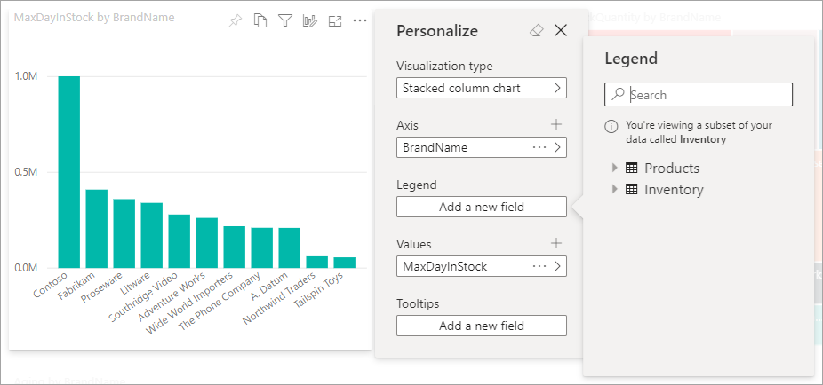
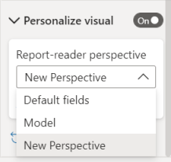
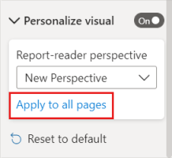

# Let users personalize visuals in a report

[!INCLUDE [applies-to](../includes/applies-to.md)] [!INCLUDE [yes-desktop](../includes/yes-desktop.md)] [!INCLUDE [yes-service](../includes/yes-service.md)]

When you share a report with a broad audience, some of your users may want to see slightly different views of particular visuals. Maybe they'd want to swap what's on the axis, change the visual type, or add something to the tooltip. It's hard to make one visual that satisfies everyone's requirements. With this new capability, you can empower your business users to explore and personalize visuals, all in report reading view. They can adjust the visual the way they want, and save it as a bookmark to come back to. They don't need to have edit permission for the report, or to go back to the report author for a change.

:::image type="content" source="media/power-bi-personalize-visuals/power-bi-personalize-visual.png" alt-text="Personalize a visual":::
 
## What report users can change

This feature allows business users to gain further insights through ad-hoc exploration of visuals on a Power BI report. To learn how to use this feature as a user, see [Personalize visuals in your reports](../consumer/end-user-personalize-visuals.md). The feature is ideal for report creators who want enable basic exploration scenarios for their report readers. Here are modifications that report readers can make:

- Change the visualization type
- Swap out a measure or dimension
- Add or remove a legend
- Compare two or more measures
- Change aggregations, etc.

Not only does this feature allow for new exploration capabilities. It also includes ways for users to capture and share their changes:

- Capture their changes
- Share their changes
- Reset all their changes for a report
- Reset all their changes for a visual
- Clear out their recent changes

## Use Perspectives for a more focused view

For Personalize visuals, you can use **Perspectives** to choose a subset of a model that provides a more focused view. Choosing a subset can be helpful when working with a large data model, allowing you to focus on a manageable subset of fields, and not overwhelm report readers with the full collection of fields in that large model. 

Keep the following considerations in mind when working with perspectives:

* Perspectives are not meant to be used as a security mechanism, they are a tool for providing a better end-user experience. All security for a perspective is inherited from the underlying model.

* Perspectives in both tabular and multi-dimensional models are supported. However, for perspectives in multi-dimensional models, you can only set the perspective to be the same as the base cube for the report.

* Before deleting a perspective from a model, be sure to check that the perspective is not being used in the Personalize visuals experience. 

To use Perspectives, you must enable Personalize visuals for the report. You also must create at least one Perspective that includes the dimensions and measures you want end-users to interact with for the Personalize visuals experience.

To create the perspective use [Tabular Editor](https://tabulareditor.com/), which you can download from the following location: Tabular Editor download

Once you install **Tabular Editor**, open your report in **Power BI Desktop** and launch **Tabular Editor** from the **External Tools** tab of the ribbon, as shown in the following image.

In Tabular Editor, right-click on the **Perspectives** folder to create a new perspective.

You can double-click the text to rename the perspective.

Next, add fields to the perspective by opening the **Tables** folder in Tabular Editor, the right-click on the fields you want to show in the perspective.

Repeat that process for each field you want to add to the perspective. You can’t add duplicate fields in a perspective, so any fields you already added to a perspective will have the option to add it disabled.

After you added all the fields you want, be sure to save your settings, both in Tabular Editor and then also in Power BI Desktop.

Once you save the new perspective to the model, and save the Power BI Desktop report, navigate to the **Format** pane for the page, where you see a new section for **Personalize visual**.

The selection for *Report-reader perspective* is set to *Default fields* initially. Once you select the drop down arrow, you see the other Perspectives you’ve created.

Once you set the Perspective for the report page, the Personalize visuals experience for that page is filtered to the selected Perspective. Selecting **Apply to all pages** lets you apply your Perspective setting to all existing pages in your report.

## Enable personalization in a report

You can enable the feature either in Power BI Desktop or the Power BI service. You can also enable it in embedded reports.

### In Power BI Desktop

To enable the feature in Power BI Desktop, go to **File** > **Options and Settings** > **Options** > **Current file** > **Report settings**. Make sure **Personalize visuals** is turned on.

:::image type="content" source="media/power-bi-personalize-visuals/personalize-report-setting-desktop.png" alt-text="Enable personalization in a report":::

### In the Power BI service

To enable the feature in the Power BI service instead, go to **Settings** for your report.

:::image type="content" source="media/power-bi-personalize-visuals/power-bi-report-service-settings-personalize-visual.png" alt-text="Report settings in the Power BI service":::

Turn on **Personalize visuals** > **Save**.

:::image type="content" source="media/power-bi-personalize-visuals/personalize-report-setting-service.png" alt-text="Turn on Personalize visuals in the service":::

## Turn the feature on or off at a page or visual level

When you enable Personalize visuals for a given report, by default all visuals in that report can be personalized. If you don't want all the visuals to be personalized, you can turn the setting on or off per page or per visual.

### Per page

Select the page tab > select **Format** in the **Visualizations** pane.

:::image type="content" source="media/power-bi-personalize-visuals/personalize-page-level-setting.png" alt-text="Select Personalize Visual for a page.":::
 
Slide **Personalize visual** >  **On** or **Off**.

### Per visual

Select the visual > select **Format** in the **Visualizations** pane > expand **Visual header**.

:::image type="content" source="media/power-bi-personalize-visuals/power-bi-format-visual-header-personalize.png" alt-text="Select Visual header":::
 
Slide **Personalize visual** >  **On** or **Off**.

:::image type="content" source="media/power-bi-personalize-visuals/power-bi-format-visual-personalize-on-off.png" alt-text="Personalize visual slider on or off":::

## Limitations

Currently the feature has a few limitations to be aware of.

- This feature isn't supported for publish to web.
- Export to PowerPoint and PDF do not capture personalized visuals.
- User explorations don't automatically persist. You need to save your view as a personal bookmark to capture your changes.
- This feature is supported in the Power BI mobile apps for iOS and Android tablets and in the Power BI Windows app; it is not supported in the Power BI mobile apps for phones. However, any change to a visual you save in a personal bookmark while in the Power BI service is respected in all the Power BI mobile apps.

## Next steps

[Personalize visuals in your reports](../consumer/end-user-personalize-visuals.md).     

Give the new visual personalization experience a try. Give us your feedback for this feature, and how we can continue to improve it, on the [Power BI Ideas site](https://ideas.powerbi.com/forums/265200-power-bi). 

More questions? [Try the Power BI Community](https://community.powerbi.com/)
