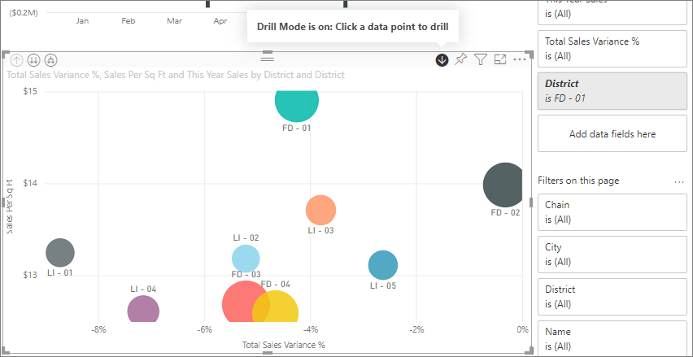

# Types of filters in Power BI reports

Filters don't all behave the same way because they're not created the same way. How you create them influences how they behave in the new filter pane in editing mode. In this article, we describe the different kinds of filters: the different ways you create them and the different things they're good for. Read about how to [add filters to reports](power-bi-report-add-filter.md). 

Let’s start with the two most common filter types: manual and automatic.

## Manual filters 

Manual filters are the filters that report creators drag and drop anywhere in the new filter pane. Users with edit permission to the report can edit, delete, clear, hide, lock, rename, or sort this filter in the new pane.

## Automatic filters 

Automatic filters are the filters that get automatically added to the visual level of the filter pane when you build a visual. These filters are based on the fields that make up your visual. Users with edit permission to the report can edit, clear, hide, lock, rename, or sort this filter in the new pane. They can't delete automatic filters, because the visual refers to those fields.

## More advanced filters

These next filter types are less common, but it's still important to understand them if they're displayed in your report. Besides, you might find them useful in creating just the right filter for your report.

## Include and exclude filters

Include and exclude filters get automatically added to the filter pane when you use the include or exclude functionality for a visual. Users with edit permission to the report can delete, lock, hide, or sort this filter in the new pane. They can't edit, clear, or rename an include or exclude filter, because it's associated with the include and exclude functionality of visuals.

## Drill-down filters

Drill-down filters get automatically added to the filter pane when you use the drill-down functionality for a visual in your report. Users with edit permission to the report can edit or clear the filter in the new pane. They can't delete, hide, lock, rename, or sort this filter because it's associated with the drill-down functionality of visuals. To remove the drill-down filter, you click the drill-up button for the visual.

## Cross-drill filters

Cross-drill filters are automatically added to the new pane when a drill-down filter is passed to another visual on the report page via the cross-filter or cross-highlight feature. Users with edit permission to the report can't delete, clear, hide, lock, rename, or sort this filter because it's associated with the drill-down functionality of visuals. They also can't edit this filter because it comes from drilling down in another visual. To remove the drill-down filter, you click the drill-up button for the visual that's passing the filter.

## Drillthrough filters

Drillthrough filters get passed from one page to another via the drillthrough feature. They show up in the drillthrough pane. There are two types of drillthrough filters. The first type is the one that invokes the drillthrough. Report editors can edit, delete, clear, hide, or lock this type of filter. The second type is the drillthrough filter that gets passed to the target, based on the page-level filters of the source page. Report editors can edit, delete, or clear, this transient type of drillthrough filter. They can't lock or hide this filter for end users.

## URL filters

URL filters get added to the new pane by adding a URL query parameter. Users with edit permission to the report can edit, delete, or clear the filter in the new pane. They can't hide, lock, rename, or sort this filter because it's associated with the URL parameter. To remove the filter, you remove the parameter from the URL. Here's an example URL with a parameter:

app.powerbi.com/groups/me/apps/*app-id*/reports/*report-id*/ReportSection?filter=Stores~2FStatus%20eq%20'Off'

Read more about [URL filters](../collaborate-share/service-url-filters.md).

## Pass-through filters

Pass-through filters are visual-level filters created through Q&A. Authors can delete, hide, or sort these filters in the new pane. However, they can't rename, edit, clear, or lock these filters.

## Comparing filter types

This table compares what authors can do with the different types of filters.

| Filter type | Edit | Clear | Delete | Hide | Lock | Sort | Rename |
|----|----|----|----|----|----|----|----|
| Manual filters | Y | Y | Y | Y | Y | Y | Y |
| Auto filters | Y | Y | N | Y | Y | Y | Y |
| Include/Exclude filters | N | N | Y | Y | Y | Y | N |
| Drill-down filters | Y | Y | N | N | N | N | N |
| Cross Drill filters | N | N | N | N | N | N | N |
| Drillthrough filters (Invokes drillthrough) | Y | Y | Y | Y | Y | N | N |
| Drillthrough filters (Transient) | Y | Y | Y | N | N | N | N |
| URL filters - transient | Y | Y | Y | N | N | N | N |
| Pass Through filters | N | N | Y | Y | N | Y | N |

## Next steps

[Add filters to reports](power-bi-report-add-filter.md)

[Take a tour of the report Filters pane](../consumer/end-user-report-filter.md)

[Filters and highlighting in reports](power-bi-reports-filters-and-highlighting.md)

More questions? [Try the Power BI Community](https://community.powerbi.com/)
