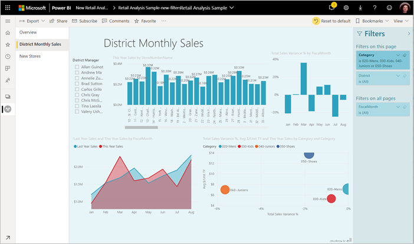
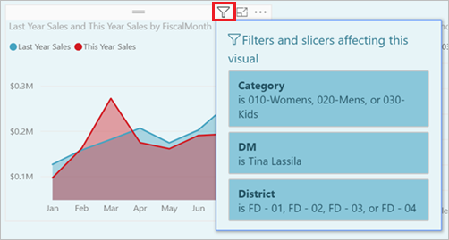

# Format filters in Power BI reports

[!INCLUDE [applies-to](../includes/applies-to.md)] [!INCLUDE [yes-desktop](../includes/yes-desktop.md)] [!INCLUDE [yes-service](../includes/yes-service.md)]

You have a lot of control over report filter design and functionality. This article explains how you can format the Filters pane to look like the rest of the report. You can lock and even hide filters.



The first step is to [add filters to your report](power-bi-report-add-filter.md). Then, as a report designer, there are lots of ways you can format the Filters pane:

- Add and remove fields to filter on. 
- Change the filter state.
- Format and customize the Filters pane so that it feels part of your report.
- Define whether the Filters pane is open or collapsed by default when a consumer opens the report.
- Hide the entire Filters pane or specific filters that you don't want report consumers to see.
- Control and even bookmark the visibility, open, and collapsed state of the Filters pane.
- Lock filters that you don't want consumers to edit.

When reading a report, users can hover over any visual to see a read-only list of all the filters or slicers affecting that visual.



Read about [how report readers use filters](../consumer/end-user-report-filter.md) in report Reading mode.

## Build the Filters pane

By default the Filters pane is formatted based on your current report settings. In the Filters pane, you configure which filters to include, and update existing filters. The Filters pane looks the same for your report consumers when you publish your report. 

1. When you add a visual to a report canvas, Power BI automatically adds a filter to the Filters pane for each field in the visual.

2. To build your Filters pane, drag other fields of interest into the Filters pane either as visual, page, or report level filters.

## Show or hide the Filters pane

### Hide the Filters pane in Reading mode

If you don't want your report readers to see the Filters pane at all, select the **eye** icon next to **Filters**.

 

### Hide the Filters pane while editing

You can hide the Filters pane while you're editing your report, when you aren't using the Filters pane and you need extra space on the screen. 

- On the **View** tab, the **Filters** button allows you to show or hide the Filters pane.


This setting only hides the Filters pane in Power BI Desktop. There's no equivalent in Editing mode in the Power BI service.

## Lock or hide filters

You can lock or hide individual filter cards. If you lock a filter, your report consumers can see but not change it. If you hide it, they can't even see it. Hiding filter cards is typically useful if you need to hide data cleanup filters that exclude nulls or unexpected values. 

- In the Filters pane, select or clear the **Lock filter** or **Hide filter** icons in a filter card.

   

As you turn these settings on and off in the Filters pane, you see the changes reflected in the report. Hidden filters don't show up in the pop-up filter list for a visual.

You can also configure the Filters pane state to flow with your report bookmarks. The pane's open, close, and visibility state are all bookmarkable.
 
## Format the Filters pane

A big part of the filter experience is that you can format the Filters pane to match the look and feel of your report. You can also format the Filters pane differently for each page in the report. Here are elements you can format: 

- Background color
- Background transparency
- Border on or off
- Border color
- Title and header font, color, and text size

You can also format these elements for filter cards, depending on if they're applied (set to something) or available (cleared): 

- Background color
- Background transparency
- Border: on or off
- Border color
- Font, color, and text size
- Input box color

### Format the Filters pane and cards

1. In the report, click the report itself, or the background (*wallpaper*), then in the **Visualizations** pane, select **Format**. 
    You see options for formatting the report page, the wallpaper, and also the Filters pane and Filter cards.

1. Expand **Filters pane** to set color for the background, icon, and left border, to complement the report page.

    

1. Expand **Filter cards** to set the **Available** and **Applied** color and border. If you make available and applied cards different colors, it's obvious which filters are applied. 
  
    

## Theming for Filters pane
You can now modify the default settings of the Filters pane with the theme file. Here's a sample theme snippet to get you started:

 
```
"outspacePane": [{ 

"backgroundColor": {"solid": {"color": "#0000ff"}}, 

"foregroundColor": {"solid": {"color": "#00ff00"}}, 

"transparency": 50, 

"titleSize": 35, 

"headerSize": 8, 

"fontFamily": "Georgia", 

"border": true, 

"borderColor": {"solid": {"color": "#ff0000"}} 

}], 

"filterCard": [ 

{ 

"$id": "Applied", 

"transparency": 0, 

"backgroundColor": {"solid": {"color": "#ff0000"}}, 

"foregroundColor": {"solid": {"color": "#45f442"}}, 

"textSize": 30, 

"fontFamily": "Arial", 

"border": true, 

"borderColor": {"solid": {"color": "#ffffff"}}, 

"inputBoxColor": {"solid": {"color": "#C8C8C8"}} 

}, 

{ 

"$id": "Available", 

"transparency": 40, 

"backgroundColor": {"solid": {"color": "#00ff00"}}, 

"foregroundColor": {"solid": {"color": "#ffffff"}}, 

"textSize": 10, 

"fontFamily": "Times New Roman", 

"border": true, 

"borderColor": {"solid": {"color": "#123456"}}, 

"inputBoxColor": {"solid": {"color": "#777777"}} 

}] 
```

## Sort the Filters pane

Custom sort functionality is available in the Filters pane. When creating your report, you can drag and drop filters to rearrange them in any order.


The default sort order is alphabetical for filters. To start custom sort mode, just drag any filter to a new position. You can only reorder filters within the level they apply to. For example, you can change the order of the visual-level filters within the visual-level section of the Filters pane.

## Improved Filters pane accessibility

We've improved the keyboard navigation for the Filters pane. You can tab through every part of the Filters pane and use the context key on your keyboard or Shift+F10 to open the context menu.


## Rename filters
When you're editing the Filters pane, you can double-click the title to edit it. Renaming is useful if you want to update the filter card to make more sense for your end users. Keep in mind renaming the filter card does *not* rename the display name of the field in the fields list. It just changes the display name used in the filter card.


## Filters pane search

The Filters pane search feature allows you to search across your filter cards by title. This feature is helpful if you have several different filter cards in your Filters pane and need help finding the ones of interest.


You can also format the search box, just as you can format the other elements of the Filters pane.


While this Filters pane search feature is on by default, you can also choose to turn it on or off by selecting **Enable search for Filters pane** in the **Report** settings of the **Options** dialog.


## Restrict changes to filter type

Under the **Filtering experience** section of **Report** settings, you have an option to control if users can change the filter type.


## Allow saving filters

By default, your report readers can save filters for your report. You can choose to not allow them to save filters.

- Also in **Report** settings of the **Options** dialog, under **Persistent filters**, select **Don't allow end users to save filters on this report**.

    :::image type="content" source="media/power-bi-report-filter/power-bi-persistent-filters.png" alt-text="Screenshot of Don't allow end users to save filters on this report.":::

## Apply filters button

You can add a single **Apply** button to the filter pane, allowing you and your end-users to apply all filter modifications at once. Having this button can be useful if you want to defer applying filter changes. You only have to wait once, after you're ready to apply all the filter changes to the report or visuals.

:::image type="content" source="media/power-bi-report-filter/apply-filter-button.png" alt-text="Apply filter button":::

### Turn on the Apply button

You can set this feature at the report level. However, the feature is off by default.

1. Go to **File** > **Options and settings** > **Options** > **Query reduction**.

1. Select **Add a single Apply button to the filter pane to apply changes at once**.

    :::image type="content" source="media/power-bi-report-filter/apply-all-filters.png" alt-text="Turn on Apply filter button":::

### Format the Apply button

Currently, you can control some of the formatting for the **Apply** text for the button. In the **Filter pane** section of the **Format** pane, set these options:

- **Checkbox and Apply color** controls fill color. 
- **Font and icon color** controls text color.
- **Header text size** controls text size.
- **Font family** controls font.

    :::image type="content" source="media/power-bi-report-filter/format-apply-filter.gif" alt-text="Format the Apply filter button text":::

## Considerations and limitations

Publish-to-web doesn't display the Filters pane. If you're planning to publish a report to the web, consider adding slicers for filtering instead.

## Next steps

- [How to use report filters](../consumer/end-user-report-filter.md)
- [Filters and highlighting in reports](power-bi-reports-filters-and-highlighting.md)
- [Different kinds of filters in Power BI](power-bi-report-filter-types.md)

More questions? [Try the Power BI Community](https://community.powerbi.com/)
