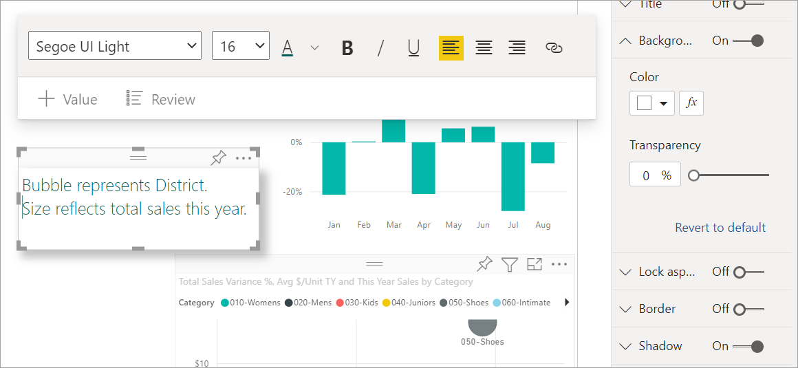
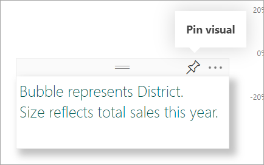
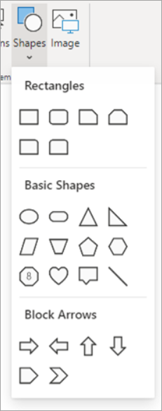
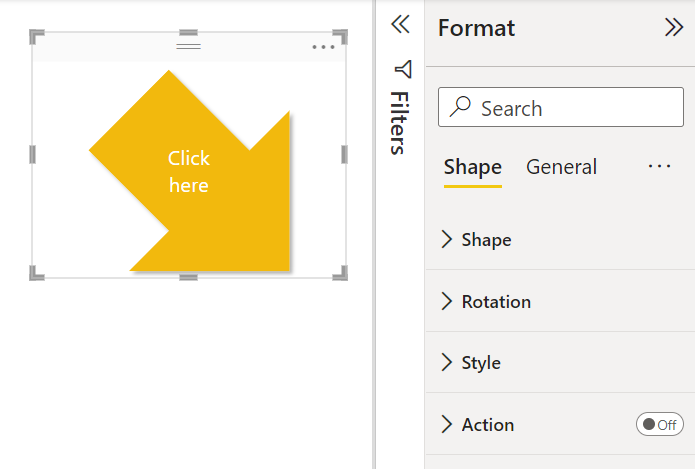
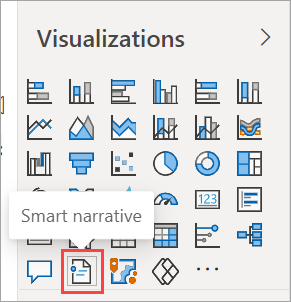

# Add text boxes, shapes, and smart narrative visuals to Power BI reports

You can add text boxes, shapes, and *smart narrative visuals* to reports in Power BI Desktop or the Microsoft Power BI service. The [smart narrative visual](#add-a-smart-narrative) uses artificial intelligence to provide a text summary of your visuals and reports. In either Power BI Desktop or the Microsoft Power BI service, you must have editing permissions for the report. If a report has been shared with you in the Power BI service, you won't have editing permissions. 

Watch Will use Power BI Desktop to add static images to a report, and then follow the steps below to try it out yourself in the Power BI service.
> 
> <iframe width="560" height="315" src="https://www.youtube.com/embed/_3q6VEBhGew" frameborder="0" allowfullscreen></iframe>
> 

## Add a text box to a report

This procedure uses the Retail Analysis sample available in the Power BI service.

1. Open a report in Editing view.

2. Select **Text box** from the top menu. Power BI places an empty text box on the canvas. 
   
   

4. To position the text box, select the grey area at the top and drag. To resize the text box, select and drag any of the outline handles. 
   
   

3. Type your text into the text box and, optionally, set the format font, color, and text alignment. 
   
5. With the text box still selected, add additional formatting in the **Format text box** pane. In this example, we've given the text a theme color, and added a white background and shadow. You can also specify an exact size and position for a text box.  

   

6. To close the text box, select any blank space on the report canvas. 

7. You can also pin a text box to a dashboard. Select the pin icon, then select the dashboard where you want to pin it.

     

## Add a shape to a report

You can add all sorts of shapes to Power BI reports, with a variety of formatting options and styling. You can also upgrade old shapes in your reports.

First, here's a video demonstrating the flexibility you have when creating shapes.

>
> [!VIDEO https://www.microsoft.com/videoplayer/embed/RWDX9z]
>

Now you're ready to create your own shapes.

1. Place your cursor anywhere on the report canvas and select **Shapes**.
   
   

2. From the dropdown, select a shape to add it to your report canvas.  Then in the **Format shape** pane, you can customize the shape to suit your needs. For this example, the arrow has been rotated 45 degrees and formatted to include text and a shadow. 
   
   

3. To position the shape, select the grey area at the top and drag. To resize the shape, select and drag any of the outline handles. As with the text box, you can also create an exact size and position for a shape.

   > [!NOTE]
   > Shapes cannot be pinned to a dashboard, except as one of the visuals when you [pin a live page](service-dashboard-pin-live-tile-from-report.md). 
   >  

## Add a smart narrative

You can also add a *smart narrative* to your report. The smart narrative visualization uses artificial intelligence to provide a text summary of your visuals and reports. It provides relevant insights that you can customize.

1. In the **Visualizations** pane, select the **Smart narrative** icon. If you don't see it, you may need to turn on the preview.

    

2. Power BI creates a text box with auto-generated text describing interesting features of the data in your report.

    

3. You can format it as you would any other text box. The underlined text are values the smart narrative is finding in the data.

Read more about [smart narratives](../visuals/power-bi-visualization-smart-narrative.md).

## Next steps

You might also be interested in the following articles:

* [Add a hyperlink to a text box](service-add-hyperlink-to-text-box.md)
* [Basic concepts for designers in the Power BI service](../fundamentals/service-basic-concepts.md)
* [Tips to improve analysis with shapes, images, and icons in Power BI reports](../guidance/report-tips-shapes-images-icons.md)
* More questions? [Try the Power BI Community](https://community.powerbi.com/)
