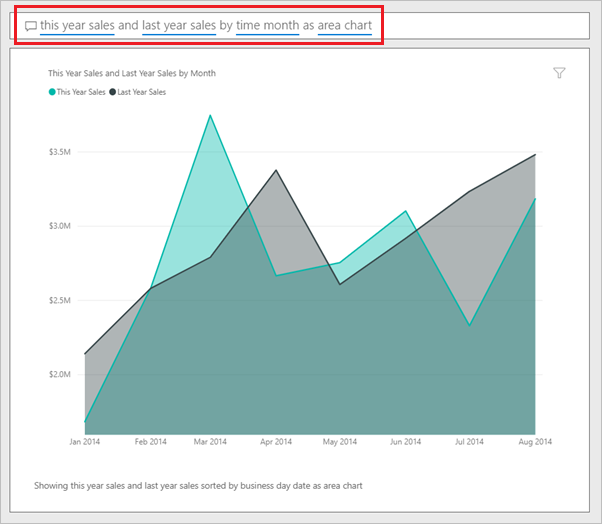
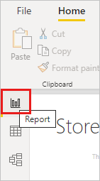
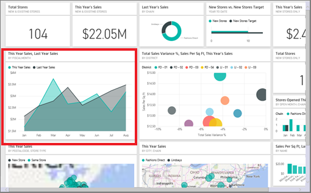

# Create a Q&A visual in a dashboard in Power BI

[!INCLUDE [applies-yes-desktop-yes-service](../includes/applies-yes-desktop-yes-service.md)]

Sometimes the fastest way to get an answer from your data is to ask a question using natural language.  In this article, we look at two different ways of creating the same visualization: first, asking a question with Q&A in a dashboard, and second, building it in a report. We use the Power BI service to build the visual in the report, but the process is almost identical using Power BI Desktop.

To follow along, you must use a report that you can edit, so we'll use one of the samples available with Power BI.

## Create a Q&A visual in a dashboard

How would we go about creating this line chart using Q&A?

1. From your Power BI workspace, select **Get Data** \> **Samples** \> **Retail Analysis Sample** > **Connect**.

1. Open the Retail Analysis Sample dashboard and place your cursor in the Q&A box, **Ask a question about your data**.

    

1. In the Q&A box, type something like this question:

    **this year sales and last year sales by month as area chart**

    As you type your question, Q&A picks the best visualization to display your answer; and the visualization changes dynamically as you modify the question. Also, Q&A helps you format your question with suggestions, autocomplete, and spelling corrections. Q&A recommends a small wording change: "this year sales and last year sales by *time month* as area chart".  

    

1. Select the sentence to accept the suggestion.

   When you finish typing your question, the result is the same chart that you see in the dashboard.

   

1. To pin the chart to your dashboard, select the pin icon  in the upper-right corner.

## Create a visual in the report editor

# [Power BI Desktop](#tab/powerbi-desktop)

1. Open Power BI Desktop and load the Retail Analysis Sample. You can get this sample from [Download original sample Power BI files](sample-datasets.md#download-original-sample-power-bi-files).

2. Select the **Report** icon to open the Reports view.

    

3. At the bottom of the page, select **District Monthly Sales**.

    

# [Power BI service](#tab/powerbi-service)

1. Navigate back to the Retail Analysis Sample dashboard.

2. The dashboard contains the same area chart tile for "Last Year Sales and This Year Sales."  Select this tile. Don't select the tile you created with Q&A. Selecting it opens Q&A. The original area chart tile was created in a report, so the report opens to the page that contains this visualization.

    

3. Open the report in Editing View by selecting **Edit**.  If you aren't the owner of a report, you don't have the option to open the report in Editing view.

    

---

4. Select the area chart and review the settings in the **Fields** pane.  The report creator built this chart by selecting these three values (**Last Year Sales** and **This Year Sales > Value** from the **Sales** table, and **FiscalMonth** from the **Time** table) and organizing them in the **Axis** and **Values** wells of the **Visualizations** pane.

    

You see they ended up with the same visual. Creating it this way wasn't too complicated. But creating it with Q&A was easier!

## Next steps

- [Use Q&A in dashboards and reports](power-bi-tutorial-q-and-a.md)  
- [Q&A for consumers](../consumer/end-user-q-and-a.md)
- [Make your data work well with Q&A in Power BI](service-prepare-data-for-q-and-a.md)

More questions? [Try the Power BI Community](https://community.powerbi.com/)
