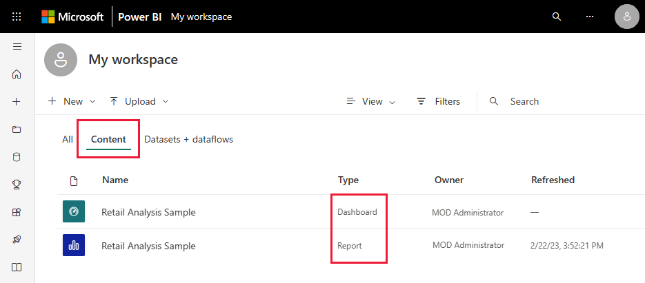
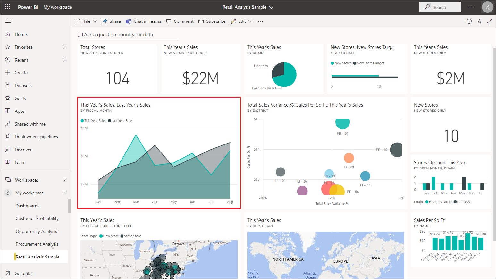
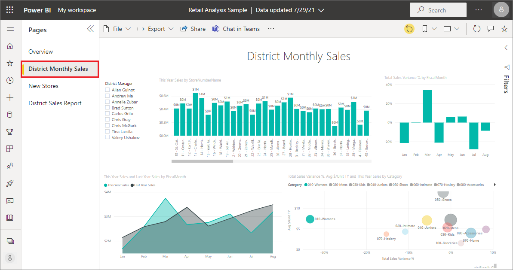
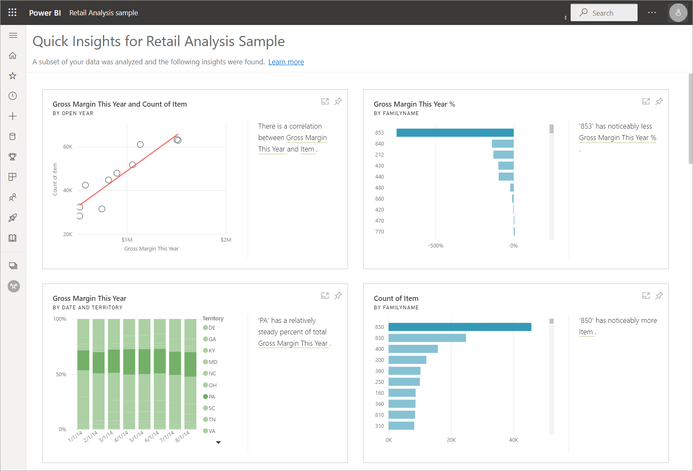
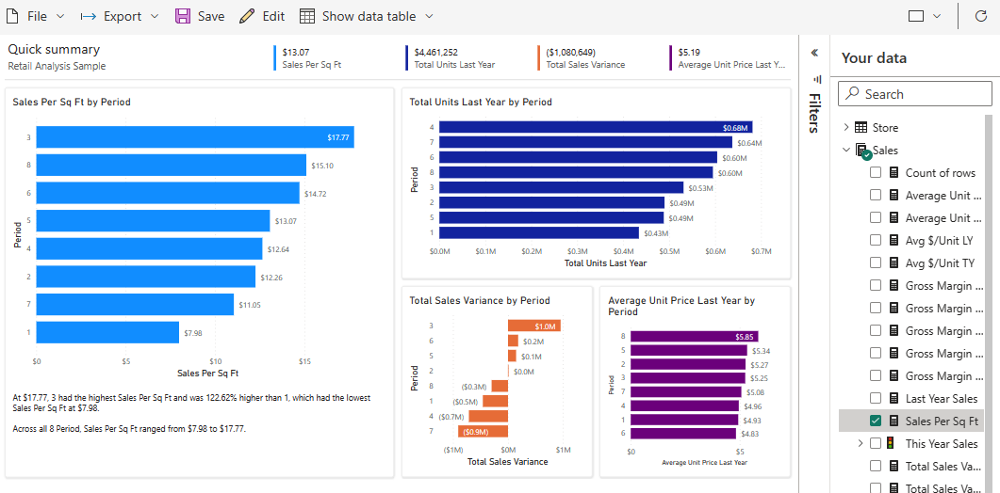
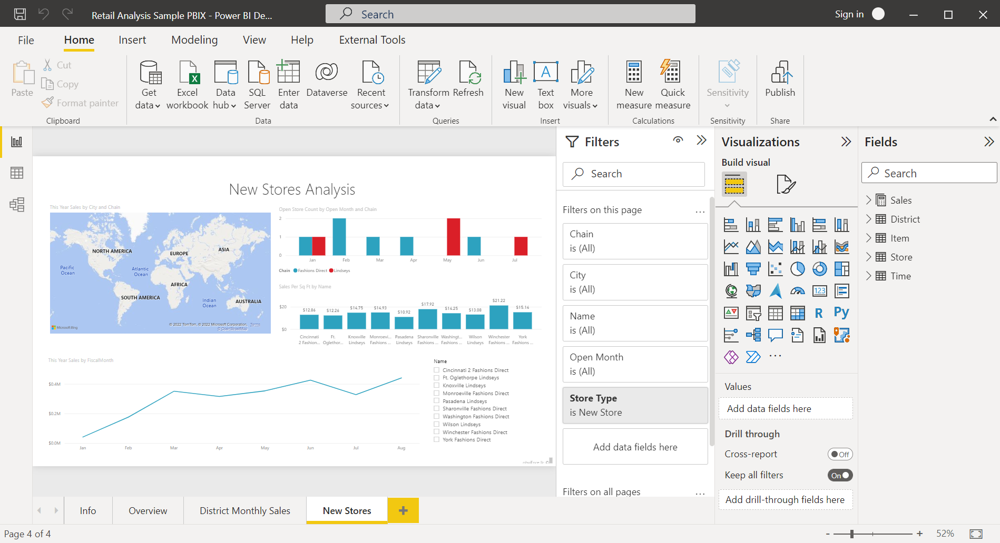
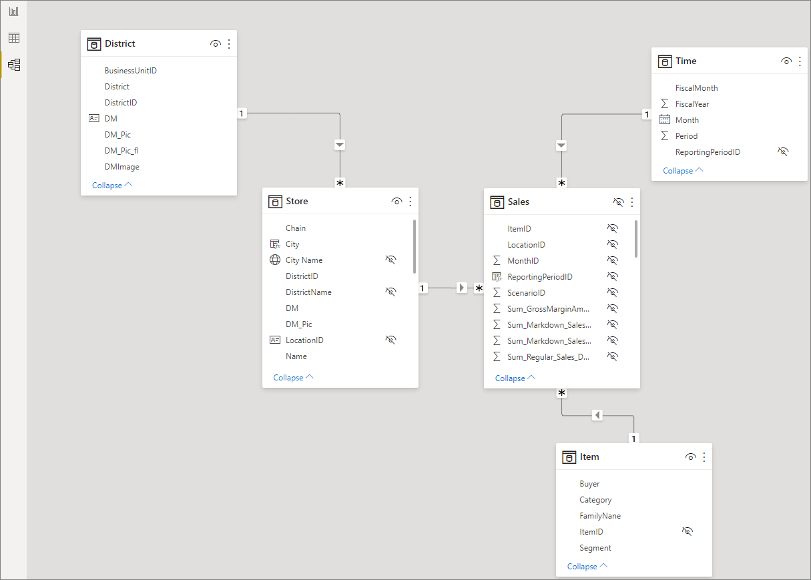

# Tutorial: Explore a Power BI sample

[!INCLUDE [applies-yes-desktop-yes-service](../includes/applies-yes-desktop-yes-service.md)]

Power BI has several samples that you can either download in the Power BI service or open in Power BI Desktop. In a *built-in sample*, the report is bundled with a dashboard and dataset, and built into the Power BI service. The *.pbix file* that you can view in Power BI Desktop contains a report and dataset. 

:::image type="content" source="media/sample-tutorial-connect-to-the-samples/retail-report-overview.png" alt-text="Retail Analysis Sample, Overview page.":::

This tutorial shows you how to: 

> [!div class="checklist"]
> * Sign up for a Power BI license, if you don't have one.
> * Import the Retail Analysis sample and add it to the Power BI service.
> * Explore the sample in the service.
> * Create a visual by using natural language in *Q&A*.
> * Generate *quick insights* based on the dataset.
> * Open the Retail Analysis sample .pbix file in Power BI Desktop.

If you'd like more background information, see [Sample datasets for Power BI](sample-datasets.md). In that article you learn about how to get the samples, where to save them, and how to use them. 

If you want to familiarize yourself with the built-in sample in this tutorial and its scenario, see [Retail Analysis sample for Power BI: Take a tour](sample-retail-analysis.md) before you begin.

## Prerequisites

- To download a sample in the Power BI service, you can sign up for a [free or trial license](../fundamentals/service-self-service-signup-purchase-for-power-bi.md).
- To open a Power BI .pbix file, you need to [get Power BI Desktop](../fundamentals/desktop-get-the-desktop.md). It's a free download.

## Import the sample in the Power BI service

1. Open the Power BI service (app.powerbi.com), sign in, and open the workspace where you want to save the sample. 

    If you don't have a Power BI Pro or Premium Per User (PPU) license, you can save the sample to your My Workspace.

2. Select **Get data** at the bottom of the nav pane. 

   :::image type="content" source="../media/power-bi-get-data.png" alt-text="Select Get data.":::

   If you don't see **Get Data**, expand the nav pane by selecting the following icon at the top of the pane.

    

1. On the **Get Data** page that appears, select **Samples**.

1. Select **Retail Analysis Sample** > **Connect**.

   

## What was imported?

With the built-in samples, when you select **Connect**, Power BI gets a copy of that built-in sample and stores it for you in the cloud.

1. Power BI creates the new dashboard, report, and dataset in your workspace. 

   
2. On the **Content** tab, you see the dashboard and the report, both named *Retail Analysis Sample*.

   
   
3. On the **Datasets + dataflows** tab, you see the dataset, also named *Retail Analysis Sample*.
   
   
   
## Explore your new content

Now explore the dashboard, dataset, and report on your own. There are many different ways to navigate to your dashboards, reports, and datasets. 

- If a tile was created by using [Power BI Q&A](power-bi-tutorial-q-and-a.md), the Q&A page opens when you select it. 
- If a tile was pinned from a report, the report opens. 
- If a tile was [pinned from Excel](service-dashboard-pin-tile-from-excel.md), Excel Online will open inside of Power BI. 

The first two of these methods are described in the following procedures.

### Explore in Q&A

The Q&A feature in Power BI lets you explore your data in your own words, asking questions using natural language.

1. From your workspace, select the **Retail Analysis Sample** *dashboard* to open it.

   The dashboard opens, with a variety of visualization tiles.
 
1. Select the **This Year's Sales, New & Existing Stores** tile, of **$22 M**. 

    :::image type="content" source="media/sample-tutorial-connect-to-the-samples/retail-dashboard-this-years-sales.png" alt-text="Select the This Year's Sales tile.":::

    This tile was created with Power BI Q&A, so when you select the tile, Q&A opens again.

     :::image type="content" source="media/sample-tutorial-connect-to-the-samples/retail-q-n-a-this-years-sales.png" alt-text="The tile opens in Q&A with this year's sales.":::

1. In the top bar, next to **this year's sales**, start typing "by store". Q&A creates a bar chart of values for each store.

    :::image type="content" source="media/sample-tutorial-connect-to-the-samples/retail-q-n-a-this-years-sales-store.png" alt-text="Type by store in the Q&A bar.":::

1. In the upper-right corner, select **Pin visual**. 
1. Pin your new visual to your existing dashboard, **Retail Analysis Sample**.

1. Select **Exit Q&A**. Power BI added your new tile at the end of the dashboard. You can resize it and drag it anywhere you want on the dashboard. You see how the other tiles move to make way for it.

    :::image type="content" source="media/sample-tutorial-connect-to-the-samples/retail-dashboard-this-years-sales-store.png" alt-text="Rearrange the tiles on the dashboard.":::

### Explore the report

1. Select one of the other tiles in the dashboard to open the underlying report. In this example, we'll select the area chart, **This Year's Sales, Last Year's Sales by Fiscal Month**.  

   

   The report opens to the page that contains the area chart you selected; in this case, the **District Monthly Sales** page of the report.

   

1. Check out [Dive deeper into the data](sample-retail-analysis.md#dive-deeper-into-the-data) in the article "Retail Analysis sample for Power BI: Take a tour" for suggestions on exploring the report.

### Explore quick insights

One easy way of exploring a *dataset* is to run [quick insights](../consumer/end-user-insights.md). 

1. On the **Datasets** tab, select **More options** (...), and then choose **Get quick insights**. 
1. When the insights are ready, select **View insights**.
     
    

1. If an insight is interesting, pin it to the dashboard.

### Create a report from the dataset

When someone shares an app with colleagues, they typically want to share only the insights, rather than provide direct access to the data. On the **Datasets** tab, you have several options for exploring your dataset. However, you can't view the rows and columns of your data, as you can in Power BI Desktop or Excel. 

   
1. One way of exploring the dataset is by creating your own visualizations and reports from scratch. Select **More options (...)** > **Create report**.
   
   
   
   The dataset opens in report editing mode.
   
   

1. Now you can create any visuals you want, or you can try the tutorial [Create a decomposition tree with a Power BI sample](sample-tutorial-decomp-tree.md), which uses the same data.

## Download the sample in Power BI Desktop 

When you first open the sample .pbix file in Power BI Desktop, it displays in Report view where you can explore and modify existing report pages and add new ones, with your own visualizations. Report view provides almost the same design experience as report Editing view in the Power BI service. You can move visualizations around, copy and paste, change the kind of visualization, and so on. 

Unlike editing a report in the Power BI service, in Power BI Desktop you can also work with your queries and model your data to ensure your data supports the best insights in your reports. You can then save your Power BI Desktop file wherever you like, whether it's to your local drive or to the Power BI service.

1. Download the [Retail Analysis sample .pbix file](https://download.microsoft.com/download/9/6/D/96DDC2FF-2568-491D-AAFA-AFDD6F763AE3/Retail%20Analysis%20Sample%20PBIX.pbix) and open it in Power BI Desktop. 

    

1. The file opens in Report view. Notice the four tabs at the bottom of the report editor; these tabs represent the four pages in this report. For this example, the **New Stores** page is currently selected. 

    

1. For a deep dive into the report editor, see [Take a tour of the report editor](service-the-report-editor-take-a-tour.md).

## What's in your report?
When you download a sample .pbix file, you've downloaded not just a report but also the *underlying dataset*. When you open the file, Power BI Desktop loads the data with its associated queries and relationships. You can view the underlying data and relationships, but you can't view the underlying queries in the Query Editor.

1. Switch to [Data view](../connect-data/desktop-data-view.md) by selecting the data icon .
 
    

    In Data view, you can inspect, explore, and understand data in your Power BI Desktop model. It's different from how you view tables, columns, and data in the Query Editor. The data in Data view is already loaded into the model.

    When you're modeling your data, sometimes you want to see what's actually in the rows and columns of a table, without creating a visual on the report canvas. This is especially true when you're creating measures and calculated columns, or you need to identify a data type or data category.

1. Switch to [Model view](../transform-model/desktop-relationship-view.md) by selecting the following icon: .
 
    

    Model view shows all of the tables and columns in your model, and the relationships between them. From here you can view, change, and create relationships.

## Next steps
This environment is a safe one to play in, because you can choose not to save your changes. And if you do save them, you can always select **Get data** for a new copy of this sample.

We hope this tour has shown how Power BI dashboards, datasets, relationships, and reports can provide insights into sample data. Now it's your turn; connect to your own data. With Power BI, you can connect to a wide variety of data sources. To learn more, see [Get started with the Power BI service](../fundamentals/service-get-started.md) and [Get started with Power BI Desktop](../fundamentals/desktop-getting-started.md).  

> [!div class="nextstepaction"]
> [Samples for the Power BI service](sample-datasets.md)

More questions? [Try the Power BI Community](https://community.powerbi.com/)
