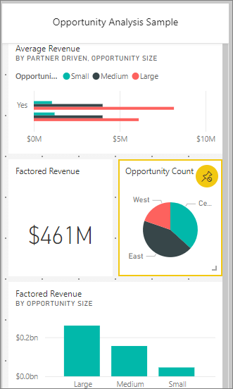
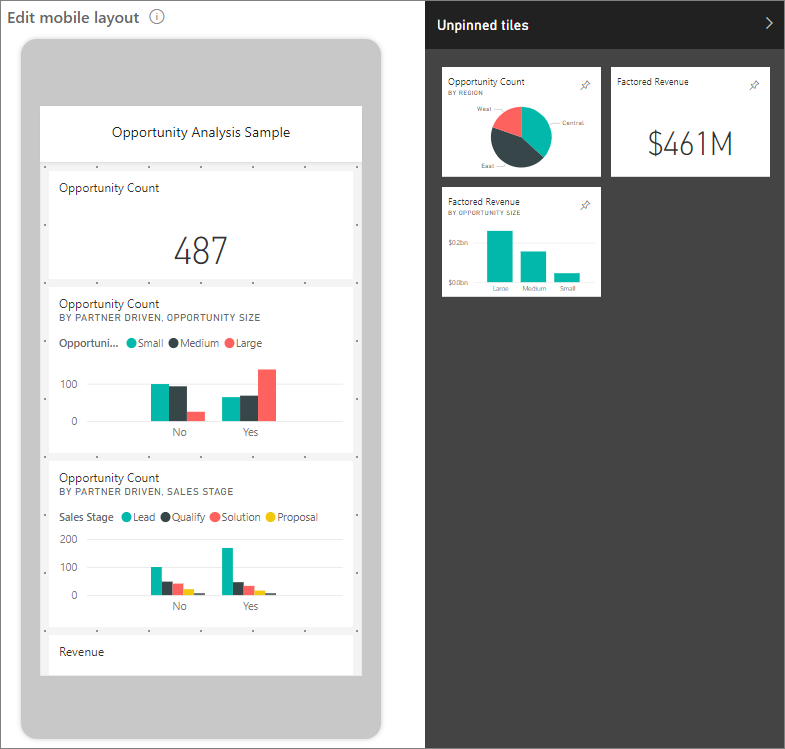
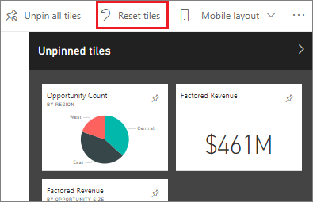

# Optimize a dashboard for mobile phones - Power BI 

[!INCLUDE [applies-no-desktop-yes-service-yes-mobile](../includes/applies-no-desktop-yes-service-yes-mobile.md)]

When you view dashboards in portrait mode on a phone, you notice the dashboard tiles are laid out one after another, all the same size. In the Power BI service, you can create a customized view of a dashboard, specifically for portrait mode on phones. Even if you create a phone view, when you turn the phone sideways, you see the dashboard as it's laid out in the service.

Are you looking for information about viewing dashboards on a mobile device? Try this quickstart [Explore dashboards and reports in the Power BI mobile apps](../consumer/mobile/mobile-apps-quickstart-view-dashboard-report.md) instead.

> [!NOTE]
> As you edit the phone view, anyone viewing the dashboard on a phone can see the changes you make in real time. For example, if you unpin all tiles on the dashboard phone view, the dashboard on the phone will suddenly have no tiles. 
> 
> 

## Create a phone view of a dashboard
1. In the Power BI service, open a dashboard.
2. Select the arrow next to **Edit** on the top menu, and then select **Mobile layout**.

    

    If you aren't the dashboard owner, you won't see this option.

    

    The phone dashboard edit view opens. Here you can unpin, resize, and rearrange tiles to fit the phone view. The web version of the dashboard doesn't change.

1. Select a tile to drag, resize, or unpin it.  You notice the other tiles move out of the way as you drag a tile.
   
    
   
    The unpinned tiles go in the **Unpinned tiles** pane, where they stay unless you add them back.
   
    
2. If you change your mind, select **Reset tiles** to put them back in the size and order they were before.
   
    
   
    Just opening **Mobile layout** view in the Power BI service slightly changes the size and shape of the tiles on a phone. So to return the dashboard to its exact state before you opened it in Mobile layout view, select **Reset tiles**.
   
3. When you're satisfied with the phone dashboard layout, switch back to web view by selecting **Web layout** in the top menu.
   
    Power BI saves the phone layout automatically.

## Next steps
* [Create reports optimized for the Power BI phone apps](desktop-create-phone-report.md)
* [Create responsive visuals optimized for any size](../visuals/power-bi-report-visualizations.md)
* More questions? [Try asking the Power BI Community](https://community.powerbi.com/)
