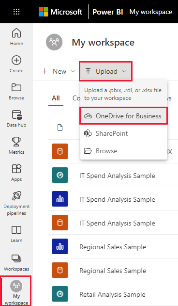
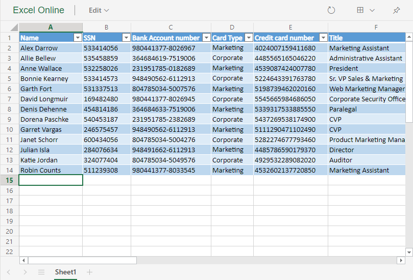
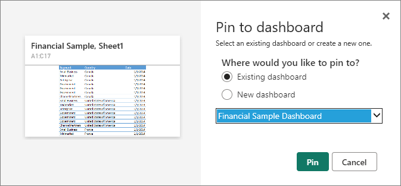

# Pin a tile to a Power BI dashboard from Excel
Before you can pin a tile from your Excel workbook, you'll connect that workbook to Power BI service (app.powerbi.com). Connecting a workbook essentially brings a linked read-only version of that workbook into Power BI service and allows you to pin ranges to dashboards. You can even pin an entire worksheet to a dashboard.  
If a workbook has been shared with you, you'll have the ability to view the tiles pinned by the owner, but not create any dashboard tiles yourself. 

For in-depth information about how Excel and Power BI work together, see [Get data from Excel workbook files](https://go.microsoft.com/fwlink/?LinkID=521962).

Watch Will demonstrate several ways to import data from, and connect to, Excel workbooks.

<iframe width="560" height="315" src="https://www.youtube.com/embed/l8JoB7w0zJA" frameborder="0" allowfullscreen></iframe>

## Connect your Excel workbook from OneDrive for Business to Power BI
When you choose **Connect**, your workbook will appear in Power BI just like it would in Excel Online. But, unlike Excel Online, you’ll have some great features to help you pin elements from your worksheets right to your dashboards.

You can’t edit your workbook in Power BI. But if you need to make some changes, you can select the pencil icon from the **Workbooks** tab of your workspace, and then choose to edit your workbook in Excel Online or open it in Excel on your computer. Any changes you make are saved to the workbook on OneDrive.

1. Upload your workbook to your OneDrive for Business.

2. From Power BI, [connect to that workbook](../connect-data/service-excel-workbook-files.md) by selecting **Get Data > Files > OneDrive - Business** and nagivating to the location where you saved the Excel file. Select the file and choose **Connect > Connect**.

    

3. In Power BI, the workbook is added to the **Workbooks** tab of your workspace.  The  icon indicates this is an Excel workbook and a yellow asterisk indicates it's new.
    
    
4. Open the workbook in Power BI by selecting the workbook name.

    Changes you make to the workbook in Power BI are not saved and do not affect the original workbook on OneDrive for Business. If you sort, filter, or change values in Power BI, those changes cannot be saved or pinned. If you need to make changes that will be saved, select **Edit** from the upper-right corner to open it for editing in Excel Online or Excel. Changes made this way may take a few minutes to update the tiles on the dashboards.
   
    

## Pin a range of cells to a dashboard
One way to add a new [dashboard tile](../consumer/end-user-tiles.md) is from within an Excel workbook in Power BI. Ranges can be pinned from Excel workbooks that have been saved in your OneDrive for Business or another group-shared document library. The ranges can contain data, charts, tables, PivotTables, PivotCharts, and other Excel parts.

1. Highlight the cells that you'd like to pin to a dashboard.
   
    
2. Select the pin  icon. 
3. Pin the tile to an existing dashboard or to a new dashboard. 
   
   * Existing dashboard: select the name of the dashboard from the dropdown.
   * New dashboard: type the name of the new dashboard.
   
     
4. Select **Pin**. A Success message (near the top right corner) lets you know the range was added, as a tile, to your dashboard. 
   
    
5. Select **Go to dashboard**. From here you can [rename, resize, link, and move](service-dashboard-edit-tile.md) the pinned visualization. By default, selecting the pinned tile opens the workbook in Power BI.

## Pin an entire table or PivotTable to a dashboard
Follow the steps above except instead of selecting a range of cells, select an entire table or PivotTable.

To pin a table, select the entire range of the table and be sure to include the headers.  To pin a PivotTable, be sure to include every visible part of the PivotTable, including filters if used.

 

A tile created from a table or PivotTable will show the entire table.  If you add/remove/filter rows or columns in the original workbook, they will also be added/removed/filtered in the tile.

## View the workbook linked to the tile
Selecting a workbook tile opens the linked workbook in Power BI. Since the workbook file is located on the owner’s OneDrive for Business, viewing the workbook requires you have Read permissions for the workbook. If you do not have permission, you will receive an error message.  

 

## Considerations and troubleshooting
Unsupported features: Power BI uses Excel Services to retrieve the workbook tiles. Therefore, since some features from Excel are not supported in Excel Services REST API, they will not be seen on tiles in Power BI. For example: Sparklines, icon set conditional formatting, and time slicers. For a full list of unsupported features see [Unsupported Features in Excel Services REST API](/sharepoint/dev/general-development/unsupported-features-in-excel-services-rest-api)

## Next steps
[Share a dashboard that has links to an Excel workbook](../collaborate-share/service-share-dashboard-that-links-to-excel-onedrive.md)

[Get data from Excel workbooks](../connect-data/service-excel-workbook-files.md)

More questions? [Try the Power BI Community](https://community.powerbi.com/)
