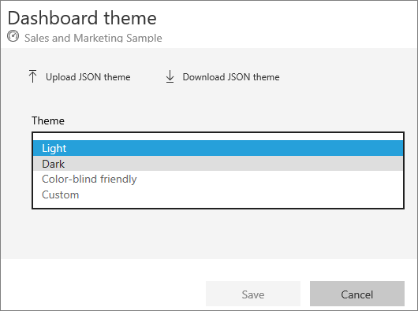
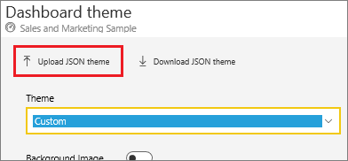
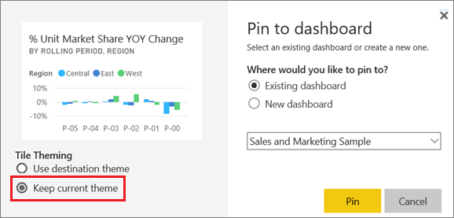
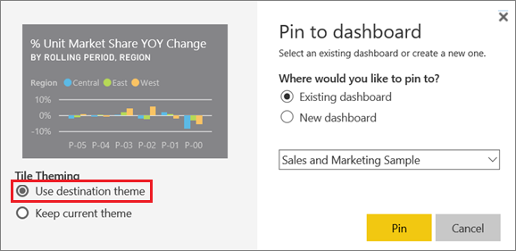

# Use dashboard themes in the Power BI service
With **dashboard themes** you can apply a color theme to your entire dashboard, such as corporate colors, seasonal coloring, or any other color theme you might want to apply. When you apply a dashboard theme, all visuals on your dashboard use the colors from your selected theme. A few exceptions apply, described in the [Considerations and limitations](#considerations-and-limitations) section of this article.


Changing the colors of the report visuals on a dashboard doesn't affect the visuals in the associated report. Also, when you pin tiles from a report that already has a [report theme applied](desktop-report-themes.md), you can choose to keep the current theme or use the dashboard theme.


## Prerequisites
* To follow along, open the [Sales and Marketing sample dashboard](sample-datasets.md).


## How dashboard themes work
To get started, open a dashboard that you created, or can edit. Select **Edit** > **Dashboard theme**. 


In the dashboard pane that appears, select one of the pre-built themes.  In the example below, we've selected **Dark**.




## Create a custom theme

The default theme for Power BI dashboards is **Light**. If you want to customize the colors or create your own theme, select **Custom** in the drop-down. 


Use the custom options to create your own dashboard theme. If adding a background image, we recommend that your image be at least 1920x1080 resolution. To use an image as a background, upload the image to a public website, copy the URL, and paste it into the **Image URL** field. 

## Use a JSON theme
Another way to create a custom theme is to upload a JSON file that has settings for all the colors you'd like to use for your dashboard. In Power BI Desktop, report creators use JSON files to [create themes for reports](desktop-report-themes.md). You can upload these same JSON files for dashboards, or find and upload JSON files from the [Theme gallery page](https://community.powerbi.com/t5/Themes-Gallery/bd-p/ThemesGallery) in the Power BI Community. 


You can also save your custom theme as a JSON file and then share it with other dashboard creators. 

### Use a theme from the Theme Gallery

As with the built-in and custom options, when you upload a theme, the colors are automatically applied to all tiles on the dashboard. 

1. Hover over a theme and choose **View report**.

    

2. Scroll down and find the link to the JSON file.  Select the download icon and save the file.

    

3. Back in Power BI service, in the Custom Dashboard theme window, select **Upload JSON theme**.

    

4. Navigate to the location where you saved the JSON theme file and select **Open**.

5. On the Dashboard theme page, select **Save**. The new theme is applied to your dashboard.

    

## Reports and dashboards with different themes

If your report uses a different theme from the dashboard theme, in most cases you can control whether the visual retains the current report theme or uses the dashboard theme. However, card visuals in dashboards use the 'DIN' font family, with black text. You can change the text color for all the tiles on a dashboard, including the cards, by creating a custom dashboard theme.

- When pinning a tile to a dashboard, to keep the report theme, select **Keep current theme**. The visual, on the dashboard, will retain the report theme, including transparency settings.

    The only time you see **Tile Theming** options is if you created the report in Power BI Desktop, [added a report theme](desktop-report-themes.md), and then published the report to Power BI service.

    

- Try re-pinning the tile and selecting **Use dashboard theme**.

    

## Dashboard theme JSON file format

At its most basic level, the theme JSON file has only one required line: **name**.

```json
{
    "name": "Custom Theme"
}
```

Other than **name**, everything else is optional. You're free to add only the properties you specifically want to format to the theme file, and continue to use the Power BI defaults for the rest.

The JSON file for dashboard theming includes:

- name: The theme name (only required field).
- foreground and background: Colors for the dashboard.
- dataColors: A list of hexcode to use for data in charts. You can include as few or as many colors as you want.
- tiles: Background and color configurations for dashboards.
- visualStyles: Granular formatting for visuals.

Here is a sample theme JSON for the default Light theme:

```json
{

"name":"Light",

"foreground":"#000000",

"background":"#EAEAEA",

"dataColors":["#01B8AA","#374649","#FD625E","#F2C80F","#5F6B6D","#8AD4EB","#FE9666","#A66999"],

"tiles":{"background":"#FFFFFF","color":"#000000"},

"visualStyles":{"*":{"*":{"*":[{"color":{"solid":{"color":"#000000"}}}]}}}

}
```

## Considerations and limitations

* You can't apply dashboard themes to pinned live report pages, iframe tiles, SSRS tiles, workbook tiles, or images.
* You see dashboard themes on mobile devices, but you can only create a dashboard theme in Power BI service.
* Dashboard custom themes only work with tiles pinned from reports.

## Next steps

- [Apply themes to reports](desktop-report-themes.md)
