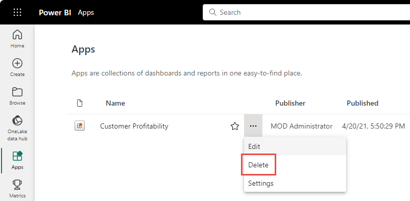

# Delete almost anything in the Power BI service

[!INCLUDE [applies-no-desktop-yes-service](../includes/applies-no-desktop-yes-service.md)]

This article shows you how to delete a dashboard, report, workbook, semantic model, app, visualization, or a workspace in the Power BI service. You can delete almost anything in the Power BI service, with some exceptions.

## Delete a dashboard, report, semantic model, or workbook

1. In your workspace, select the **All** tab.
1. Select **More options (...)** next to the asset you want to delete, and choose **Delete**.

    

1. Select **Delete** to confirm the deletion.

## Remove an app from your app list page

You can easily remove apps from your apps list page. Removing an app doesn't delete the app for other members. Only an admin or a member of a workspace can permanently delete the app from that workspace.

1. In the nav pane, select **Apps** to open the apps list page.
2. Hover over the app you want to delete, select **More options (...)**, and then choose **Delete**.

   

   If you remove an app accidentally, you have several options for getting it back:

   - Ask the app creator to resend it.
   - Find the original email with the link to the app.
   - Check your Notifications center to see if the notification for that app is still listed.
   - Check [your organization's AppSource](../consumer/end-user-apps.md).

## Remove members from a workspace

Only workspace admins can remove people from a workspace. If you're an admin, you can remove yourself or anyone else. However, if you're the only admin for a workspace, Power BI won't let you remove yourself.

1. In the workspace list view, select **Access** in the upper-right corner.

    :::image type="content" source="media/service-delete/power-bi-select-access.png" alt-text="Screenshot of the workspace list view, highlighting Access.":::

1. In the **Access** pane, select **More options (...)** next to the name of the person you want to remove, and choose **Remove**.

    :::image type="content" source="media/service-delete/power-bi-access-remove.png" alt-text="Screenshot of the Access pane, highlighting the more options icon and Remove.":::

## Delete a workspace

If you're a workspace admin, you can delete a workspace with no effect on any Microsoft 365 groups. As an admin for a workspace, you can delete it or remove others from it. When you delete the workspace, the associated app is also deleted for all group members, and the app is removed from AppSource. Everything contained in the workspace is permanently deleted after 30 days.

1. From the nav pane, open **Workspaces**, and open the workspace you want to delete.

2. Select **More options** (...) to the top banner of the workspace and select **Workspace settings**.

3. In the **Workspace settings** pane, select **Other** > **Remove this workspace**.

## Considerations and limitations

- Removing a *dashboard* doesn't delete the underlying semantic model or any reports associated with that dashboard.
- If you're the *owner of a dashboard or report*, you can remove it. If you've shared it with colleagues, removing it from your Power BI workspace removes it from their Power BI workspaces too.
- If a *dashboard or report is shared with you*, you can't remove it.
- Deleting a report doesn't delete the semantic model that the report is based on. Any visualizations that you pinned to a dashboard from the report are also safe. They remain on the dashboard until you delete them individually.
- You can delete a *semantic model*. However, deleting a semantic model also deletes all reports and dashboard tiles that contain data from that semantic model.
- You can remove *workbooks*. However, removing a workbook also removes all reports and dashboard tiles that contain data from this workbook. If a workbook is stored on OneDrive for work or school, deleting it from Power BI doesn't delete it from OneDrive.

## Related content

This article covered how to delete the major building blocks of the Power BI service. Here are a few other things you can also delete:

- Remove [(unfavorite) a dashboard](../consumer/end-user-favorite.md#unfavorite-content)
- Delete [Dashboard tiles](service-dashboard-edit-tile.md#delete-the-tile)

More questions? [Ask the Power BI Community](https://community.powerbi.com/)
