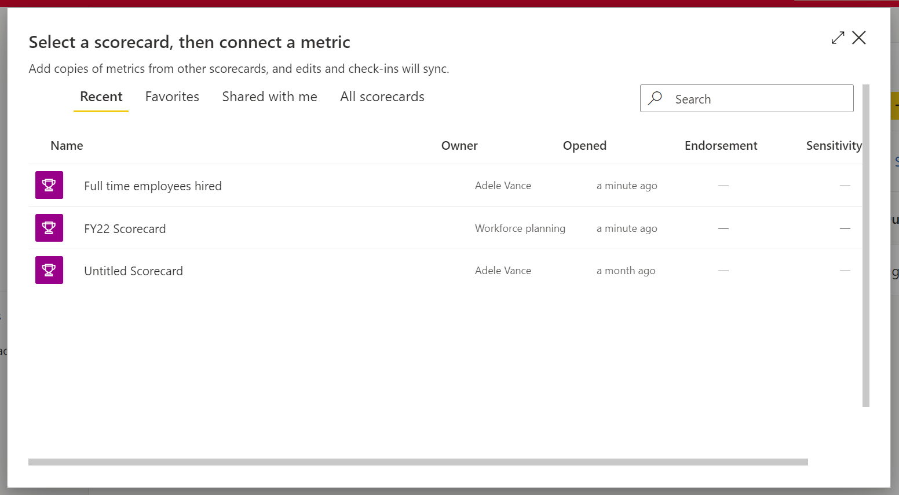
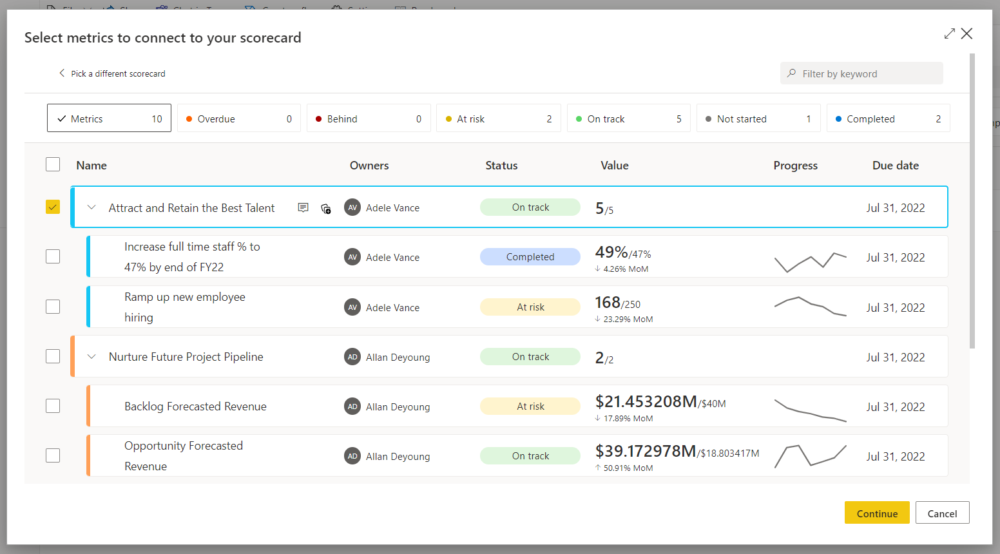
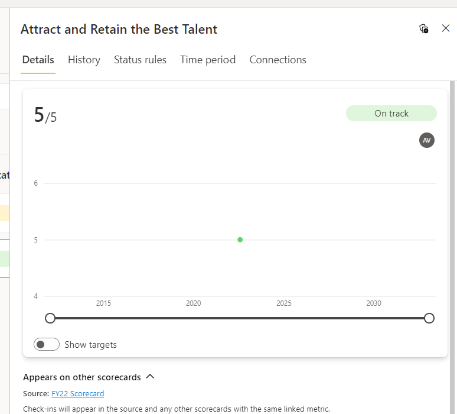

# Create linked metrics in the Power BI service (Preview)

[!INCLUDE [applies-no-desktop-yes-service](../includes/applies-no-desktop-yes-service.md)]

With linked metrics, you can show the same metric on multiple scorecards, across multiple workspaces. All check-ins, edits, and updates are reflected in all the metric locations, so you don't have to create duplicate metrics to track the same thing. For example, in many organizations, the leadership team has a scorecard, and each department has its own scorecard with metrics from the leadership team, along with other metrics that are relevant to their department. With this feature, you can now link such metrics to any number of scorecards and get them to be in sync automatically.

If you link multiple metrics at once, the parent-child relationships and the metrics’ order from the source scorecard are preserved in the destination scorecard. And you can use the **Set For All** option to apply permissions to descendant metrics on the source scorecard, even if there are linked metrics in between the parent and descendants.

## Permissions

Say you have build access to a scorecard, meaning you can build content with the data associated with the scorecard. You can link metrics from that scorecard to any scorecards you have edit access to. Only users who have view access to the source metric can see the linked metric.

## Create a linked metric

1. Open a scorecard and select **Edit**
1. Select the **New** button.
1. Select **Link to existing metric (preview)**.

    :::image type="content" source="media/service-metrics-linked-metrics/linked-goals-1.png" alt-text="Screenshot of the option to link a metric in a scorecard.":::

1. Select the scorecard that contains the metric you’d like to link from the list provided.

    ](media/service-metrics-linked-metrics/linked-goals-2.png#lightbox)

1. Select the metric(s) you’d like to include in this scorecard.

    ](media/service-metrics-linked-metrics/linked-goals-3.png#lightbox)

1. Select **Continue**. The linked metric(s) appear on this scorecard.

## Check-in and edit a linked metric

You can add check-ins right from the linked metric if you have permission to check in on the source metric. Check-ins are reflected in all scorecards that contain the linked metric and source metric.

You can make edits only in the source metric. You can navigate from the linked metric to the source metric. Select **Go to source metric** from the overflow menu of the linked metric.

:::image type="content" source="media/service-metrics-linked-metrics/linked-goals-4.png" alt-text="Screenshot showing option to go to source metric.":::

Edits are reflected in all scorecards that contain the linked metric.

## Linked metric details

You can see the name and link to the source scorecard in the Details pane.

](media/service-metrics-linked-metrics/linked-goals-5.png#lightbox)
   
You can also see this information in the Connections pane.

](media/service-metrics-linked-metrics/linked-goals-6.png#lightbox)

## Linked metrics considerations

### Linked metrics and hierarchies 

If you filter your scorecard by a hierarchy, linked metrics aren't filtered. They continue showing their original value. Check-ins to linked metrics aren't allowed on a hierarchical child scorecard.

### Linked metrics and rollups

If you link a rollup metric onto a different scorecard, it continues to show its calculated value from the source scorecard and doesn't take into account any child metrics on the destination scorecard. Additionally, if a linked metric is the child of a rollup metric, it's not included in the parent's calculation.

## Next steps

- [Get started with metrics in Power BI](service-goals-introduction.md)
- [Create scorecards and manual metrics in Power BI](service-goals-create.md)
- [Create connected metrics in Power BI](service-goals-create-connected.md)

More questions? [Try the Power BI Community](https://community.powerbi.com/).
