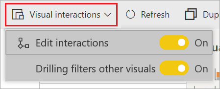
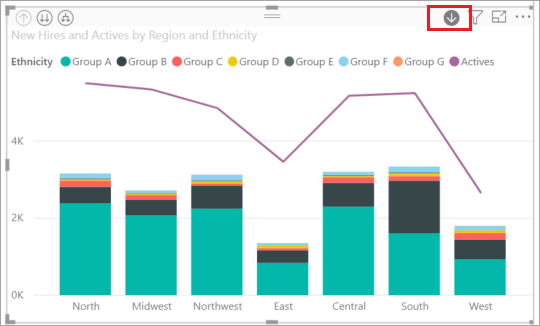
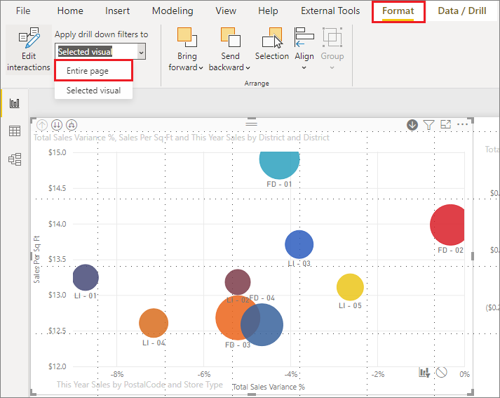

# Change how visuals interact in a Power BI report
If you have edit permissions for a report, you can use **Visual interactions** to change how visualizations on a report page impact each other. 

## Introduction to visual interactions
By default, visualizations on a report page can be used to cross-filter and cross-highlight the other visualizations on the page.
For example, selecting a state on a map visualization highlights the column chart and filters the line chart to display only data that applies to that one state.
See [About filtering and highlighting](power-bi-reports-filters-and-highlighting.md). And if you have a visualization that supports [drilling](../consumer/end-user-drill.md), by default, drilling one visualization has no impact on the other visualizations on the report page. But both of these default behaviors can be overridden, and interactions set, on a per-visualization basis.

This article shows you how to use **visual interactions** in Power BI Desktop. The process is the same in the Power BI service [Editing view](service-interact-with-a-report-in-editing-view.md). If you only have Reading view access, or the report has been shared with you, you will not be able to change the visual interactions settings.

The terms *cross-filter* and *cross-highlight* are used to distinguish the behavior described here from what happens when you use the **Filters** pane to *filter* and *highlight* visualizations.  

> [!NOTE]
> This video uses older versions of Power BI Desktop and the Power BI service. 
>
>

<iframe width="560" height="315" src="https://www.youtube.com/embed/N_xYsCbyHPw?list=PL1N57mwBHtN0JFoKSR0n-tBkUJHeMP2cP" frameborder="0" allowfullscreen></iframe>

## Enable the visual interaction controls
If you have edit permissions to a report, you can turn on the visual interaction controls and then customize how the visualizations on your  report page filter and highlight each other. 

1. Select a visualization to make it active.  
2. Display the **Visual Interactions** options.
    

    - In Desktop, select **Format > Interactions**.

        

    - In the Power BI service, open the report in Editing view and select the dropdown from the report menu bar.

        

3. To display the visualization interaction controls, select **Edit interactions**. Power BI adds filter and highlight icons to all of the other visualizations on the report page. We can see that the tree map is cross-filtering the line chart and the map, and is cross-highlighting the column chart. You can now change how the selected visualization interacts with the other visualizations on the report page.
   
    

## Change the interaction behavior
Get familiar with how your visualizations interact by selecting each visualization on your report page, one at a time.  Select a data point or a bar or a shape and watch the impact on the other visualizations. If the behavior you see is not what you'd prefer, you can change the interactions. These changes are saved with the report, so you and your report consumers will have the same visual interaction experience.

Start by selecting a visualization to make it active.  Notice that all the other visualizations on the page now display interaction icons. The bolded icon is the one that is being applied. Next, determine what impact you'd like the **selected visualization** to have on the others.  And, optionally, repeat for all other visualizations on the report page.

If the selected visualization should:
   
   * cross-filter one of the other visualizations on the page, select the **filter** icon in the upper right corner of that visualization .
   * cross-highlight one of the other visualizations on the page, select the **highlight** icon .
   * have no impact on one of the other visualizations on the page, select the **no impact** icon .

## Change the interactions of drillable visualizations
[Certain Power BI visualizations can be drilled](../consumer/end-user-drill.md). By default, when you drill a visualization, it has no impact on the other visualizations on the report page. But, that behavior can be changed. 

> [!TIP]
> Try it yourself using the [Human Resources sample PBIX file](https://download.microsoft.com/download/6/9/5/69503155-05A5-483E-829A-F7B5F3DD5D27/Human%20Resources%20Sample%20PBIX.pbix). There's a column chart with a drill-down feature on the **New hires** tab.
>

1. Select the drillable visual to make it active. 

2. Turn on the drill-down feature by selecting the drill-down icon.

    

2. From the menu bar, select **Format** > **Drilling filters other visuals**.  Now when you drill down (and up) in a visualization, the other visualizations on the report page change to reflect your current drilling selection. 

    

3. If the behavior you see is not what you'd prefer, you can change the interactions [as described above](#change-the-interaction-behavior).

## Considerations and troubleshooting
If you build a matrix with fields from different tables, then try to cross-highlight by selecting multiple items at different levels of the hierarchy, you get errors on the other visuals. 

    
## Next steps
[Filtering and highlighting in Power BI reports](power-bi-reports-filters-and-highlighting.md)