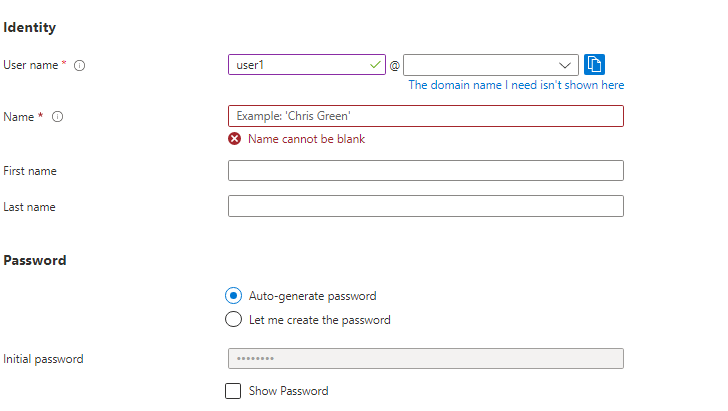
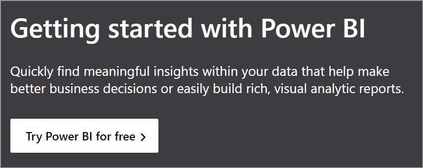

# Create an Azure Active Directory tenant to use with Power BI

:::image type="icon" source="../../includes/media/yes-icon.svg" border="false":::&nbsp;App&nbsp;owns&nbsp;data :::image type="icon" source="../../includes/media/yes-icon.svg" border="false":::&nbsp;User&nbsp;owns&nbsp;data

This article shows you how to create a new Azure Active Directory (Azure AD) tenant to use when creating a custom app that calls [Power BI REST APIs](/rest/api/power-bi/).

An Azure AD tenant is a reserved Azure AD service instance that an organization receives and owns once it signs up for a Microsoft cloud service such as Azure, Microsoft Intune, or Microsoft 365. Each tenant represents an organization, and is distinct and separate from other Azure AD tenants.

Once you have an Azure AD tenant, you can define an application and assign it permissions so it can call [Power BI REST APIs](/rest/api/power-bi/).

Your organization may already have an Azure AD tenant that you can use for your app, or you can create a new tenant specifically for your app. This article shows how to create a new tenant.

## Create an Azure Active Directory tenant

To integrate Power BI into your custom app, you need an Azure AD directory. This directory is your *tenant*. If your organization doesn't have a tenant, [you need create one as part of your dev environment](/azure/active-directory/develop/active-directory-howto-tenant). You should also create a tenant if you want to keep things isolated and don't want your app mixing with your organization's tenant. Or, you may just want to create a tenant for testing purposes.

To create a new Azure AD tenant:

Follow the directions in [Quickstart: Create a new tenant in Azure Active Directory](/azure/active-directory/fundamentals/active-directory-access-create-new-tenant) to create a new **Azure Active Directory**.

Provide the relevant **Organization name**, **Initial domain name** and **Country/Region**.

   > [!NOTE]
   > Your initial domain is part of onmicrosoft.com. You can add other domain names later. A tenant directory can have multiple domains assigned to it.

## Create Azure Active Directory tenant users

When you create a new Azure AD tenant, you become the first user of that tenant. As the first user, you're automatically assigned the [Global Admin](/azure/active-directory/roles/permissions-reference#global-administrator) role. Add new users by navigating to the [Users](https://portal.azure.com/#blade/Microsoft_AAD_IAM/UsersManagementMenuBlade/MsGraphUsers) page.

Create a master user to use as your master embedding account. You can think of the master user account as a service account.

1. In the home page of the Azure portal, select the Azure Active Directory tab.

    > [!div class="mx-imgBorder"]
    >

2. Under **Manage**, select **Users**.

    > [!div class="mx-imgBorder"]
    >

3. Under **+ New user** select **+ Create new user**.

    > [!div class="mx-imgBorder"]
    >

4. Provide a **Display Name** and **User name** for your tenant Global Admin. Leave **Directory role** as **user**. Note the password, then select **Create**.

    > [!div class="mx-imgBorder"]
    >

5. Sign up for Power BI with the user account that you created in step 4. Go to [powerbi.com](https://powerbi.microsoft.com/getting-started-with-power-bi/) and select **Try Power BI for free**.

    > [!div class="mx-imgBorder"]
    >

    When you sign up, you're prompted to try Power BI Pro free for 60 days. You can opt into that to become a Pro user, which gives you the option to [start developing an embedded solution](embed-sample-for-customers.md).

   > [!NOTE]
   > Make sure you sign up with your user account's email address.

## Next steps

Now that you have an Azure AD tenant, you can use this tenant to test items within Power BI. You can also embed Power BI dashboards and reports in your app. For more information, see [How to embed your Power BI dashboards, reports, and tiles](embed-sample-for-customers.md).

* [Register an app](register-app.md)
* [Quickstart: Set up a dev environment](/azure/active-directory/develop/active-directory-howto-tenant)  

More questions? [Try asking the Power BI Community](https://community.powerbi.com/)
