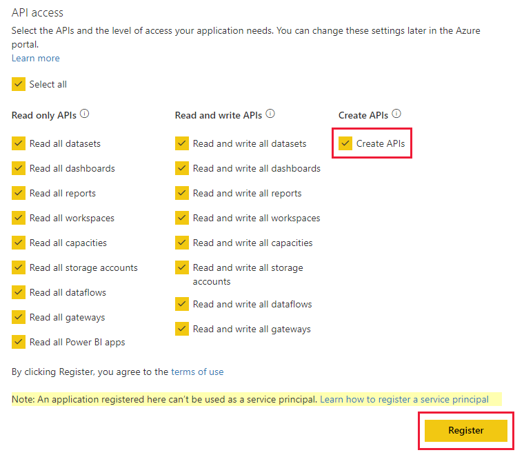

# Automatically install Power BI apps when embedding content for your organization

To embed content from an app, the user must have [access to the app](../../collaborate-share/service-create-distribute-apps.md) that contains the content to embed. If the app is installed for the user, then the user can embed content from the app. For more information, see [Embed reports or dashboards from app](./index.yml). To make embedding content from an app easier, you can set up [automatic app installation](https://powerbi.microsoft.com/blog/automatically-install-apps/) in PowerBI.com for your organization. Defining automatic app installation is a tenant level action and applies to all apps.

## Automatically installing an app while embedding content

If a user has access to an app that isn't installed, and the user tries to embed app content, the embedding will fail. Avoid this problem by allowing automatic installation of the app upon embedding content. Allowing automatic installation means if the app the user tries to embed isn't installed, the app is automatically installed for the user. Automatic app installation results in a smooth experience for the user.

## Embedding for Power BI users (user-owned data)

To allow the automatic installation of apps for your users, add the *Create APIs* permission to your application when you're [registering your application](register-app.md#register-an-azure-ad-app). If you've already registered your app, add the Create APIs permission by [changing your application's permissions](/power-bi/developer/embedded/register-app#change-your-azure-ad-apps-permissions).

Provide the app ID in the embed URL. To provide the app ID, the app creator must install the app and then use one of the supported [Power BI REST API](/rest/api/power-bi/) calls, such as [Get Reports](/rest/api/power-bi/reports/getreports) or [Get Dashboards](/rest/api/power-bi/dashboards/getdashboards). The app creator must take the embed URL from the REST API response. The app ID appears in the URL if the content is from an app. Use the embed URL to embed content.

## Secure embedding

To use automatic application installation, the app creator must install the app. Then the app creator must go to the app on PowerBI.com, navigate to the report, and get the link. All other users with access to the app that can use the link can embed the report.

## Considerations and limitations

* You can only embed reports and dashboards in this scenario.

* This feature is currently not supported for app-owned data and SharePoint embedding scenarios.
