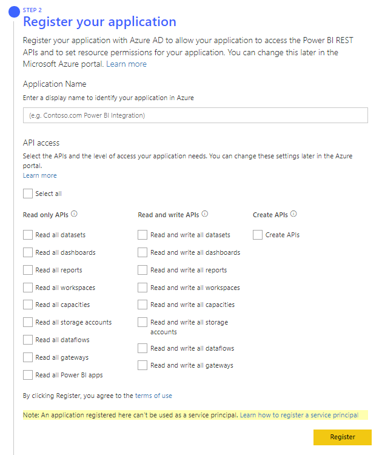
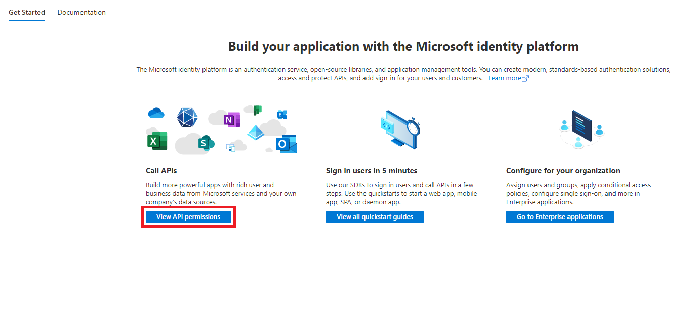
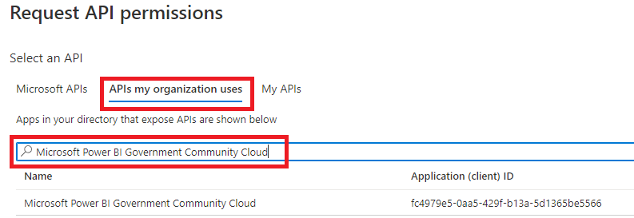

# Register an Azure AD application to use with Power BI

To use Power BI embedded analytics, you need to register an Azure Active Directory (Azure AD) application in Azure. The Azure AD app establishes permissions for Power BI REST resources, and allows access to the [Power BI REST APIs](/rest/api/power-bi/).

## Determine your embedding solution

Before registering your app, decide which of the following solutions is best suited for you:

* [Embed for your customers](#embed-for-your-customers)
* [Embed for your organization](#embed-for-your-organization)

### Embed for your customers

Use the [embed for your customers](embed-sample-for-customers.md) solution, also known as *app owns data*, if you're planning to create an application that's designed for your customers. Users will not need to sign in to Power BI or have a Power BI license, to use your application. Your application will use one of the following methods to authenticate against Power BI:

* **Master user** account (a Power BI Pro license used for signing in to Power BI)

* [Service principal](embed-service-principal.md)

The embed for your customers solution is usually used by independent software vendors (ISVs) and developers who are creating applications for a third party.

### Embed for your organization

Use the [embed for your organization](embed-sample-for-your-organization.md) solution, also known as *user owns data*, if you're planning to create an application  that requires users to use their credentials to authenticate against Power BI.

The embed for your organization solution is usually used by enterprises and big organizations, and is intended for internal users.

## Register an Azure AD app

The easiest way to register an Azure AD app, is by using the  [Power BI embedding setup tool](https://app.powerbi.com/embedsetup). The tool offers a quick registration process for both embedding solutions, using a simple graphical interface.

If you're creating an *embed for your organization* application, and want more control over your Azure AD app, you can register it manually in the Azure portal.

> [!IMPORTANT]
> Before you register a Power BI app you need an [Azure Active Directory tenant and an organizational user](create-an-azure-active-directory-tenant.md).

## [Embed for your customers](#tab/customers)

These steps describe how to register an Azure AD application for the Power BI [embed for your customers](embed-sample-for-customers.md) solution.

> [!IMPORTANT]
> The following instructions will not work for GCC customers. If you are embedding for a GCC, follow the instructions for **Manual registration**.

[!INCLUDE[registration tool step 1](../../includes/register-tool-step-1.md)]

2. In the *Choose an embedding solution* section, select **Embed for your customers**.

[!INCLUDE[registration tool step 3](../../includes/register-tool-step-3.md)]

4. In *Step 2 - Register your application*, fill in the following fields:

    * **Application Name** - Give your application a name.

    * **API access** - Select the Power BI APIs (also known as scopes) that your application needs. You can use *Select all* to select all the APIs. For more information about Power BI access permissions, see [Permissions and consent in the Microsoft identity platform endpoint](/azure/active-directory/develop/v2-permissions-and-consent).

    

5. Select **Register**.

    Your Azure AD app **Application ID** is displayed in the *Summary* box. Copy this value for later use.

[!INCLUDE[registration tool steps 6-7](../../includes/register-tool-steps-6-7.md)]

8. In *Step 5 - Grant permissions*, select **Grant permissions** and in the pop-up window select **accept**. This allows your Azure AD app to access the APIs you selected (also known as scopes) with your signed in user. This user is also known as the **master user**.

9. (Optional) If you created a Power BI workspace and uploaded content to it using the tool, you can now select **Download sample application**. Make sure you copy all the information in the *Summary* Box.

[!INCLUDE[registration tool note](../../includes/register-tool-note.md)]

## [Embed for your organization](#tab/organization)

These steps describe how to register an Azure AD application for the Power BI [embed for your organization](embed-sample-for-your-organization.md) solution.

[!INCLUDE[registration tool step 1](../../includes/register-tool-step-1.md)]

2. In the *Choose an embedding solution* section, select **Embed for your organization**.

[!INCLUDE[registration tool step 3](../../includes/register-tool-step-3.md)]

4. In *Step 2 - Register your application*, fill in the following fields:

    * **Application Name** - Give your application a name.

    * **Home Page URL** - Enter a URL for your home page.

    * **Redirect URL** - Upon signing in, your application users will be redirected to this address while your application receives an authentication code from Azure. Select one of these options:

        * **Use a default URL** - This option will automatically create and download a sample embedded analytics application. The default URL is http://localhost:13526/.

        * **Use a custom URL** - Select this option if you already have an embedded analytics application, and know what you want to use as a redirect URL.

    * **API access** - Select the Power BI APIs (also known as scopes) that your application needs. You can use *Select all* to select all the APIs. For more information about Power BI access permissions, see [Permissions and consent in the Microsoft identity platform endpoint](/azure/active-directory/develop/v2-permissions-and-consent).

5. Select **Register**.

    Your Azure AD app **Application ID** and **Application secret** values are displayed in the *Summary* box. Copy these values for later use.

[!INCLUDE[registration tool steps 6-7](../../includes/register-tool-steps-6-7.md)]

8. (Optional) If you created a Power BI workspace and uploaded content to it using the tool, you can now select **Download sample application**. Make sure you copy all the information in the *Summary* Box.

[!INCLUDE[registration tool note](../../includes/register-tool-note.md)]

## [Manual registration](#tab/manual)

Use the Azure AD manual app registration only if you're creating one of the following solutions:

* An *embed for your organization* application.

* An *embed for your customers* application with a *service principal*.

    >[!NOTE]
    >If you choose this option, after you register your Azure AD app you'll have to [add Power BI permissions](#change-your-azure-ad-apps-permissions) to it.

For more information about how to register applications in Azure Active Directory, see [Register an app with the Azure Active Directory](/azure/active-directory/develop/quickstart-v2-register-an-app).

1. Sign into the [Azure portal](https://portal.azure.com).

2. Select your Azure AD tenant by selecting your account in the upper right corner of the page.

3. Select **App registrations**. If you can't see this option, search for it.

4. In *App registrations*, select **New registration**.

5. Fill in the following fields:

    * **Name** - Give your application a name.

    * **Supported account type** - Select who can use the application.

6. (Optional) In the **Redirect URI**, add a redirect URL.

7. Select **Register**. After your app is registered you're directed to your app's overview page, where you can obtain the *Application ID*.

---

## Change your Azure AD app's permissions

After you register your application, you can make changes to its permissions. Permission changes can be made programmatically, or in the Azure portal.

>[!NOTE]
>Azure AD app permissions are only applicable for these scenarios:
>
>* *Embed for your organization*
>* *Embed for your customers* with the *master user* authentication method

## [Azure](#tab/Azure)

In the Azure portal, you can view your app and make changes to its permissions.

1. Sign into the [Azure portal](https://portal.azure.com).

2. Select your Azure AD tenant by selecting your account in the upper right corner of the page.

3. Select **App registrations**. If you can't see this option, search for it.

4. From the **Owned applications** tab, select your app. The application opens in the *Overview* tab, where you can review the *Application ID*.

5. Select the **View API permissions** tab.

    

6. Select **Add a permission**.

7. To add permissions, follow these steps (note that the first step is different for GCC apps):

    1. From the **Microsoft APIs** tab, select **Power BI service**.
    > [!NOTE]
    > For GCC apps, Select the **APIs my organization uses** tab, and search for either *Microsoft Power BI Government Community Cloud* OR *fc4979e5-0aa5-429f-b13a-5d1365be5566*.
    >    

    2. Select **Delegated Permissions** and add or remove the specific permissions you need.

    3. When you're done, select **Add permissions** to save your changes.

8. To remove a permission, follow these steps:

    1. Select the ellipsis (...) to the right of the permission.

    2. Select **Remove permission**.

    3. In the *Remove permission* pop-up window, select **Yes, remove**.

## [HTTP](#tab/HTTP)

To change your Azure AD app permissions programmatically, you'll need to get the existing service principals (users) within your tenant. For information on how to do that, see [servicePrincipal](/graph/api/resources/serviceprincipal).

1. To get all the service principals within your tenant, call the `Get servicePrincipal` API without `{ID}`.

2. Check for a service principal with your app's *application ID* as the `appId` property.

    ```json
    Post https://graph.microsoft.com/v1.0/servicePrincipals HTTP/1.1
    Authorization: Bearer ey..qw
    Content-Type: application/json
    {
    "accountEnabled" : true,
    "appId" : "{App_Client_ID}",
    "displayName" : "{App_DisplayName}"
    }
    ```

    >[!NOTE]
    >`displayName` is optional.

3. Grant Power BI permissions to your app, by assigning one of these values to `consentType`:

    * `AllPrincipals` - Can only be used by a Power BI admin to grant permissions on behalf of all the users in the tenant.

    * `Principal` - Use to grant permissions on behalf of a specific user. If you're using this option, add the `principalId={User_ObjectId}` property to the request body.

     ```json
     Post https://graph.microsoft.com/v1.0/OAuth2PermissionGrants HTTP/1.1
     Authorization: Bearer ey..qw
     Content-Type: application/json
     {
     "clientId":"{Service_Plan_ID}",
     "consentType":"AllPrincipals",
     "resourceId":"c78a3685-1ce7-52cd-95f7-dc5aea8ec98e",
     "scope":"Dataset.ReadWrite.All Dashboard.Read.All Report.Read.All Group.Read Group.Read.All Content.Create Metadata.View_Any Dataset.Read.All Data.Alter_Any",
     "expiryTime":"2018-03-29T14:35:32.4943409+03:00",
     "startTime":"2017-03-29T14:35:32.4933413+03:00"
     }
     ```

    > [!NOTE]
    >
    > * If you're using a **master user**, to avoid being prompted for consent by Azure AD, you need to grant permissions to the master account.
    > * The `resourceId` *c78a3685-1ce7-52cd-95f7-dc5aea8ec98e* is tenant dependent and not universal. This value is the *objectId* of the *Power BI Service* application in Azure AD. To get this value from the Azure portal, navigate to [Enterprise applications > All applications](https://portal.azure.com/#blade/Microsoft_AAD_IAM/StartboardApplicationsMenuBlade/AllApps), and search for *Power BI Service*.

4. Grant app permissions to Azure AD, by assigning a value to `consentType`.

    ```json
    Post https://graph.microsoft.com/v1.0/OAuth2PermissionGrants HTTP/1.1
    Authorization: Bearer ey..qw
    Content-Type: application/json
    {
    "clientId":"{Service_Plan_ID}",
    "consentType":"AllPrincipals",
    "resourceId":"61e57743-d5cf-41ba-bd1a-2b381390a3f1",
    "scope":"User.Read Directory.AccessAsUser.All",
    "expiryTime":"2018-03-29T14:35:32.4943409+03:00",
    "startTime":"2017-03-29T14:35:32.4933413+03:00"
    }
    ```

## [C#](#tab/CSharp)

You can also change your Azure AD app permissions using C#. For more information see the [oAuth2PermissionGrant](/graph/api/oauth2permissiongrant-get) API. This method can be useful if you're considering to automate some of your processes.

For more information regarding the HTTP requests, refer to the [HTTP tab](register-app.md?tabs=customers%2CHTTP#change-your-azure-ad-apps-permissions).

```csharp
var graphClient = GetGraphClient();

currentState.createdApp = await graphClient.Applications
    .Request()
    .AddAsync(application);

System.Threading.Thread.Sleep(2000);

var passwordCredential = new PasswordCredential
{
    DisplayName = "Client Secret Created in C#"
};

currentState.createdSecret = await graphClient.Applications[currentState.createdApp.Id]
    .AddPassword(passwordCredential)
    .Request()
    .PostAsync();

var servicePrincipal = new ServicePrincipal
{
    AppId = currentState.createdApp.AppId
};

currentState.createdServicePrincipal = await graphClient.ServicePrincipals
    .Request()
    .AddAsync(servicePrincipal);

GraphServiceClient graphClient = new GraphServiceClient(authProvider);

// Use oAuth2PermissionGrant to change permissions
var oAuth2PermissionGrant = await graphClient.Oauth2PermissionGrants["{id}"]
               .Request()
               .GetAsync();
```

---

## Next steps

>[!div class="nextstepaction"]
>[Considerations when generating an embed token](generate-embed-token.md)

>[!div class="nextstepaction"]
>[Capacity and SKUs in Power BI embedded analytics](embedded-capacity.md)
