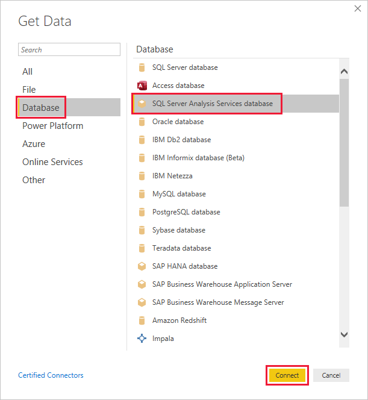

# Embed a report on an on-premises SQL Server Analysis Services (SSAS)

This article explains how to embed Power BI content with an [on-premises](pbi-glossary.md#on-premises-on-prem) *Analysis Services Tabular Model* live connection into a standard Power BI app owns data application. This article applies to **all** live connection AS models whether or not they implement RLS.

In this scenario, the database is on the SSAS (on-prem) model, and the Power BI engine connects to it via a [gateway](pbi-glossary.md#gateways-or-on-premises-data-gateways). The security roles (RLS) and permissions, if there are any, are defined in the SSAS (on-prem) model, and *not* in Power BI Desktop.

## ISV setup

On-prem row level security is only available with a live connection, but you can create a live connection to any database whether or not it implements RLS. This includes:

* Databases with no RLS roles set up
* Database with single or multiple roles set up
* Database with static of dynamic security roles

To embed a report from an SSAS model, you need to do the following actions:

1. [Set up the gateway](#set-up-the-gateway)
2. [Create a live connection](#create-a-live-connection)
3. [Generate an embed token](#generate-an-embed-token)

## Set up the gateway

1. [Add a data source connection to the on-prem gateway](../../connect-data/service-gateway-data-sources.md#add-a-data-source)

Enter the Datasource name, datasource type, Server, database, a username and password that the active directory recognizes.

:::image type="content" source="./media/rls-ssas/create-gateway.png" alt-text="Screenshot showing how to create a new gateway.":::

For more information on creating and managing a gateway see [Add or remove a gateway data source](../../connect-data/service-gateway-data-sources.md) and [Add or remove a gateway data source](../../connect-data/service-gateway-enterprise-manage-ssas.md).

### Add the service principal or master user as a gateway admin

The user generating the embed token also needs one of the following permissions:

* Gateway admin permissions
* Datasource impersonate permission (ReadOverrideEffectiveIdentity)

Add the service principal or master user as an admin or as a[Datasource User](/rest/api/power-bi/gateways/add-datasource-user) with a [DatasourceAccessRight](/rest/api/power-bi/gateways/add-datasource-user#request-body) of [`ReadOverrideEffectiveIdentity`](/rest/api/power-bi/gateways/add-datasource-user#datasourceuseraccessright).

### User mapping

Since the usernames on the on-prem directory and the Azure AD directory are different, you need to create a user mapping table that provides each user or role in the on-prem directory with an effective identity to be passed to Power BI.

If the database has RLS, map each role to a username to be used as the effective identity.

:::image type="content" source="./media/rls-ssas/gateway-map-users.png" alt-text="Screenshot showing how to map user names to effective identities.":::

For more information see [Map user names for Analysis Services data sources](../../connect-data/service-gateway-enterprise-manage-ssas.md#map-user-names-for-analysis-services-data-sources).

## Create a live connection

Once the environment is set up, create a *live connection* between Power BI Desktop and the SQL server and create your report.

1. Start Power BI Desktop and select **Get data** > **Database**.

1. From the data sources list, select the **SQL Server Analysis Services Database** and select **Connect**.

   

1. Fill in your Analysis Services tabular instance details and select **Connect live**. Then select **OK**.

  :::image type="content" source="./media/rls-ssas/get-data-connect-live.png" alt-text="Screenshot of Analysis Services details.":::

## Generate an embed token

To embed your report in the *embed for your customers* scenario, [generate an embed token](./generate-embed-token.md#row-level-security) that passes the effective identity to Power BI.

The information needed to generate an embed token depends on if you're connected to Power BI using a service principal or as a master user, and also if the AS engine uses RLS.

## [Master user](#tab/master-user)

The master user must either be a gateway admin or have a `DatasourceAccessRight` of `Impersonate` (read/override permissions). Users with override permission have a key icon next to their name.

  :::image type="content" source="media/rls-ssas/impersonate-override-permission.png" alt-text="Screenshot of a gateway member with a key icon next to their name.":::

To generate the embed token, provide the following information:

* **Username** (optional) - A valid username recognized by the SSAS that will be used as the effective identity. If no username is provided, the master user's credentials are used.
* **Role** (required for RLS) - The report will only display data if the effective identity is a member of the role.

## [Service principal](#tab/service-principal)

The service principal must either have gateway admin privileges or have a `DatasourceAccessRight` of `Impersonate` (read/override permissions). Users with override permission have a key icon next to their name.

  :::image type="content" source="media/rls-ssas/impersonate-override-permission.png" alt-text="Screenshot of a gateway member with a key icon next to their name.":::

To generate the embed token, provide the following information:

* **Username** (required) - A valid username recognized by the SSAS that will be used as the effective identity.
* **Role** (required for RLS) - The report will only display data if the effective identity is a member of the role.

## [Service principal profile](#tab/service-principal-profile)

The service principal profile must either have gateway admin privileges or have a `DatasourceAccessRight` of `Impersonate` (read/override permissions). Users with override permission have a key icon next to their name.

  :::image type="content" source="media/rls-ssas/impersonate-override-permission.png" alt-text="Screenshot of a gateway member with a key icon next to their name.":::

To generate the embed token, provide the following information:

* **Username** (required) - A valid username recognized by the SSAS that will be used as the effective identity.
* **Role** (required for RLS) - The report will only display data if the effective identity is a member of the role.

---
Now you can embed your report in your app, and your report will filter data according to the permissions of the user accessing the report.

## Considerations and limitations

* On-premises row-level security with Power BI is only available with live connection.
* All live connections to AS engines need an effective identity even if there is no RLS implemented.
* CustomData isn't supported.

## Next steps

> [!div class="nextstepaction"]
>[Generate an embed token](generate-embed-token.md#row-level-security)
