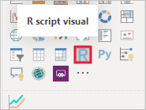
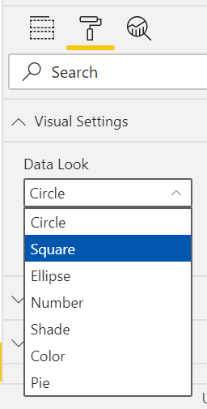

# Tutorial: Create an R-powered Power BI visual

[!INCLUDE[Power B I visuals tutorials overview](../../includes/visual-tutorial-overview.md)]

This article is a step by step guide for creating an R-powered visual for Power BI.

In this tutorial, you learn how to:

> [!div class="checklist"]
>
> * Create an R-powered visual
> * Edit the R-script in Power BI Desktop
> * Add libraries to the dependencies file of the visual
> * Add a static property

## Prerequisites

* A **Power BI Pro** account. [Sign up for a free trial](https://powerbi.microsoft.com/pricing/) before you begin.
* An R engine. You can download one free from many locations, including the [Microsoft R Open download page](https://www.microsoft.com/download/details.aspx?id=51205) and the [CRAN Repository](https://cran.r-project.org/bin/windows/base/). For more information, see [Create Power BI visuals using R](../../create-reports/desktop-r-visuals.md).
* [Power BI Desktop](../../fundamentals/desktop-get-the-desktop.md).
* [Windows PowerShell](/powershell/scripting/install/installing-windows-powershell) version 4 or later for Windows users OR the [Terminal](https://macpaw.com/how-to/use-terminal-on-mac) for OSX users.

## Get started

1. Prepare some sample data for the visual. You can save these values to an Excel database or a *.csv* file and import it into **Power BI Desktop**.

    | MonthNo | Total Units |
    |-----|-----|
    | 1 | 2303 |
    | 2 | 2319 |
    | 3 | 1732 |
    | 4 | 1615 |
    | 5 | 1427 |
    | 6 | 2253 |
    | 7 | 1147 |
    | 8 | 1515 |
    | 9 | 2516 |
    | 10 | 3131 |
    | 11 | 3170 |
    | 12 | 2762 |

2. To create a visual, open **PowerShell** or **Terminal**, and run the following command:

      ```cmd
      pbiviz new rVisualSample -t rvisual
      ```

      This command creates a new folder for the *rVisualSample* visual. The structure is based on the `rvisual` template. It creates a file called *script.r* in the root folder of the visual. This file holds the R-script that is run to generate the image when the visual is rendered. You can create your R-script in **Power BI Desktop**.

3. From the newly created `rVisualSample` directory run the following command:

   ```cmd
   pbiviz start
   ```

4. In **Power BI Desktop**, select **R script visual**:

   

5. Assign data to the developer visual by dragging **MonthNo** and **Total units** to **Values** for the visual.

    

6. Set the aggregation type of **Total units** to *Don't summarize*.

    

7. From the R-script editor in your **Power BI Desktop**, type the following:

      ```r
      plot(dataset)
      ```

      This command creates a scatter chart using the values in the semantic model as input.

8. Select the **Run script** icon to see the result.

      

## Edit the R Script

The R-script can be modified to create other types of visuals. Let's create a line chart next.

1. Paste the following R code into the **R script editor**.

   ```r
   x <- dataset[,1] # get the first column from semantic model
   y <- dataset[,2] # get the second column from semantic model

   columnNames = colnames(dataset) # get column names

   plot(x, y, type="n", xlab=columnNames[1], ylab=columnNames[2]) # draw empty plot with axis and labels only
   lines(x, y, col="green") # draw line plot
   ```

2. Select the **Run script** icon to see the result.

    

3. When your R-script is ready, copy it to the `script.r` file located in the root directory of your visual project.

4. In the *capabilities.json* file, change the `dataRoles`: `name` to *dataset*, and set the `dataViewMappings` input to *dataset*.

    ```json
    {
      "dataRoles": [
        {
          "displayName": "Values",
          "kind": "GroupingOrMeasure",
          "name": "dataset"
        }
      ],
      "dataViewMappings": [
        {
          "scriptResult": {
            "dataInput": {
              "table": {
                "rows": {
                  "select": [
                    {
                      "for": {
                        "in": "dataset"
                      }
                    }
                  ],
                  "dataReductionAlgorithm": {
                    "top": {}
                  }
                }
              }
            },
            ...
          }
        }
      ],
    }
    ```

5. Add the following code to support resizing the image in the *src/visual.ts* file.

    ```typescript
      public onResizing(finalViewport: IViewport): void {
          this.imageDiv.style.height = finalViewport.height + "px";
          this.imageDiv.style.width = finalViewport.width + "px";
          this.imageElement.style.height = finalViewport.height + "px";
          this.imageElement.style.width = finalViewport.width + "px";
      }
    ```

## Add libraries to visual package

The `corrplot` package creates a graphical display of a correlation matrix. For more information about `corrplot`, see [An Introduction to corrplot Package](https://cran.r-project.org/web/packages/corrplot/vignettes/corrplot-intro.html).

1. Add the `corrplot` library dependency to the `dependencies.json` file. Here is an example of the file content:

    ```json
    {
      "cranPackages": [
        {
          "name": "corrplot",
          "displayName": "corrplot",
          "url": "https://cran.r-project.org/web/packages/corrplot/"
        }
      ]
    }
    ```

2. Now you can start using the corrplot package in your `script.r` file.

    ```r
    library(corrplot)
    corr <- cor(dataset)
    corrplot(corr, method="circle", order = "hclust")
    ```

    The result of using `corrplot` package looks like this example:

    

## Add a static property to the property pane

Now that we have a basic `corrplot` visual, let's add properties to the property pane that allow the user to change the look and feel to the visual.

We use the `method` argument to configure the shape of the data points. The default script uses a circle. Modify your visual to let the user choose between several options.

1. Define an `object` called *settings* in the *capabilities.json* file and give it the following properties. Then use this object name in the enumeration method to get the values from the property pane.

    ```json
    {
      "settings": {
      "displayName": "Visual Settings",
      "description": "Settings to control the look and feel of the visual",
      "properties": {
        "method": {
          "displayName": "Data Look",
          "description": "Control the look and feel of the data points in the visual",
          "type": {
            "enumeration": [
              {
                "displayName": "Circle",
                "value": "circle"
              },
              {
                "displayName": "Square",
                "value": "square"
              },
              {
                "displayName": "Ellipse",
                "value": "ellipse"
              },
              {
                "displayName": "Number",
                "value": "number"
              },
              {
                "displayName": "Shade",
                "value": "shade"
              },
              {
                "displayName": "Color",
                "value": "color"
              },
              {
                "displayName": "Pie",
                "value": "pie"
              }
            ]
          }
        }
      }
    }
    ```

2. Open the *src/settings.ts* file. Create a `CorrPlotSettings` class with the public property `method`. The type is `string` and the default value is `circle`. Add the `settings` property to the `VisualSettings` class with the default value:

    ```typescript

    "use strict";

    import { formattingSettings } from "powerbi-visuals-utils-formattingmodel";

    import FormattingSettingsCard = formattingSettings.SimpleCard;
    import FormattingSettingsSlice = formattingSettings.Slice;
    import FormattingSettingsModel = formattingSettings.Model;

    /**

    * RCV Script Formatting Card
    */
    class rcvScriptCardSettings extends FormattingSettingsCard {
        provider: FormattingSettingsSlice = undefined;
        source: FormattingSettingsSlice = undefined;

        name: string = "rcv_script";
        displayName: string = "rcv_script";
        slices: Array<FormattingSettingsSlice> = [this.provider, this.source];
    }

    /**

    * visual settings model class
    *

    */
    export class VisualFormattingSettingsModel extends FormattingSettingsModel {
        // Create formatting settings model formatting cards
        rcvScriptCard = new rcvScriptCardSettings();

        cards = [this.rcvScriptCard];
    }
    ```

    After these steps, you can change the property of the visual.

   

    Finally, the R-script must have a default property. If the user doesn't change the property value (in this case, the shape setting), the visual uses this value.

    For R runtime variables for the properties, the naming convention is `<objectname>_<propertyname>`, in this case, `settings_method`.

3. Run the following R-script:

    ```r
    library(corrplot)
    corr <- cor(dataset)

    if (!exists("settings_method"))
    {
        settings_method = "circle";
    }

    corrplot(corr, method=settings_method, order = "hclust")
    ```

## Package and import your visual

Now you can package the visual and import it to any Power BI report.

1. Fill in the `displayName`, `supportUrl`, `description`, author's `name` and `email`, and any other important information in the `pbiviz.json` file.
2. If you want to change the visual's icon on the visualization pane, replace the **icon.png** file in the **assets** folder.
3. From the root directory of your visual run:

    ```powershell
    pbiviz package
    ```

    For more information on packaging your visual see [Packaging the custom visual](custom-visual-develop-tutorial-format-options.md#packaging-the-custom-visual)

4. Import the visual's pbiviz file to any Power BI report. See [Import a visual file from your local computer into Power BI](import-visual.md#import-a-visual-file-from-your-local-computer-into-power-bi) for instructions on how to do this.

5. Your final visual looks like the following example:


## Related content

* [Use R-powered Power BI visuals in Power BI](../../create-reports/desktop-r-powered-custom-visuals.md).

* [Build a bar chart](create-bar-chart.md)
