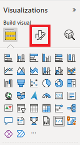
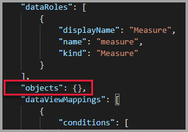
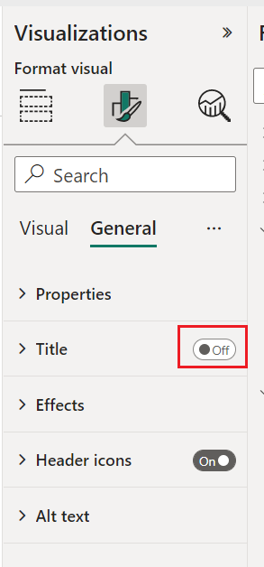
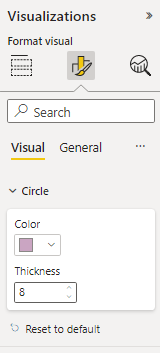
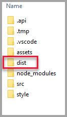

# Tutorial: Adding formatting options to the Circle Card visual

When you create a visual, you can add options for customizing its properties. Some of the items that can be to customized  formatted include:

* Title
* Background
* Border
* Shadow
* Colors

In this tutorial, you learn how to:
> [!div class="checklist"]
>
> * Add formatting properties to your visual.
> * Package the visual
> * Import the custom visual to a Power BI Desktop or Service report

## Prerequisite

This tutorial explains how to add common formatting properties to a visual. We'll use the [Circle card](develop-circle-card.md) visual as an example. We'll add the ability to change the color and thickness of the circle. If you don't have the [Circle card](develop-circle-card.md) project folder that you created in that tutorial, please redo the tutorial before continuing.

## Adding formatting options

1. In **PowerShell**, Navigate to your circle card project folder and start the circle card visual. Your visual is now running while being hosted on your computer.

    ```powershell
    pbiviz start
    ```

2. In **Power BI**, select the **Format page**.

    You should see a message that reads - *Formatting options are unavailable for this visual.*

    

    If you see formatting options here but can't change them skip to [Adding custom formatting options](#adding-custom-formatting-options) to customize them.

3. In **Visual Studio Code**, open the `capabilities.json` file.

4. Before the **dataViewMappings** array, add **objects** (after line 8).

    ```json
    "objects": {},
    ```

    

5. Save the `capabilities.json` file.

6. In **Power BI**, review the formatting options again.

    > [!Note]
    > If you do not see the formatting options change then select **Reload Custom Visual**.

    

7. Set the **Title** option to *Off*. Notice that the visual no longer displays the measure name at the top-left corner.

    

    

### Adding custom formatting options

Now let's add new group called *color* for configuring the color and width of the circle.

1. In PowerShell, enter *Ctrl+C* to stop the custom visual.

2. In **Visual Studio Code**, in the `capabilities.json` file, insert the following JSON fragment into the object labeled **objects**.

    ```json
        {
            "circle": {
                "displayName": "Circle",
                "properties": {
                    "circleColor": {
                        "displayName": "Color",
                        "description": "The fill color of the circle.",
                        "type": {
                            "fill": {
                                "solid": {
                                    "color": true
                                }
                            }
                        }
                    },
                    "circleThickness": {
                        "displayName": "Thickness",
                        "description": "The circle thickness.",
                        "type": {
                            "numeric": true
                        }
                    }
                }
            }
        }
    ```

    The JSON fragment describes a group called *circle*, which consists of two variables -  *circleColor* and *circleThickness*.

   

3. Save the `capabilities.json` file.

4. In the **Explorer pane**, go to the **src** folder, and then select **settings.ts**. *This file represents the settings for the starter visual*.

5. In the `settings.ts` file, replace the two classes with the following code.

    ```typescript
    export class CircleSettings {
        public circleColor: string = "white";
        public circleThickness: number = 2;
    }
    export class VisualSettings extends DataViewObjectsParser {
        public circle: CircleSettings = new CircleSettings();
    }
    ```

    

    This module defines the two classes. The **CircleSettings** class defines two properties with names that match the objects defined in the `capabilities.json` file (**circleColor** and **circleThickness**) and also sets default values. The **VisualSettings** class inherits the **DataViewObjectParser** class and adds a property named **circle**, which matches the object defined in the `capabilities.json` file, and returns an instance of **CircleSettings**.

6. Save the `settings.ts` file.

7. Open the `visual.ts` file.

8. In the `visual.ts` file, import *VisualSettings*, *VisualObjectInstanceEnumeration* and *EnumerateVisualObjectInstancesOptions*:

    ```typescript
    import { VisualSettings } from "./settings";
    import VisualObjectInstanceEnumeration = powerbi.VisualObjectInstanceEnumeration;
    import EnumerateVisualObjectInstancesOptions = powerbi.EnumerateVisualObjectInstancesOptions;
    ```

    and in the **Visual** class add the following property:

    ```typescript
    private visualSettings: VisualSettings;
    ```

    This property stores a reference to the **VisualSettings** object, describing the visual settings.

    

9. In the **Visual** class, add the following method before the **update** method. This method is used to populate the formatting options.

    ```typescript
    public enumerateObjectInstances(options: EnumerateVisualObjectInstancesOptions): VisualObjectInstanceEnumeration {
        const settings: VisualSettings = this.visualSettings || <VisualSettings>VisualSettings.getDefault();
        return VisualSettings.enumerateObjectInstances(settings, options);
    }
    ```

    This method is used to populate the formatting options.

    

10. In the **update** method, after the declaration of the **radius** variable, add the following code.

    ```typescript
    this.visualSettings = VisualSettings.parse<VisualSettings>(dataView);

    this.visualSettings.circle.circleThickness = Math.max(0, this.visualSettings.circle.circleThickness);
    this.visualSettings.circle.circleThickness = Math.min(10, this.visualSettings.circle.circleThickness);
    ```

    This code retrieves the format options. It adjusts any value passed into the **circleThickness** property, converting it to 0 if negative, or 10 if it's a value greater than 10.

    

11. In the **circle element**, modify the values passed to the **fill style** and **stroke-width style** as follows:

    ```typescript
    this.visualSettings.circle.circleColor
    ```

    ```typescript
    this.visualSettings.circle.circleThickness
    ```

    

12. Save the `visual.ts` file.

13. In **PowerShell**, start the visual.

    ```powershell
    pbiviz start
    ```

14. In **Power BI**, in the toolbar floating above the visual, select **Toggle Auto Reload**.

    

15. In the **visual format** options, expand **Circle**.

    

    Modify the **color** and **thickness** option.

    Modify the **thickness** option to a value less than zero, and a value higher than 10. Then notice the visual updates the value to a tolerable minimum or maximum.

## Packaging the custom visual

Now that the visual is completed and ready to be used, it's time to package it. A packaged visual can be imported to Power BI reports or service to be used and enjoyed by others.

In this section you will learn how to

* [Enter property values](#edit-the-property-values-of-the-visual) for the custom visual project in the `pbiviz.json` file.
* [Update the icon](#update-the-icon) (`icon.png`) file.
* Finally, [package](#create-the-visual package) the custom visual.

### Edit the property values of the visual

1. In **PowerShell**, stop the custom visual.

2. Open the `pbiviz.json` file in **Visual Studio Code**.

3. In the **visual** object, modify the **displayName** property to *Circle Card*.

    In the **Visualizations** pane, hovering over the icon reveals the display name.

    

4. For the **description** property, enter the following text.

    *Displays a formatted measure value inside a circle*

5. Fill **supportUrl** and **gitHubUrl** for the visual.

    Example:

    ```json
    {
        "supportUrl": "https://community.powerbi.com",
        "gitHubUrl": "https://github.com/microsoft/PowerBI-visuals-circlecard"
    }
    ```

6. Enter your details in the **author** object.

7. Save the `pbiviz.json` file.

### Update the icon

1. In the **assets** object of the `pbiviz.json` file, notice that the document defines a path to an icon. The icon is the image that appears in the **_Visualizations_** pane. It must be a **PNG** file, *20 pixels by 20 pixels*.

2. In Windows Explorer, copy the `icon.png` file, and then paste it to replace the default file located in the **assets** folder.

3. In **Visual Studio Code**, in the Explorer pane, expand the **assets** folder, and then select the **icon.png** file.

4. Review the icon.

    

### Create the visual package

1. In **Visual Studio Code**, ensure that all files are saved.

2. To package the custom visual, in PowerShell, enter the following command.

    ```powershell
    pbiviz package
    ```

The package is output to the **dist** folder of the project.



The package contains everything required to import the custom visual into either the Power BI service or a Power BI Desktop report. You have now packaged the custom visual, and it's  ready for use.

## Importing the custom visual

Now you are ready to import the Circle Card custom visual.
Follow the directions in [import a visual file from your local computer into Power-BI](import-visual.md#import-a-visual-file-from-your-local-computer-into-power-bi) to import the `circleCard.pbiviz` file from the **dist** folder into your **Power BI** report.

## Debugging

For tips about debugging your custom visual, see the [debugging guide](visuals-how-to-debug.md).

## Next steps

> [!div class="nextstepaction"]
> [Publish Power BI visuals to AppSource](office-store.md)

> [!div class="nextstepaction"]
> [Create a Power BI bar chart visual](create-bar-chart.md)

> [!div class="nextstepaction"]
> [Learn how to debug a Power BI visual you created](visuals-how-to-debug.md)

> [!div class="nextstepaction"]
> [Power BI visuals project structure](visual-project-structure.md)
