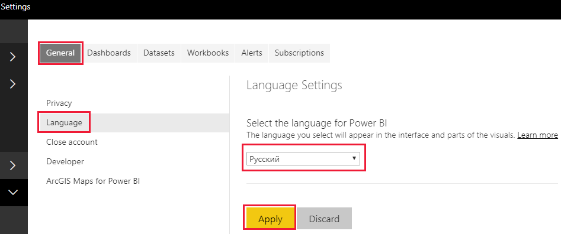
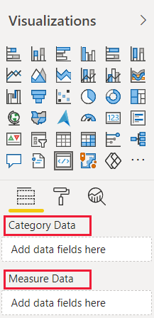
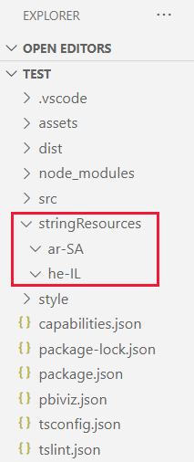
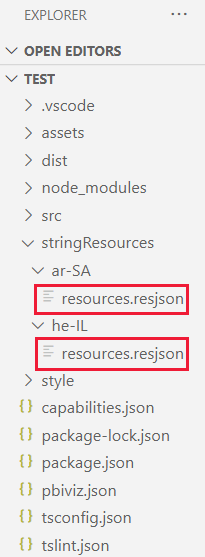

# Add the locale Power BI language to your Power BI visual

Power BI [supports a range of local languages](./../../fundamentals/supported-languages-countries-regions.md). You can retrieve the Power BI locale language, and use it to display content in your visual.

Below is an example of a *sample bar chart* visual displaying content in different languages. Each of these bar charts was created using a different locale language (English, Basque, and Hindi) which is displayed in the tooltip.


> [!NOTE]
> * The localization manager in the visual's code is supported from API 1.10.0 and higher.
> * Localization  is not supported for debugging the development visual.

## How to add the local Power BI language to your visual

To add the local Power BI language to your visual, you'll need to do follow these steps:

1. [Set up your environment to display a language that isn't English](#step-1---set-up-your-environment-to-display-a-language-that-isnt-english).

2. [Get the local Power BI language](#step-2---get-the-locale-power-bi-language).

3. [Set the visual display names](#step-3---set-the-visual-display-names)

4. [Create a language folder](#step-4---create-a-language-folder).

5. [Add a resources file for each language](#step-5---add-a-resources-file-for-each-language).

6. [Create a new localizationManager instance](#step-6---create-a-new-localizationmanager-instance).

7. [Call the getDisplayName function](#step-7---call-the-getdisplayname-function).

### Step 1 - Set up your environment to display a language that isn't English

To test your visual, you'll need Power BI to use a language that isn't English. This section shows how to change the settings of Power BI Desktop and Power BI service, so that they use a local language that isn't English.

* **Power BI Desktop** - Download the localized version of Power BI desktop from https://powerbi.microsoft.com.

* **Power BI service** - If you're using Power BI service (web portal), change your language in settings:

    1. Sign in to [PowerBI.com](https://powerbi.microsoft.com/).

    2. Navigate to **Settings** > **Settings** > **Settings**.

        >[!div class="mx-imgBorder"]
        >

    3. From the **General** tab, select **Language**. In the **Language Settings** select the language you want Power BI to use, and then select **Apply**.

        >[!div class="mx-imgBorder"]
        >

### Step 2 - Get the locale Power BI language

The local Power BI language is passed as a string called `locale` during the initialization of the visual. If a locale language is changed in Power BI, the visual will be generated again with the new `locale`.

```typescript
private locale: string;
...
this.locale = options.host.locale;
```

> [!NOTE]
> In Power BI Desktop, the `locale` property contains the language of the installed Power BI Desktop.

### Step 3 - Set the visual display names

Every visual displays information in the property pane. For example, a non-localized custom visual created by using the `pbiviz new` command, will show the *Category Data* and *Measure Data* fields in the property pane.

>[!div class="mx-imgBorder"]
>

The property pane display fields are defined in the  **capabilities.json** file. Every display field is defined using a `displayName` property. Add a `displayNameKey` to every display name you want to localize.

```json
{
    "dataRoles": [
        {
            "displayName": "Category Data",
            "displayNameKey": "VisualCategoryDataNameKey1",
            "name": "category",
            "kind": "Grouping"
        },
        {
            "displayName": "Measure Data",
            "displayNameKey": "VisualMeasureDataNameKey2",
            "name": "measure",
            "kind": "Measure"
        }
    ]
}
```

### Step 4 - Create a language folder

To create localized visuals, your project needs to have a language folder. In your project, create a folder called **stringResources**. The folder will contain one sub folder for each local language you want your visual to support. For example, to support Arabic and Hebrew, add two folders in the following way:

>[!div class="mx-imgBorder"]
>

### Step 5 - Add a resources file for each language

For each language you want your visual to support, you'll need to add a **resources.resjson** JSON file in the appropriate **stringResources** sub folder. These files contain the locale language information, and the localized string values for every `displayNameKey` you want to replace.

>[!div class="mx-imgBorder"]
>

Every JSON file defines a single [supported locale language](#supported-languages). Add all the localization strings you are going to use into each **resources.resjson** file.

#### Examples

* **resources.resjson** file with *Russian* strings for each `displayNameKey`.

    ```json
    {
        ...
        "Role_Legend": "Обозначения",
        "Role_task": "Задача",
        "Role_StartDate": "Дата начала",
        "Role_Duration": "Длительность"
        ...
    }
    ```

* **resources.resjson** file with *Hebrew* strings for each `displayNameKey`.

    ```json
    {
        ...
        "Role_Legend": "Legend",
        "Role_task": "Task",
        "Role_StartDate": "Start date",
        "Role_Duration": "Duration"
        ...
    }
    ```

### Step 6 - Create a new localizationManager instance

Create a new `localizationManager` instance in your visual's code.

```typescript
private localizationManager: ILocalizationManager;

constructor(options: VisualConstructorOptions) {
    this.localizationManager = options.host.createLocalizationManager();
}
```

### Step 7 - Call the getDisplayName function

After creating a new `localizationManager` instance, you can call the localization manager's `getDisplayName` function with the string key argument you defined in **resources.resjson**.

For example, the following code returns *Legend* for en-US, and *Обозначения* for ru-RU.

```typescript
let legend: string = this.localization.getDisplayName("Role_Legend");
```

## Supported languages

The table below contains a list of all the languages supported in Power BI, and the string that the `local` variable returns for each one.

Locale string | Language
--------------|---------------------
ar-SA | العربية (Arabic)
bg-BG | български (Bulgarian)
ca-ES | català (Catalan)
cs-CZ | čeština (Czech)
da-DK | dansk (Danish)
de-DE | Deutsche (German)
el-GR | ελληνικά (Greek)
en-US | English (English)
es-ES | español service (Spanish)
et-EE | eesti (Estonian)
eU-ES | Euskal (Basque)
fi-FI | suomi (Finnish)
fr-FR | français (French)
gl-ES | galego (Galician)
he-IL | עברית (Hebrew)
hi-IN | हिन्दी (Hindi)
hr-HR | hrvatski (Croatian)
hu-HU | magyar (Hungarian)
id-ID | Bahasa Indonesia (Indonesian)
it-IT | italiano (Italian)
ja-JP | 日本の (Japanese)
kk-KZ | Қазақ (Kazakh)
ko-KR | 한국의 (Korean)
lt-LT | Lietuvos (Lithuanian)
lv-LV | Latvijas (Latvian)
ms-MY | Bahasa Melayu (Malay)
nb-NO | norsk (Norwegian)
nl-NL | Nederlands (Dutch)
pl-PL | polski (Polish)
pt-BR | português (Portuguese)
pt-PT | português (Portuguese)
ro-RO | românesc (Romanian)
ru-RU | русский (Russian)
sk-SK | slovenský (Slovak)
sl-SI | slovenski (Slovenian)
sr-Cyrl-RS | српски (Serbian)
sr-Latn-RS | srpski (Serbian)
sv-SE | svenska (Swedish)
th-TH | ไทย (Thai)
tr-TR | Türk (Turkish)
uk-UA | український (Ukrainian)
vi-VN | tiếng Việt (Vietnamese)
zh-CN | 中国 (Chinese-Simplified)
zh-TW | 中國 (Chinese-Tranditional)

## Next steps

>[!div class="nextstepaction"]
>[Formatting utils](utils-formatting.md)
