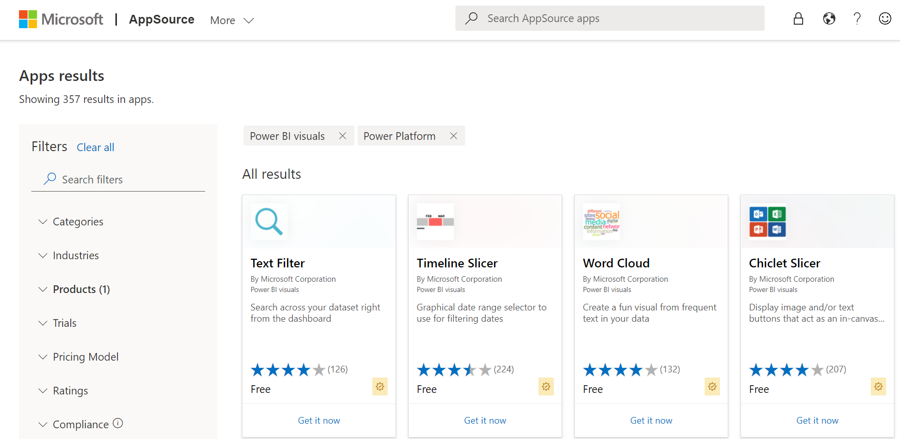

# Publish Power BI visuals to the Microsoft commercial marketplace

Once you have created your Power BI visual, you may want to publish it to AppSource for others to discover and use. For a detailed explanation of how to create a Power BI visual offer, see [Plan a Power BI visual offer](/azure/marketplace/marketplace-power-bi-visual).

## What is AppSource?

[AppSource](https://appsource.microsoft.com/marketplace/apps?product=power-bi-visuals) is the place to find SaaS apps and add-ins for your Microsoft products and services.

## Prerequisite

To submit your Power BI visual, you must be enrolled with [Partner Center](/partner-center/overview). If you're not yet enrolled, [Open a developer account in Partner Center](/azure/marketplace/create-account).

## Prepare to submit your Power BI visual

Before submitting a Power BI visual to AppSource, ensure that it complies with the [Power BI visuals guidelines](guidelines-powerbi-visuals.md).

>[!IMPORTANT]
>If you're resubmitting or updating a visual, **do not change its GUID**. Follow these instructions to [test a new version of a visual](submission-testing.md#testing-a-new-version-of-a-published-visual).

When you are ready to submit your Power BI visual, verify that your visual meets all the requirements listed below.

| Item | Required | Description |
| --- | --- | --- |
| Pbiviz package |Yes |[Pack your Power BI visual into a *.pbiviz* package](package-visual.md). Ensure the *pbiviz.json* file contains all the required metadata:  - Visual name - Display name  - GUID  - Version  - Description  - Support URL  - Author name and email |
| Sample *.pbix* report file |Yes |To help users become familiar with the visual, highlight the value that the visual brings to the user and give examples of usage and formatting. You can also add a *"hints"* page at the end with some tips and tricks and things to avoid. The sample *.pbix* report file must work offline, without any external connections. |
| Logo |Yes |Include the custom visual logo that will appear in the Marketplace listing. It should be in PNG format and exactly 300 x 300 px. **Important!** Review the [AppSource store images guide](/office/dev/store/craft-effective-appsource-store-images) carefully, before submitting the logo. |
| Screenshots |Yes |Provide at least one screenshot, and up to five, in PNG format. The dimensions must be exactly 1366 px (width) by 768 px (height), and the size not larger than 1024 kb. Add text bubbles to explain the value of key features shown in each screenshot. |
| Support download link |Yes |Provide a support URL for your customers. This link is entered as part of your Partner Center listing, and is visible to users when they access your visual's listing on AppSource. The URL should start with https://. |
| Privacy document link |Yes |Provide a link to the visual's privacy policy. This link is entered as part of your Partner Center listing, and is visible to users when they access your visual's listing on AppSource. The URL should start with https://. |
| End-user license agreement (EULA) |Yes |You must provide an EULA file for your Power BI visual. You can use the [standard contract](https://go.microsoft.com/fwlink/?linkid=2041178), [Power BI visuals contract](https://visuals.azureedge.net/app-store/Power%20BI%20-%20Default%20Custom%20Visual%20EULA.pdf), or your own EULA. |
| Video link |No |To increase the interest of users for your custom visual, provide a link to a video about your visual. The URL should start with https://. |

## Submit your custom visual to AppSource

To submit a Power BI visual to AppSource, upload a **.pbiviz** package and **.pbix** file to Partner Center.

Before you create the **.pbiviz** package, complete the following fields in the **pbiviz.json** file:

* description
* supportUrl
* author
* name
* email

>[!NOTE]
>**Individual publishers** can use one of these methods to submit a Power BI visual:
>
>* If you have an old Seller Dashboard account, you can continue using this account's credentials to sign into Partner Center.
>* If you don't have an old Seller Dashboard account, and are not registered to Partner Center, you'll need to [Open a developer account in Partner Center](/office/dev/store/open-a-developer-account) using your work email.

> [!IMPORTANT]
> Before you submit your visual, make sure it passes all the [requirements](submission-testing.md). A visual that doesn't pass the requirements will be rejected.

When you're ready to create or update your offer, follow the instructions in [Create a Power BI app offer](/azure/marketplace/marketplace-power-bi-visual).

## Track submission status and usage

You can review the [validation policies](/legal/marketplace/certification-policies#1180-power-bi-visuals).

* After submission, you will be able to view the submission status in the [app dashboard](https://sellerdashboard.microsoft.com/Application/Summary/).

* To understand when your Power BI visual will be available to download from AppSource, review the Power BI visuals [publication timeline](power-bi-custom-visuals-certified.md#publication-timeline).

## Certify your visual

Certified Power BI visuals are visuals in the Marketplace that meet certain specified code [requirements](power-bi-custom-visuals-certified.md#certification-requirements) that the Microsoft Power BI team has tested and approved. To request certification, select the Request Power BI certification check box.
We recommend that you submit and publish your Power BI visual before you request certification, because the certification process can take time. When you request certification, be sure to provide all required certification information in the Notes for certification box on the Review and publish page.
All certified visuals must pass all the [certification requirements](power-bi-custom-visuals-certified.md#certification-requirements).

## Next steps

* [Learn how to create a Power BI visual](develop-circle-card.md)
* [Guidelines for publishing Power BI visuals](guidelines-powerbi-visuals.md)
* [Test your Power BI visual before submitting for certification](submission-testing.md)  
* [Getting a Power BI visual certified](power-bi-custom-visuals-certified.md)

**More questions?** [Try asking the Power BI Community](https://community.powerbi.com/)
