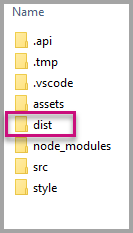

# Package a Power BI visual

Before you can load a visual that you created into [Power BI Desktop](https://powerbi.microsoft.com/desktop/) or share it with the community in the [Power BI Visual Gallery](https://visuals.powerbi.com/), you have to package it.
Before packaging a visual, make sure to do the following:

* [Provide property values](#enter-property-values) and meta data for the visual
* [Update the icon](#update-the-icon-optional)
* [Package](#package-the-visual) the custom visual

## Enter property values

1. In **PowerShell**, stop the custom visual.
2. In **VS Code**, navigate to the root folder of your visual project and open the *pbiviz.json* file.

3. In the `visual` object, modify the `displayName` property.

    

    In the **Visualizations** pane, hovering over the icon reveals the display name.

4. Fill in or modify the following additional fields in the *pbiviz.json* file:
    * `visualClassName`
    * `description`

5. Fill **supportUrl** and **gitHubUrl** for the visual.

    Example:

    ```json
    {
        "supportUrl": "https://community.powerbi.com",
        "gitHubUrl": "https://github.com/microsoft/PowerBI-visuals-circlecard"
    }
    ```

6. Enter your name and email in the `author` object.

7. Save the *pbiviz.json* file.

## Update the icon (optional)

1. In the **assets** object, notice that the document defines a path to an icon. The icon is the image that appears in the **_Visualizations_** pane. It must be a **PNG** file, *20 pixels by 20 pixels*.

2. In Windows Explorer, copy the icon.png file you want to use, and then paste it to replace the default file located at assets folder.

3. In **VS Code**, in the Explorer pane, expand the assets folder, and then select the icon.png file.

4. Review the icon.

    

## Package the visual

1. In **VS Code**, ensure that all files are saved.

2. In **PowerShell**, enter the following command to generate a *pbiviz* file:

    ```powershell
    pbiviz package
    ```

    This command creates a *pbiviz* file in the *dist/* directory of your visual project, and overwrites any previous *pbiviz* file that might exist.

    

The package is output to the **dist** folder of the project. The package contains everything required to import the custom visual into either the Power BI service or a Power BI Desktop report. You have now packaged the custom visual, and it is now ready for use.

## Next steps

> [!div class="nextstepaction"]
> [Publish Power BI visuals to Partner Center](office-store.md)

> [!div class="nextstepaction"]
> [Import a custom visual](import-visual.md)
