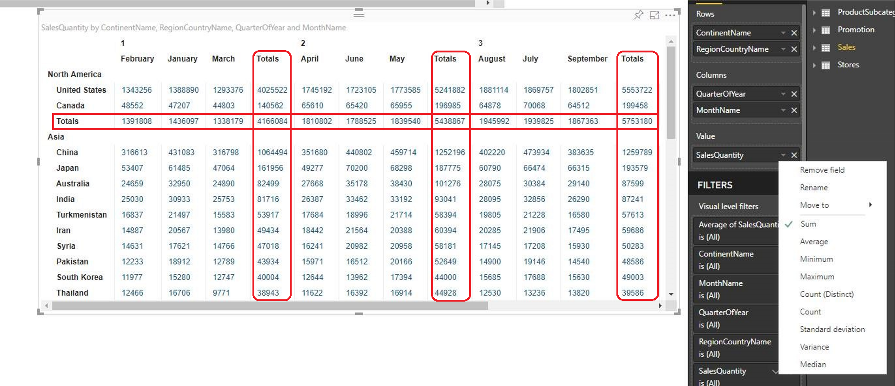

# Request aggregated subtotal data

The *Total and Subtotal API* allows custom visuals with a matrix data-view to request aggregated subtotal data from the Power BI host. The subtotals can be calculated for the entire matrix dataset or specified for individual levels of the matrix data hierarchy (see this [sample report](https://github.com/microsoft/Powerbi-Visuals-SampleMatrix/tree/master/doc)).

>[!NOTE]
>Requesting subtotal data is supported from API version 2.6.0. To find out which version you’re using, Run the `pbiviz -V` command.

Every time a visual refreshes its data, it issues a [data fetch request](fetch-more-data.md) to the Power BI backend. These data requests are usually for values of the fields the user dragged into the field wells of the visual. Sometimes the visual needs other aggregations/subtotals (for example, sum, count) applied to these fields. The API customizes the outgoing data query to request the extra aggregation/subtotal data. Since these calculations are performed by the Power BI backend, they are highly efficient and applicable to large datasets.

> [!div class="mx-imgBorder"]
>

## The subtotals API

The API offers the following **boolean customization switches** for each data-view type (currently just the matrix):

* *rowSubtotals*: Indicates if the subtotal data should be requested for all fields in the rows field well
* *rowSubtotalsPerLevel*: Indicates if the subtotal data can be toggled for individual fields in the row's field well
* *columnSubtotals*: Indicates if the subtotal data should be requested for all fields in the columns field well
* *columnSubtotalsPerLevel*: Indicates if the subtotal data can be toggled for individual fields in the columns field well
* *levelSubtotalEnabled*: Unlike all other properties, this property is applied to individual rows/columns. This property indicates if the subtotals are requested for the row/column

Each of the above switches is assigned a value based on the related properties in the property pane and the defaults.

## How to use the subtotal API

The visual's *capabilities* JSON file has to:

* specify the property each of the above switches maps to
* provide the default value to be used if the property is undefined

The switches all look like this:

```json
    "rowSubtotals": { 
                "propertyIdentifier": { 
                    "objectName": "subTotals", 
                    "propertyName": "rowSubtotals" 
                }, 
                "defaultValue": true 
            },
```

For example, the above indicates that the row subtotals are enabled by the property “rowSubtotals” in the “subTotals” object. It has a default value of “true”.

The API is automatically enabled for a visual whenever the subtotals structure and all the switch mappings are defined in the capabilities JSON file.

Below is an example of the complete API configuration in the *capabilities* JSON file (copied from the API sample visual):

```json
"subtotals": { 
        "matrix": { 
            "rowSubtotals": { 
                "propertyIdentifier": { 
                    "objectName": "subTotals", 
                    "propertyName": "rowSubtotals" 
                }, 
                "defaultValue": true 
            }, 
            "rowSubtotalsPerLevel": { 
                "propertyIdentifier": { 
                    "objectName": "subTotals", 
                    "propertyName": "perRowLevel" 
                }, 
                "defaultValue": false 
            }, 
            "columnSubtotals": { 
                "propertyIdentifier": { 
                    "objectName": "subTotals", 
                    "propertyName": "columnSubtotals" 
                }, 
                "defaultValue": true 
            }, 
            "columnSubtotalsPerLevel": { 
                "propertyIdentifier": { 
                    "objectName": "subTotals", 
                    "propertyName": "perColumnLevel" 
                }, 
                "defaultValue": false 
            }, 
            "levelSubtotalEnabled": { 
                "propertyIdentifier": { 
                    "objectName": "subTotals", 
                    "propertyName": "levelSubtotalEnabled" 
                }, 
                "defaultValue": true 
            } 
        } 
    }
```

It’s important that the enumerateProperities() function of the visual is aligned with the defaults specified in the capabilities. At the same time, the customization logic will operate according to the defaults specified in the capabilities (since no objects are supplied in the data view). The two must be aligned. Otherwise, the actual subtotal customizations might differ from the user’s perception.

Check out this [sample report](https://github.com/Microsoft/Powerbi-Visuals-SampleMatrix) in the DOC folder.

To review the available customizations, expand the Subtotals drop-down menu in the Format property pane, modify the subtotals settings, and track the changes to the subtotals presentation (named *Totals*) by the visual.


## Next steps

>[!div class="nextstepaction"]
>[Add interactivity to visual using Power BI visuals selections](selection-api.md)
