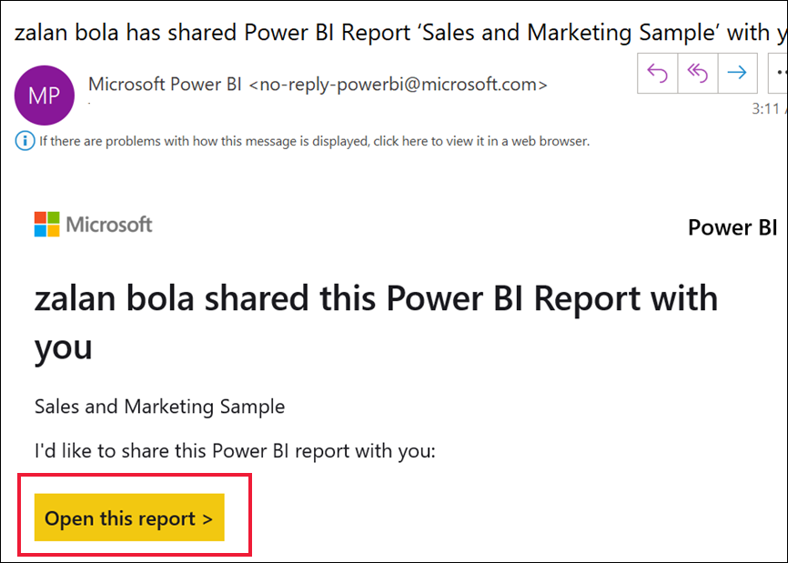
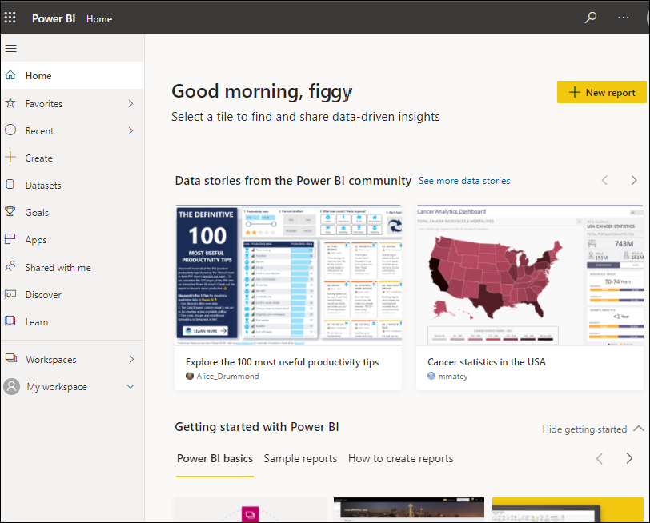
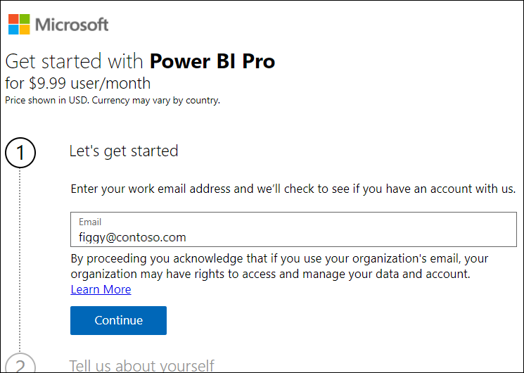
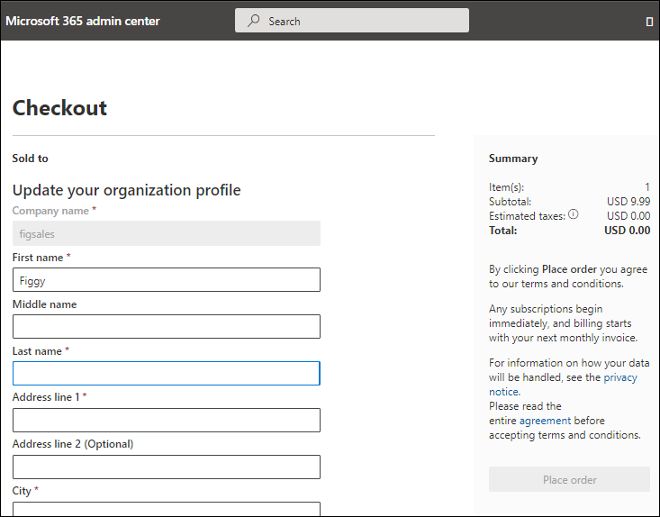

 
# Sign up for or purchase the Power BI service as an individual

Power BI can be your personal data analysis and visualization tool, and can also serve as the analytics and decision engine behind group projects, divisions, or entire corporations. This article explains how individuals can use *self-service sign-up* and *self-service purchase* to get a license for the Power BI service for themselves.  If you're a global administrator or billing administrator, see [Power BI licensing for your organization](../enterprise/service-admin-licensing-organization.md). To download the free Power BI Desktop, see [Get Power BI Desktop](desktop-get-the-desktop.md).

For definitions and an overview of self-service-sign-up and self-service purchase, visit [Self-service for Power BI](service-self-service-signup-purchase-for-power-bi.md).

## License scenarios
Use this chart to help determine which type of license you need. Power BI Desktop is always free. The Power BI service offers both free and paid license options. Paid options include Power BI Pro, Power BI Premium, and Power BI Premium Per User (PPU). Some questions to ask yourself are: "Will I be creating content or will I only be consuming content created by others?", "Will I be sharing my content with others?", "Do I have access to Premium capacity?". For help with answering these questions, see [Interact with the Power BI service as a Free user](../consumer/end-user-features.md), [What is Power BI Premium](../enterprise/service-premium-what-is.md), and [Licenses and subscriptions for business users](../consumer/end-user-license.md).

| Scenario  | Creator  | Consumer |
|-----------|----------|----------|
| You create a report in Power BI Desktop (.PBIX). Then you publish it to your My Workspace on the Power BI service. | As a creator, you only need the free Desktop app and a free Power BI license to publish to your My Workspace in the Power BI service for your own use. A paid Power BI Pro or PPU license is required to share content in My Workspace with others. | Consumers can't see content in other people's My Workspace unless the owners decide to share. To see shared My Workspace content requires a paid license. |
| You create a report in Power BI Desktop (.PBIX) and share the PBIX file to other people who open the file in Power BI Desktop | No licensing needed, only the Power BI Desktop app to be downloaded and installed. | No licensing needed, only the Power BI Desktop app to be downloaded and installed. |
| You create a report in Power BI Desktop (.PBIX) and publish it to a shared workspace in the Power BI service. |   Paid license needed to publish to shared workspaces. | Paid license required to view the content unless the workspace is hosted in Premium capacity. For workspaces in Premium capacity, the consumer only needs a free license to view that report. |
| You're sent a link to a report hosted on the Power BI service and want to view it. | You need a paid license to share a link. You need a free license to share a link to a report that is in Premium capacity. | A paid license is required to view the report unless the report is hosted in Premium capacity. For reports hosted in Premium capacity, the consumer only needs a free license to view that report. |

## Supported email addresses

Before you start the self-service process, it's important to learn which types of email addresses you can use to sign up for or purchase Power BI:

- Power BI requires that you use a work or school email address. You can't sign up or purchase using email addresses provided by consumer email services or telecommunication providers. These services include `outlook.com`, `hotmail.com`, `gmail.com`, and others. If you don't have a work or school account, [learn about alternate ways to sign up](../enterprise/service-admin-signing-up-for-power-bi-with-a-new-office-365-trial.md).

- You can sign up for or purchase Power BI with .gov or .mil addresses, but this approach requires a different process. For more information, see [Enroll your US Government organization in the Power BI service](../enterprise/service-govus-signup.md).

## Use self-service sign-up to get an individual Power BI license

Follow these steps to sign up for a Power BI service account. Once you complete this process, you'll have a Power BI (free) license that you can use to try the Power BI service on your own using My Workspace, consume content from a Power BI workspace assigned to a Power BI Premium capacity, or initiate an individual Power BI trial. For more information, see [Power BI features by license type](service-features-license-type.md).

The exact steps for sign up can vary depending on your organization and what you select to start the process. For this reason, you might not be presented with all of the screens shown below. There are many different ways to sign up for the Power BI service as an individual, and the steps in this article apply to the two most common.

- Select a **Try free** or **Start free** button. You'll find the **Try free** type of buttons on `powerbi.microsoft.com`, in related Microsoft products, and in documentation and marketing articles.
- Receive an email with a link to a Power BI dashboard, report, or app. You haven't previously signed in to your Power BI account.

1. Select **Try free** from [powerbi.microsoft.com](https://powerbi.com). You might then be prompted to select **Try Power BI for free**.

   

   

   Or, select an email link to a Power BI dashboard, report, or app.

   

1. When prompted, sign in using your organizational account.

   

1. In this example, Microsoft 365 recognizes you and knows that you already have at least one other Microsoft service installed. Select **Sign in**.

   

1. You might receive one of these dialog boxes:

   - If you get a message like this, make sure that you're using a work or school email address and not a consumer address like Hotmail, Gmail, or Outlook. See [supported email addresses, above.](#supported-email-addresses)

     

   - If you get a message like this, review the terms and conditions. If you agree, select **Start**.

     

1. At this point, you might have to wait if Microsoft is [setting up a new tenant](../enterprise/service-admin-signing-up-for-power-bi-with-a-new-office-365-trial.md). Otherwise, the Power BI service opens in your browser.

   

## Use self-service sign-up to start an individual trial of the Power BI paid version

Congratulations on signing into your Power BI account for the first time! You now have a free license. As you start to explore the Power BI service, you might see pop-ups asking if you want to upgrade to an individual trial of the paid version of Power BI, which includes Power BI Pro and Power BI Premium Per User (PPU). If you do, select **Try now**. In some organizations, if you try to use a feature that requires a Pro or PPU license, Power BI automatically initiates a 60 day trial of the paid version of Power BI. [Some features of the Power BI service require a Pro or PPU license](../consumer/end-user-license.md). If you'd like to start a free 60 day individual trial, select **Start trial**.  

In some organizations, your default Power BI account might be a Power BI Pro license. For example, some versions of Microsoft 365 include a Power BI Pro license. To learn how to look up your user license, see [what license do I have?](../consumer/end-user-license.md)

If a Power BI (free) license is sufficient, you don't have to do anything else. To take advantage of Power BI Pro or Premium Per User features, you can upgrade your license using self-service purchase.

### Trial expiration

When your free individual trial of Power BI expires, or you cancel your trial, your license changes back to its previous version of Power BI, either free or Pro. The trial can't be extended. For more information, see [Features by license type](service-features-license-type.md).

If you'd like to cancel your trial before the expiration date, select your account icon and choose **Cancel trial**.

## Use self-service purchase to buy an individual Power BI license

Individuals can make a self-service purchase online from the Power BI website or from in-product purchase prompts. Individuals are first asked to enter an email address to ensure that their email address is already associated with at least one other Microsoft online service. If they're recognized by Microsoft, they're next directed to sign in. After signing in, the individual is asked to select how many subscriptions they want to buy, and to provide credit card payment. When the purchase is complete, they can start using their subscription. The purchaser has access to a limited view of the Microsoft 365 admin center where they can assign licenses for the product to other people in their organization.

If you have more questions about self-service purchase, visit the [Self-service purchase FAQ](/microsoft-365/commerce/subscriptions/self-service-purchase-faq).

To purchase a Power BI Pro license, select **Buy now** when prompted, or visit [Power BI pricing](https://powerbi.microsoft.com/pricing). Self-service purchase is also available for Power BI Premium Per User, and the steps are similar.

Enter your email address. In this example, the individual already has a free Power BI license and is recognized by Microsoft.

Complete the order form to purchase Power BI Pro.

If self-service purchase isn't available, contact your administrator about purchasing a Power BI Pro license.

## Troubleshooting

In most cases, you can sign up for the Power BI service by following the described process. Some of the issues that might prevent you from signing up are described below, with possible workarounds.

### Personal email addresses

You attempt to sign up using a personal email address, for example `nancy@gmail.com`, and you receive a message similar to one of these messages:

*You entered a personal email address: Please enter your work email address so we can securely store your company's data*.

or

*That looks like a personal email address. Enter your work address so we can connect you with others in your company. And don't worry. We won't share your address with anyone*.

The Power BI service doesn't support email addresses provided by consumer email services or telecommunications providers. To finish signing up, try again using an email address assigned by your work or school. 

If you still can't sign up and are willing to complete a more advanced setup process, you can [register for a new Microsoft 365 trial subscription and use that email address to sign up](../enterprise/service-admin-signing-up-for-power-bi-with-a-new-office-365-trial.md).

You can also have an existing user [invite you as a guest](../enterprise/service-admin-azure-ad-b2b.md).

[!INCLUDE[self-service-signup](../includes/self-service-signup-help.md)]

### Your email address isn't a Microsoft 365 ID

You attempt to sign up or purchase and receive a message like this:

*We can't find you at contoso.com. Do you use a different ID at work or school? Try signing in with that, and if it doesn't work, contact your IT department.*

Your organization uses IDs that are different than your email address to sign in to Microsoft 365 and other Microsoft services. For example, your email address might be `zalan.bola@contoso.com` but your ID is `zalanb@contoso.com`.

To finish signing up or purchasing, use the ID that your organization has assigned to you for signing in to Microsoft 365 or other Microsoft services. If you don't know what this ID is, contact your global administrator.  

If you still can't sign up or purchase and are willing to complete a more advanced setup process, you can [register for a new Microsoft 365 trial subscription and use that email address to sign up](../enterprise/service-admin-signing-up-for-power-bi-with-a-new-office-365-trial.md).

### Power BI sign-in doesn't recognize your password

Sometimes it takes a few tries. If you retry your password several times and you still can't sign in, try running your browser in Incognito (Chrome) or InPrivate (Microsoft Edge) mode.

### You don't receive in-product prompts

You don't see prompts to upgrade (Buy now) or start a trial (Try now), and the UI doesn't display **Try now** or **Buy now** buttons.

The type of upgrade and trial options that you're offered depend on how your administrator has set up your domain. Your administrators have the ability to disable all trials, disable self-service purchase, and more. 

## Next steps

- [Self-service purchase FAQ](/microsoft-365/commerce/subscriptions/self-service-purchase-faq)
- [Power BI features by license type](../consumer/end-user-features.md)
- [Tips for finding help](../support/service-tips-for-finding-help.md)

More questions? [Try asking the Power BI Community](https://community.powerbi.com/)
