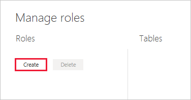

## Define roles and rules in Power BI Desktop

You can define roles and rules within Power BI Desktop. When you publish to Power BI, it also publishes the role definitions.

To define security roles, follow these steps.

1. Import data into your Power BI Desktop report, or configure a DirectQuery connection.

   > [!NOTE]
   > You can't define roles within Power BI Desktop for Analysis Services live connections. You need to do that within the Analysis Services model.

2. From the **Modeling** tab, select **Manage Roles**.

   
3. From the **Manage roles** window, select **Create**.

   
4. Under **Roles**, provide a name for the role.

    >[!NOTE]
    >You can't define a role with a comma, such as `London,ParisRole`.

5. Under **Tables**, select the table to which you want to apply a DAX rule.

6. In the **Table filter DAX expression** box, enter the DAX expressions. This expression returns a value of true or false. For example: ```[Entity ID] = “Value”```.

   

   > [!NOTE]
   > You can use *username()* within this expression. Be aware that *username()* has the format of *DOMAIN\username* within Power BI Desktop. Within the Power BI service and Power BI Report Server, it's in the format of the user's User Principal Name (UPN). Alternatively, you can use *userprincipalname()*, which always returns the user in the format of their user principal name, *username\@contoso.com*.

7. After you've created the DAX expression, select the checkmark above the expression box to validate the expression.

   

   > [!NOTE]
   > In this expression box, you use commas to separate DAX function arguments even if you're using a locale that normally uses semicolon separators (e.g. French or German).

8. Select **Save**.

You can't assign users to a role within Power BI Desktop. You assign them in the Power BI service. You can enable dynamic security within Power BI Desktop by making use of the *username()* or *userprincipalname()* DAX functions and having the proper relationships configured. 
