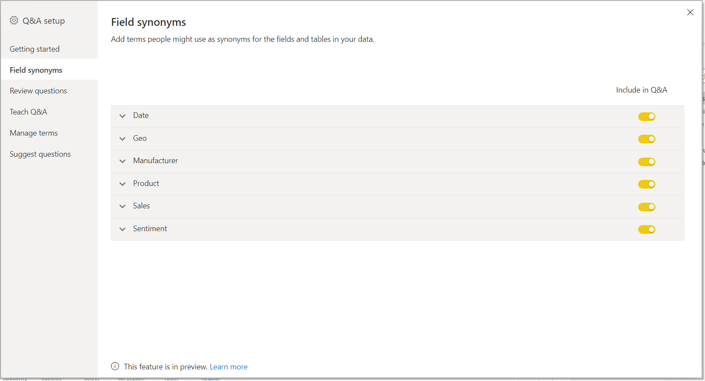
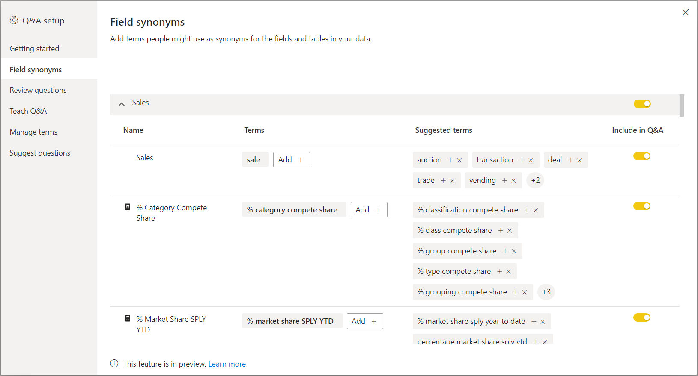
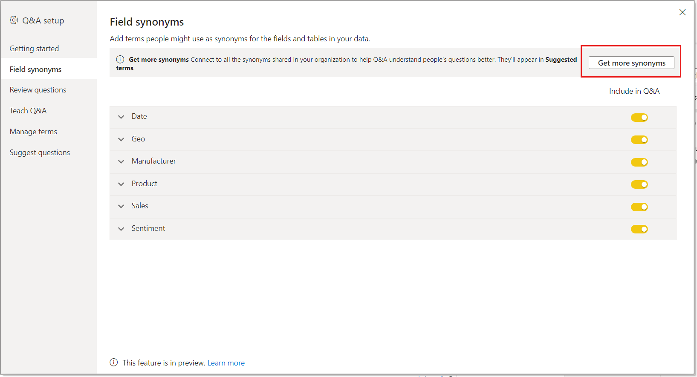
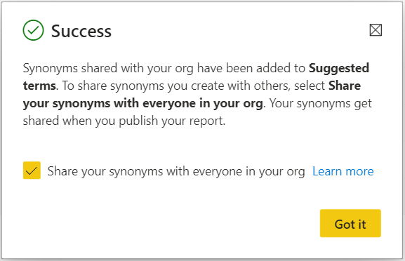
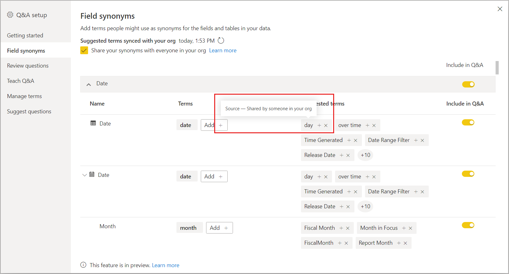
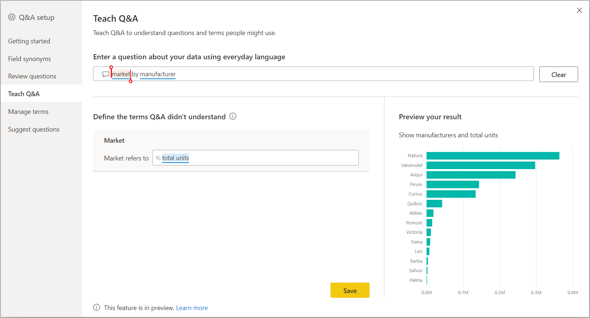

# Intro to Q&A tooling to train Power BI Q&A (preview)

With Power BI Q&A *tooling*, you can improve the natural language experience for your users. As a designer or administrator, you interact with the natural language engine and make improvements in three areas: 

- Review questions your users have asked.
- Teach Q&A to understand questions.
- Manage terms you've taught Q&A.

In addition to these dedicated tooling capabilities, the **Modeling** tab in Power BI Desktop offers more options:  

- Synonyms
- Row labels
- Hide from Q&A
- Configuring of the linguistic schema (advanced)

## Get started with Q&A tooling

Q&A tooling is only available in Power BI Desktop, and currently only supports import mode.

1. Open Power BI Desktop and use Q&A to create a visual. 
2. From the corner of the visual, select the gear icon. 

    :::image type="content" source="media/q-and-a-tooling-intro/qna-visual-gear.png" alt-text="Screenshot of the Q and A search box with the gear icon highlighted.":::

    The Getting started page opens.  

    

## Field synonyms

1. Select **Field synonyms** to see all the tables and columns that belong to the model. This view allows you to add alternative names to match the columns to help users. You can also choose whether or not a column or table should be hidden from Q&A.

   

1. Select one of the tables to expand and you'll see a dialog similar to the following example.

   

   The dialog shows all the columns, tables, and respective terms and synonyms that users can use when asking questions against the dataset. You can quickly see all the terms in one place and add or remove terms for multiple columns. 

   - Add terms - If you have a field called sales, you might decide to add a term called revenue, so a user can use this word instead of being required to use the word sales. Select **Add** to quickly add a new term.

   - Include in Q&A - This option allows a column or table to be omitted from Q&A, meaning it won't be shown and a result can't be displayed with this column. You might decide not to include a column when dealing with dates. If there are numerous date fields or foreign keys, you might decide to remove all but one of the date fields, so the correct date column is picked when a user asks a date related question.

   - Suggested Terms - Q&A also recommends suggested terms retrieved from our suggestions engine to help you quickly add terms and synonyms. If the suggestions aren't added, they still function, but they give the user an orange dotted line indicating that Q&A thinks it has an answer but isn't sure. If the suggested synonym is correct, select the plus icon (+), so it can be used as a synonym. If the suggestion is incorrect, select the x to remove the term. It won't be used as a term or synonym and won't function inside Q&A. The initial suggestions are powered by Office Dictionary or they can come from renames found inside a report. Another way to get more suggested terms is through synonym sharing within your organization. 

### Synonym sharing
With synonym sharing, you can use your coworker's synonyms and minimize duplicate effort when adding synonyms to your models. 
To connect to shared synonyms, go to **Q&A setup** > **Field synonyms** and select **Get more synonyms**.

This process might take a few seconds, but once it’s completed, you can share your synonyms with everyone in your organization. 

> [!NOTE] 
> Synonyms are only shared when you publish the report.

Any shared synonyms that match fields in your model show up in the **Suggested terms** section. You can select the plus icon (+) on the suggested term to add it as a field synonym.

As new synonyms get shared within your organization, you can select the refresh icon to ensure that your **Suggested terms** are in sync with your organization.

:::image type="content" source="media/q-and-a-tooling-intro/refresh-shared-synonyms.png" alt-text="Screenshot of the option called Share your synonyms with everyone in your org. The checkbox is selected.":::

## Review questions

Select **Review questions** to see a list of datasets being used in the Power BI service for your tenant. The **Review questions** page also displays the dataset owner, workspace, and last refreshed date. From here, you can select a dataset and see what questions users have been asking. The data also shows words that weren't recognized. All data shown here is for the last 28 days.

:::image type="content" source="media/q-and-a-tooling-intro/qna-tooling-review-questions.png" alt-text="Screenshot of the Q and A Review questions page.":::

## Teach Q&A

The **Teach Q&A** section allows you to train Q&A to recognize words. To begin, type a question that contains a word or words that Q&A doesn't recognize. Q&A prompts you for the definition of that term. Enter a filter or a field name that corresponds to what that word represents. Q&A then reinterprets the original question. If you're happy with the results, you can save your input. For more information, see [Teach Q&A to understand questions and terms](q-and-a-tooling-teach-q-and-a.md).

## Manage terms

Anything you've saved from the Teach Q&A section shows up here, so you can review or delete terms you've defined. Currently, you can't edit an existing definition. So, to redefine a term you must delete and recreate that term.

## Suggest questions

> [!NOTE]
> The suggested questions show up for all instances of the Q&A visual. It isn't possible to create a separate set of suggestions for each Q&A visual.
> 

Without doing any setup, the Q&A visual suggests several questions to get started. These questions are automatically generated based on your data model. In **Suggest questions**, you can overwrite the autogenerated questions with your own questions.

1. To start, type the question you want to add in the text box. In the preview section, you see what the result will look like in the Q&A visual. 

   :::image type="content" source="media/q-and-a-tooling-intro/power-bi-qna-suggest-questions.png" alt-text="Screenshot of the Suggest questions page with the search box highlighted.":::
 
1. Select the **Add** button to add this question to **Your suggested questions**. Each question is added to the end of this list. The questions will show up in the Q&A visual in the same order as they do in this list. 

   :::image type="content" source="media/q-and-a-tooling-intro/power-bi-qna-save-suggest-questions.png" alt-text="Screenshot of the Suggest questions page with the section called Reorder your suggested questions highlighted.":::
 
1. Select **Save** to show your list of suggested questions in the Q&A visual. 

## Set a row label

A row label allows you to define which column (or *field*) best identifies a single row in a table. For example, for a table called 'Customer', the row label is usually 'Display Name'. Providing this extra metadata allows Q&A to plot a more helpful visual when users type in 'Show me sales by customer'. Instead of treating 'customer' as a table, it can instead use 'Display Name' and display a bar chart showing each customer's sales. You can only set the row label in Modeling view. 

1. In Power BI Desktop, select Modeling view.

2. Select a table to display the **Properties** pane.

3. In the **Row label** box, select a field.

## Configure the linguistic schema (advanced)

In Power BI, you can completely train and enhance the natural language engine inside Q&A. You can change the scoring and weighting of the underlying natural language results. For more information, see [Edit Q&A linguistic schema and add phrasings](q-and-a-tooling-advanced.md).

## Next steps

There are many other best practices for improving the natural language engine. For more information, see [Best practices to optimize Q&A](q-and-a-best-practices.md).